概述 

## **1** 概述 

机号印刻位置维修周期表维修注意事项布线图主要性能技术数据符号说明标准扭矩值 

## 机号印刻位置 

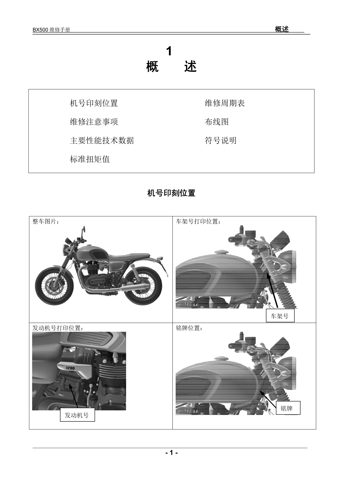

**----- Start of picture text -----** 
整车图片：车架号打印位置： 车架号 发动机号打印位置：铭牌位置： 铭牌 发动机号 **----- End of picture text -----** 

概述 

## 维修注意事项 

1 、应使用重庆高金实业有限公司生产的或重庆高金实业有限公司认可和推荐使用的零、配件，润滑油和其他辅助材料。如果使用零件不符合“高金”规格或要求，则可能损坏摩托车。 

- 2 、凡拆卸后重新装配时，应更换新垫圈、密封件的开口销等。 

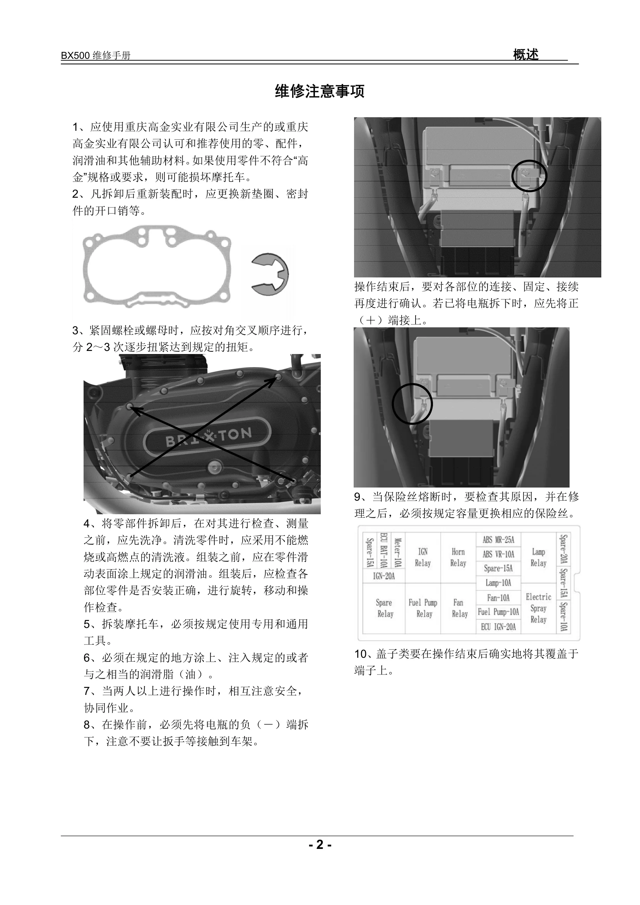

- 3 、紧固螺栓或螺母时，应按对角交叉顺序进行， 

- 分 2 ～ 3 次逐步扭紧达到规定的扭矩。 

4 、将零部件拆卸后，在对其进行检查、测量之前，应先洗净。清洗零件时，应采用不能燃烧或高燃点的清洗液。组装之前，应在零件滑动表面涂上规定的润滑油。组装后，应检查各部位零件是否安装正确，进行旋转，移动和操作检查。 

- 5 、拆装摩托车，必须按规定使用专用和通用工具。 

- 6 、必须在规定的地方涂上、注入规定的或者与之相当的润滑脂（油）。 

操作结束后，要对各部位的连接、固定、接续再度进行确认。若已将电瓶拆下时，应先将正（＋）端接上。 

9 、当保险丝熔断时，要检查其原因，并在修理之后，必须按规定容量更换相应的保险丝。 

10 、盖子类要在操作结束后确实地将其覆盖于端子上。 

- 7 、当两人以上进行操作时，相互注意安全，协同作业。 

- 8 、在操作前，必须先将电瓶的负（－）端拆下，注意不要让扳手等接触到车架。 

概述 

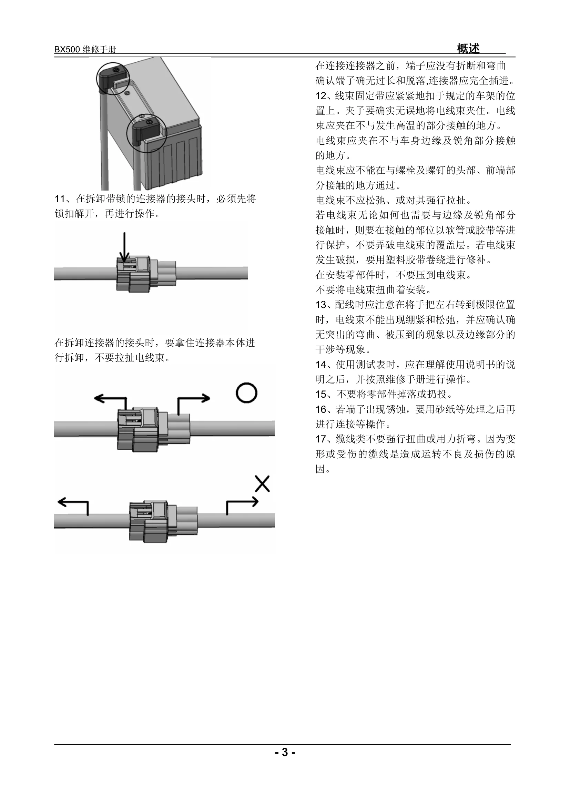

11 、在拆卸带锁的连接器的接头时，必须先将锁扣解开，再进行操作。 

在拆卸连接器的接头时，要拿住连接器本体进行拆卸，不要拉扯电线束。 

在连接连接器之前，端子应没有折断和弯曲确认端子确无过长和脱落 , 连接器应完全插进。 12 、线束固定带应紧紧地扣于规定的车架的位置上。夹子要确实无误地将电线束夹住。电线束应夹在不与发生高温的部分接触的地方。电线束应夹在不与车身边缘及锐角部分接触的地方。 

- 电线束应不能在与螺栓及螺钉的头部、前端部分接触的地方通过。 

- 电线束不应松弛、或对其强行拉扯。若电线束无论如何也需要与边缘及锐角部分接触时，则要在接触的部位以软管或胶带等进行保护。不要弄破电线束的覆盖层。若电线束发生破损，要用塑料胶带卷绕进行修补。在安装零部件时，不要压到电线束。不要将电线束扭曲着安装。 

- 13 、配线时应注意在将手把左右转到极限位置时，电线束不能出现绷紧和松弛，并应确认确无突出的弯曲、被压到的现象以及边缘部分的干涉等现象。 

- 14 、使用测试表时，应在理解使用说明书的说明之后，并按照维修手册进行操作。 

- 15 、不要将零部件掉落或扔投。 

- 16 、若端子出现锈蚀，要用砂纸等处理之后再进行连接等操作。 

- 17 、缆线类不要强行扭曲或用力折弯。因为变形或受伤的缆线是造成运转不良及损伤的原因。 

概述 

## 主要性能技术数据 

||项目|数据|
|---|---|---|
|尺寸及重量|总长 总宽 总高 轴距 最小离地间隙 整车质量|2180mm 800mm 1115mm 1450mm 150mm 空车：223kg，整备：235 kg，满载：455kg|
|车体|车架形式 前悬挂后倾角 前悬挂装置 后悬挂装置 前轮胎尺寸 后轮胎尺寸 前轮压力 后轮压力 前制动器 后制动器 燃油箱容积 燃油标号|钢管式 26° 液压弹簧复合减震 液压弹簧复减震（弹簧预压可调） 100/90 - 18 M/C(56H) 150/70 R 17 M/C(69H) 单人：220 kPa，双人：220 kPa 单人：220 kPa，双人：250 kPa 盘式 直径 Φ310mm 盘式 直径 Φ260mm 16L 95#|
|发动机|型式 气缸直径×行程 气缸排气量 压缩比 最大功率 最大扭矩 气门间隙（冷态） 气门传动机构 空气滤清器 冷却方式 冷却水加注量 曲轴平衡方式 润滑方式 油泵类型 机油牌号 机油加注量 机油滤芯 起动方式 怠速 发动机净重|双缸、四冲程、水冷 98.6mm×80mm 1222cc 10:1 61kw/6550rpm 108N.m/3100rpm IN：0.1±0.03，EX：0.15±0.03 链条传动 纸质滤芯式 水冷 1.5L 平衡轴 飞溅、压力润滑，油滤器可换 转子式 SAE 10W/40(SJ级） 3.2L/3.4L（换滤芯） 纸制，可更换 电机起动 1000±100r/min 87kg|

概述 

||项目|数据|
|---|---|---|
|传动系统|离合器 离合器操作系统 变速装置 初级减速比 变速比 末级减速比 换档型式|油浴多片式 手动机械式 6档常啮合 1.257 Ⅰ 3.50 Ⅱ 2.50 Ⅲ 1.850 Ⅳ 1.480 Ⅴ 1.296 Ⅵ 1.172 2.412 左脚操纵往返式 顺序Ⅰ－N－Ⅱ－Ⅲ－Ⅳ－Ⅴ－Ⅵ|
|电气与电喷|发电机 蓄电池容量 供电系统 熔断器 火花塞 火花塞间隙 防盗装置型式 燃油供给方式 点火方式 前照灯 转向灯 制动灯/后位灯|520w/5000rpm，永磁式交流磁电机 12V12A.h 直流供电，发电机只负责对蓄电池进行充电 25A*1、20A*2、10A*6 型号NGK LMAR8A-9 0.8～1.0mm 2类 通过点火开关锁止方向柱并关闭点火线路 电喷、ECU控制 电喷 12V30W/15W 前：12V1W 后：12V1W 12V3.7W/3.7W|

概述 

|0维修手册 概述|0维修手册 概述|0维修手册 概述|
|---|---|---|
|专用工具|||
|序号|名称|图片|
|**1**|转子拔出器||
|**2**|凸轮轴固定工具||
|**3**|上箱体平衡轴固定工具||
|**4**|下箱体平衡轴固定工具||
|**5**|曲轴固定工具||
|**6**|气缸体装配工具||
|**7**|正时惰轮主副齿固定工具||
|**8**|离合器/转子紧固工具||
|**9**|换挡轴油封装配工具||
|**10**|后叉轴调节螺管工具||

概述 

**11** 发动机调节螺管工具 

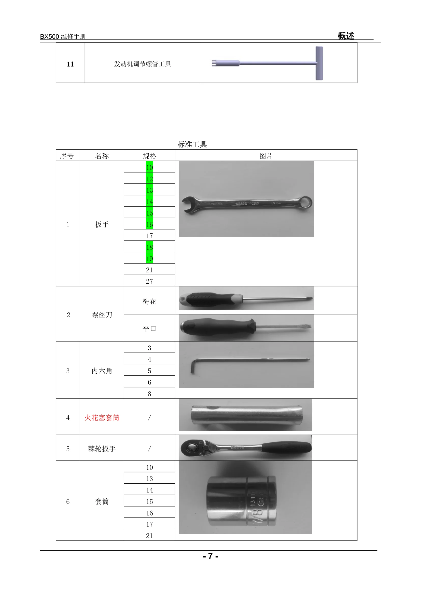

|||标准工具|标准工具|
|---|---|---|---|
|序号|名称|规格|图片|
|1|扳手|10||
|||12||
|||13||
|||14||
|||15||
|||16||
|||17||
|||18||
|||19||
|||21||
|||27||
|2|螺丝刀|梅花||
|||平口||
|3|内六角|3||
|||4||
|||5||
|||6||
|||8||
|4|火花塞套筒|/||
|5|棘轮扳手|/||
|6|套筒|10||
|||13||
|||14||
|||15||
|||16||
|||17||
|||21||

概述 

||7 8||24|||
|---|---|---|---|---|---|
||||27|||
|||加长杆|/|||
|||丁字套筒|10|||
||||13|||
||||15|||

## 标准扭矩值 

## 发动机 

|发动机||||
|---|---|---|---|
|项目|数量|螺纹直径**mm**|扭矩值**N.m**|
|五星拨板螺栓|1|8|21～25|
|换档臂定位螺栓|1|/|25～29|
|磁电机转子螺栓|1|/|138～142|
|火花塞|2|/|14～18|
|AB栓|6|9|46～50|
|摇臂轴螺栓|2|12|13～17|
|放油螺塞|1|12|28～32|
|合箱螺栓M8×105|1|8|15N*m 再拧紧120°|
|合箱螺栓M10|1|10|37～41|
|合箱螺栓M8|10|8|22～26|
|主动链轮安装螺栓|1|10|52～56|
|离合器螺母|5|/|126～130|
|连杆盖螺母|4|8|33～35|
|单向器螺栓|6|8|27～31|
|初级主动齿螺栓|1|16|103～105|
|油压传感器安装螺栓|1|/|23～27|
|油压传感器|1|/|10～14|
|档显安装螺栓|2|4|2～4|
|精滤器管接头|1|/|16～20|
|精滤器|1|/|8～12|
|水温传感器|1|12|14～16|
|离合器升板螺栓|5|6|11～13|
|起动电机正级线螺母|1|6|8～12|
|凸轮轴支架螺栓|12|6|10～14|

## 车体 

|车体||||
|---|---|---|---|
|项目|数量|螺纹直径**mm**|扭矩值**N.m**|
|装配发动机前悬挂 装配发动机前上悬挂 装配发动机上悬挂 装配发动机后上、后下悬挂 装配前减震，方向柱和前减震|2 2 1 2 6|12 12 12 12 8|70～85 70～85 70～85 70～85 21～25|

概述 

|手把管与卡子 前轮 后轮 后减震器与车架上安装点 后减震器与后叉安装点 主副车架连接点 车架和后叉连接 制动盘和轮毂连接 缓冲体和链轮 前制动卡钳和前减震连接 后制动卡钳和安装支架 制动软管连接处 制动油管与ABS连接 后制动主泵与后制动主缸体安装板 连接 换挡臂装配|4 1 1 2 2 4 1 17 6 4 2 4 4 2 1|8 18 18 8 8 10 14 8 8 8 10 10 10 8 6|21～25 80～90 80～90 28～32 28～32 55～65 96～100 28～32 28～32 28～32 50～54 28～32 18～22 20～30 11～13||
|---|---|---|---|---|

## 除以上表中所列重要部位的扭矩值外，其余标准紧固件的扭矩范围按下表 

|名称及尺寸|扭矩值**N.m**|
|---|---|
|5mm螺栓和螺母 6mm螺栓和螺母 8mm螺栓和螺母 10mm螺栓和螺母 5mm螺钉 6mm螺钉 6mm带盘螺栓和螺母 8mm带盘螺栓和螺母 10mm 带盘螺栓和螺母|4 ～6 8 ～12 18 ～25 30 ～40 4 ～6 7 ～11 10 ～14 20 ～30 30 ～40|

概述 

## 定期维护保养表 

||公里|最初1000|每5000|每10000|每15000|
|---|---|---|---|---|---|
||月数|最初3|每15|每30|每45|
|空气滤清器(滤芯)||–|检查|检查|更换|
|*消声器的螺栓、螺母||紧固|–|紧固|–|
|* 气门间隙(冷态检查) 进0.1±0.03 毫米/排0.15±0.03 毫米||检查|检查|检查|检查|
|火花塞||–|检查|检查|检查|
|发动机机油||更换|更换|更换|更换|
|机油滤芯||更换|–|更换|–|
|离合器手柄自由行程||检查|检查|检查|检查|
|*节气门体||检查|–|检查|–|
|怠速||检查|检查|检查|检查|
|燃油蒸发污染物控制系统||–|–|检查|–|
|*冷却液||每8000 公里或每24 个月更换||||
|散热器胶管||–|检查|检查|检查|
|燃油管||–|检查|检查|检查|
|传动链条||检查|检查|检查|检查|
|||每500 公里润滑一次、每1000 公里检查清 洗一次||||
|*制动器||检查|检查|检查|检查|
|*制动液软管||–|检查|检查|检查|
|||每4 年更换一次||||
|制动液||–|检查|检查|检查|
|||每2 年更换一次||||
|轮胎||–|检查|检查|检查|
|*转向机构||检查|–|检查|–|
|*前叉||–|–|检查|–|
|*后减震器||–|–|检查|–|
|*车身和发动机安装的螺栓和螺母||紧固|紧固|紧固||

注意： 

按表中的项目检查时，如有必要，则要进一步进行清洗、润滑、调整或更换等作业。注意： 

在恶劣路况以及大功率工况下长时间行驶，应增加检查频次。注意： 

表格中带有“*”标记的项目，应交有资格的特许维修店处理。 

概述 

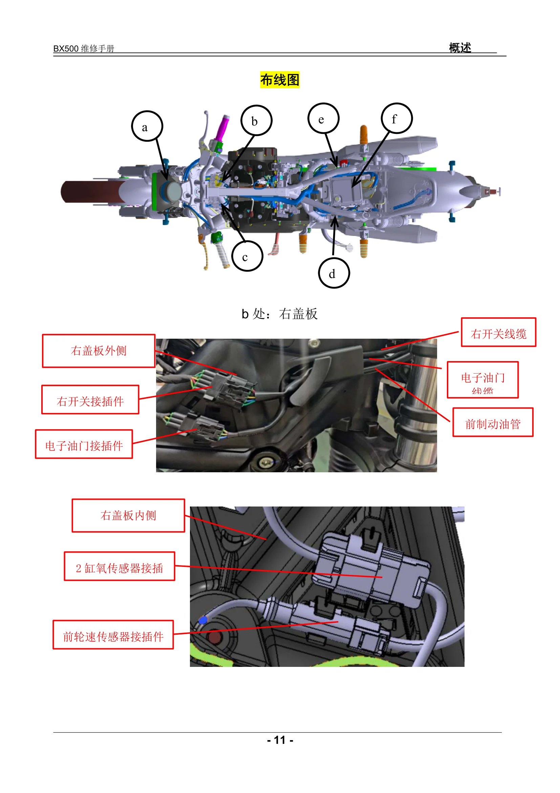

**----- Start of picture text -----** 
布线图 b e f a c d **----- End of picture text -----** 

**----- Start of picture text -----** 
b  处：右盖板 **----- End of picture text -----** 

**----- Start of picture text -----** 
右开关线缆 右盖板外侧 电子油门 线缆 右开关接插件 前制动油管 电子油门接插件 右盖板内侧 2 缸氧传感器接插 前轮速传感器接插件 **----- End of picture text -----** 

概述 

## c 处：左盖板 

左盖板外侧左开关接插件左盖板内侧散热风扇接插件 1 缸氧传感器接插 

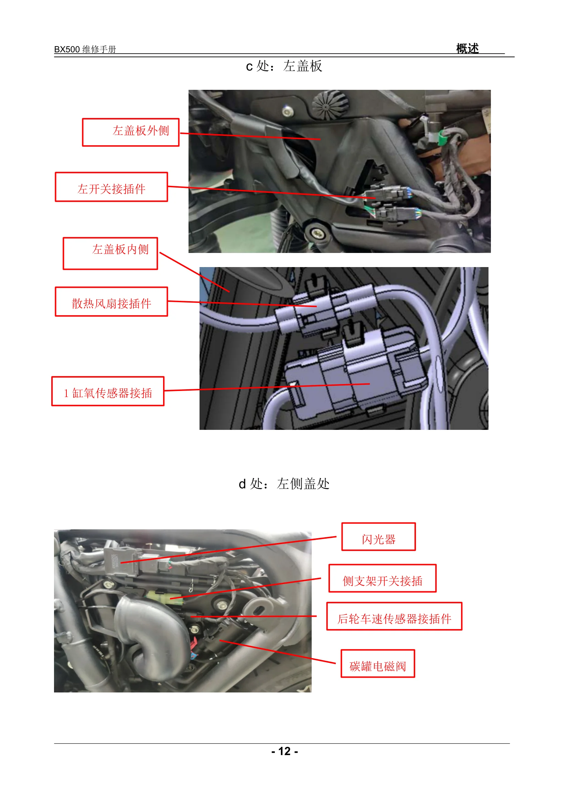

## d 处：左侧盖处 

**----- Start of picture text -----** 
闪光器 侧支架开关接插 后轮车速传感器接插件 碳罐电磁阀 **----- End of picture text -----** 

概述 

## e 处：右侧盖处 

电子档位开关接插件起动继电器接插件起动继电器调压整流器后制动油杯 

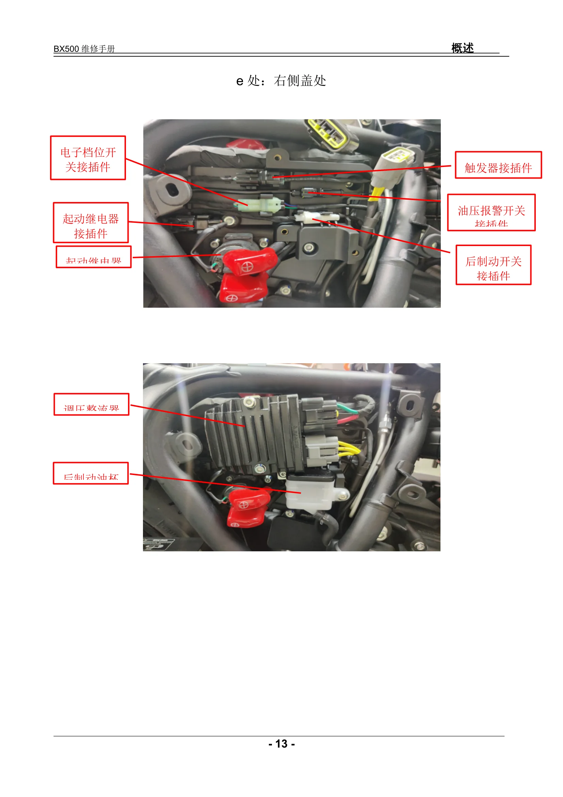

**----- Start of picture text -----** 
触发器接插件 油压报警开关 接插件 后制动开关 接插件 **----- End of picture text -----** 

概述 

## f 处：座垫下方 

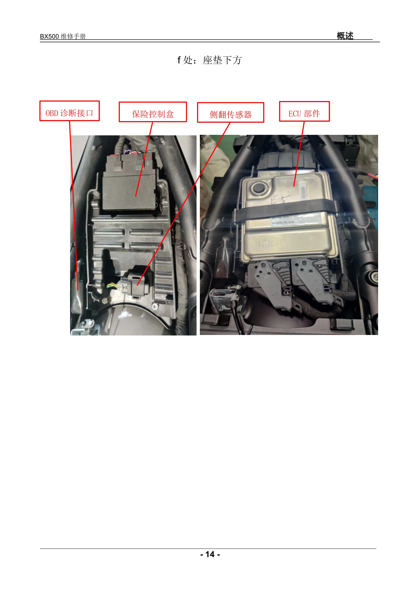

**----- Start of picture text -----** 
OBD 诊断接口保险控制盒侧翻传感器 ECU 部件 **----- End of picture text -----** 

概述 

## 符号说明 

本手册中各符号表示的意义: 

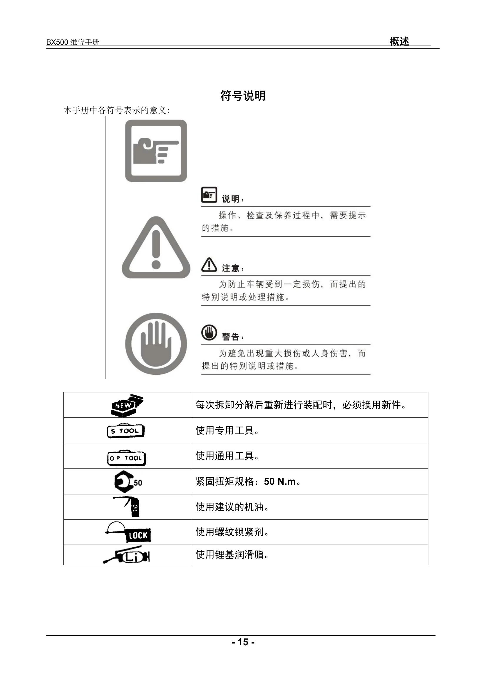

每次拆卸分解后重新进行装配时，必须换用新件。使用专用工具。使用通用工具。紧固扭矩规格： **50 N.m** 。使用建议的机油。使用螺纹锁紧剂。使用锂基润滑脂。 

润滑系统 

## 润滑系统 

维修须知机油的更换维修基准表油压报警开关发动机机油油水泵机油运行图 

## 维修须知 

本节介绍发动机机油的检查和更换方法，以及机油粗滤网和机油滤清器清洗的方法。 

机油是影响发动机性能和寿命的重要因素，必须按规定选用，不准使用普通机油、齿轮油、植物油等代替。本发动机在销售出厂时，加注的是 10W/40 机油。在更换机油时，请将曲轴箱内原来的机油放完，清洗干净后，再按规定加注新的机油。 

检查、清洗机油系统前，需将发动机内的机油放掉。 

## 润滑系统技术规格及维修基准 

|机油容量（完全新装）|3.5 L|
|---|---|
|机油容量（更换机油和滤芯）|3.2 L|
|机油容量（更换机油）|3.0 L|
|机油级别|SH以上|
|机油黏度|10W/40|
|机油种类|半合成或全合成|
|机油压力（主油道）|3.00~3.60 bar at 3500 rpm|
|内外转子尖端间隙|0.15 mm（标准值）|
||0.20 mm（极限值）|
|外转子与泵体间隙|0.15~0.24 mm（标准值）|
||0.37 mm（极限值）|

润滑系统 

## 发动机机油 

推荐使用半合成或全合成的10W/40 摩托车发动机机油，机油的级别为SH 以上。可适当调整机油黏度等级，以适应您所骑行当地的环境温度。 

请参考下面的图表，了解您所在骑行区域所使用的正确机油黏度。 

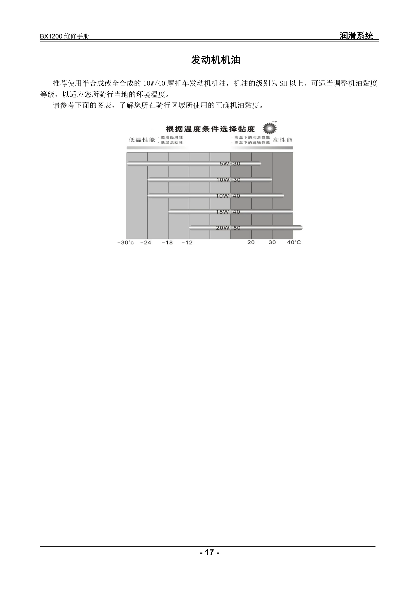

润滑系统 

## 机油运行图 

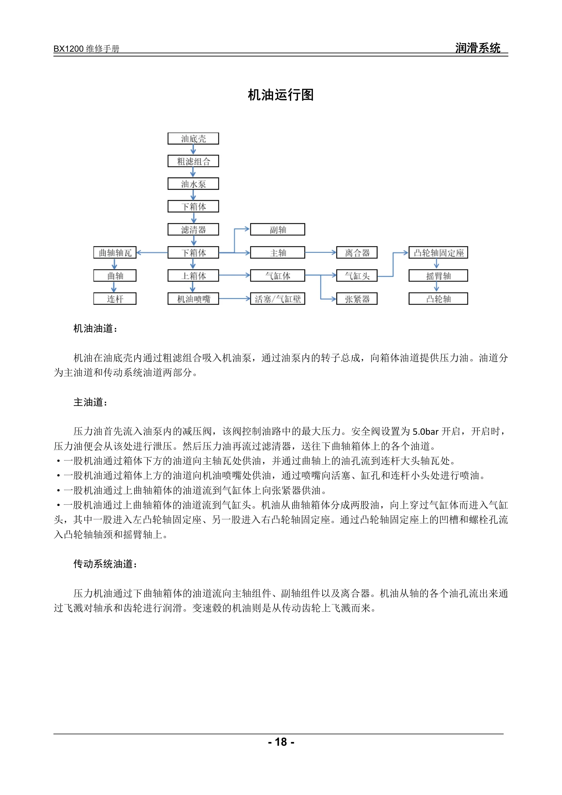

机油油道： 

机油在油底壳内通过粗滤组合吸入机油泵，通过油泵内的转子总成，向箱体油道提供压力油。油道分为主油道和传动系统油道两部分。 

## 主油道： 

压力油首先流入油泵内的减压阀，该阀控制油路中的最大压力。安全阀设置为 5.0bar 开启，开启时，压力油便会从该处进行泄压。然后压力油再流过滤清器，送往下曲轴箱体上的各个油道。 

- ·一股机油通过箱体下方的油道向主轴瓦处供油，并通过曲轴上的油孔流到连杆大头轴瓦处。 

- ·一股机油通过箱体上方的油道向机油喷嘴处供油，通过喷嘴向活塞、缸孔和连杆小头处进行喷油。 

- ·一股机油通过上曲轴箱体的油道流到气缸体上向张紧器供油。 

- ·一股机油通过上曲轴箱体的油道流到气缸头。机油从曲轴箱体分成两股油，向上穿过气缸体而进入气缸头，其中一股进入左凸轮轴固定座、另一股进入右凸轮轴固定座。通过凸轮轴固定座上的凹槽和螺栓孔流入凸轮轴轴颈和摇臂轴上。 

## 传动系统油道： 

压力机油通过下曲轴箱体的油道流向主轴组件、副轴组件以及离合器。机油从轴的各个油孔流出来通过飞溅对轴承和齿轮进行润滑。变速毂的机油则是从传动齿轮上飞溅而来。 

润滑系统 

## 机油的更换 

更彻底。 

## 机油液面高度检查： 

为使发动机正常工作，应将发动机机油保持在正确的位置，并按照维修要求更换机油和机油滤清器。 

- 1 、起动发动机，怠速运转约5 分钟。 

- 2 、停止发动机，然后等待至少3 分钟，让机油沉淀下来。 

   - 5 、用滤清器专用工具拆下机油滤清器。 

   - 6 、在新的机油滤清器的密封圈上涂上一层干净的机油。 

   - 7 、用专用工具安装新的滤清器并拧紧至 10N.m 。 

   - 8 、在放油螺栓上安装一个新的垫圈。 

   - 9 、安装放油螺栓并拧紧至 25nm 。 

   - 10 、打开注油螺塞，用新机油加满发动机。 

- 3 、注意观察油位视窗的油位。 

- 4 、在视窗的上下刻线之间应该能看到油位。 

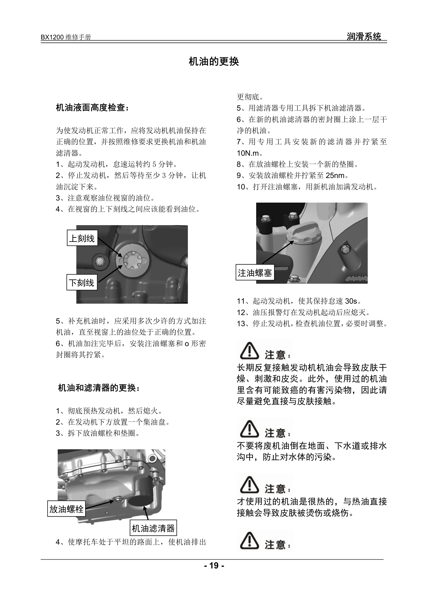

**----- Start of picture text -----** 
上刻线 下刻线 **----- End of picture text -----** 

- 5 、补充机油时，应采用多次少许的方式加注机油，直至视窗上的油位处于正确的位置。 

- 6 、机油加注完毕后，安装注油螺塞和 o 形密封圈将其拧紧。 

## 机油和滤清器的更换： 

**----- Start of picture text -----** 
注油螺塞 **----- End of picture text -----** 

- 11 、起动发动机，使其保持怠速 30s 。 12 、油压报警灯在发动机起动后应熄灭。 

- 13 、停止发动机，检查机油位置，必要时调整。 

长期反复接触发动机机油会导致皮肤干燥、刺激和皮炎。此外，使用过的机油里含有可能致癌的有害污染物，因此请尽量避免直接与皮肤接触。 

- 1 、彻底预热发动机，然后熄火。 

- 2 、在发动机下方放置一个集油盘。 

- 3 、拆下放油螺栓和垫圈。 

**----- Start of picture text -----** 
放油螺栓 机油滤清器 **----- End of picture text -----** 

- 4 、使摩托车处于平坦的路面上，使机油排出 

不要将废机油倒在地面、下水道或排水沟中，防止对水体的污染。 

才使用过的机油是很热的，与热油直接接触会导致皮肤被烫伤或烧伤。 

润滑系统 

在机油到达发动机的所有部位之前，发动机不要运行高速，否则会导致发动机损坏或卡住，只有在发动机怠速运转30s 后，才能提高发动机转速，是机油充分循环。 

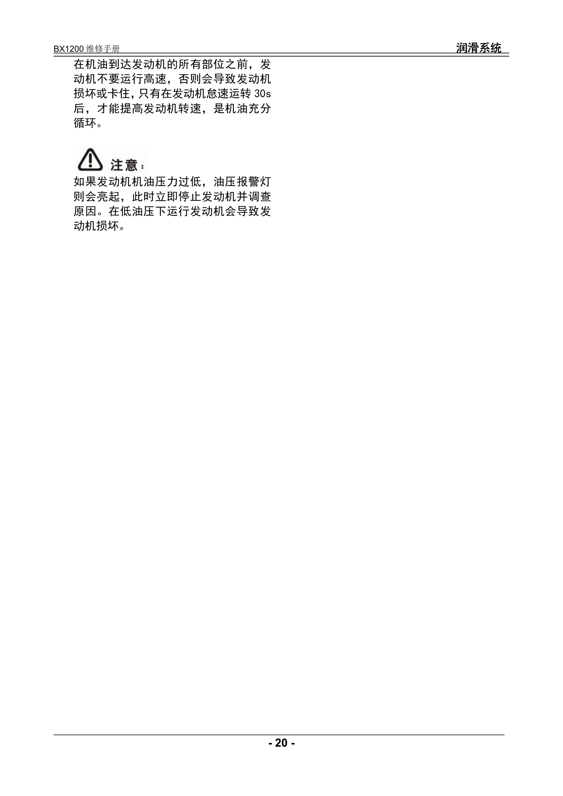

如果发动机机油压力过低，油压报警灯则会亮起，此时立即停止发动机并调查原因。在低油压下运行发动机会导致发动机损坏。 

润滑系统 

## 油压报警开关 

## 油压报警开关的拆卸 

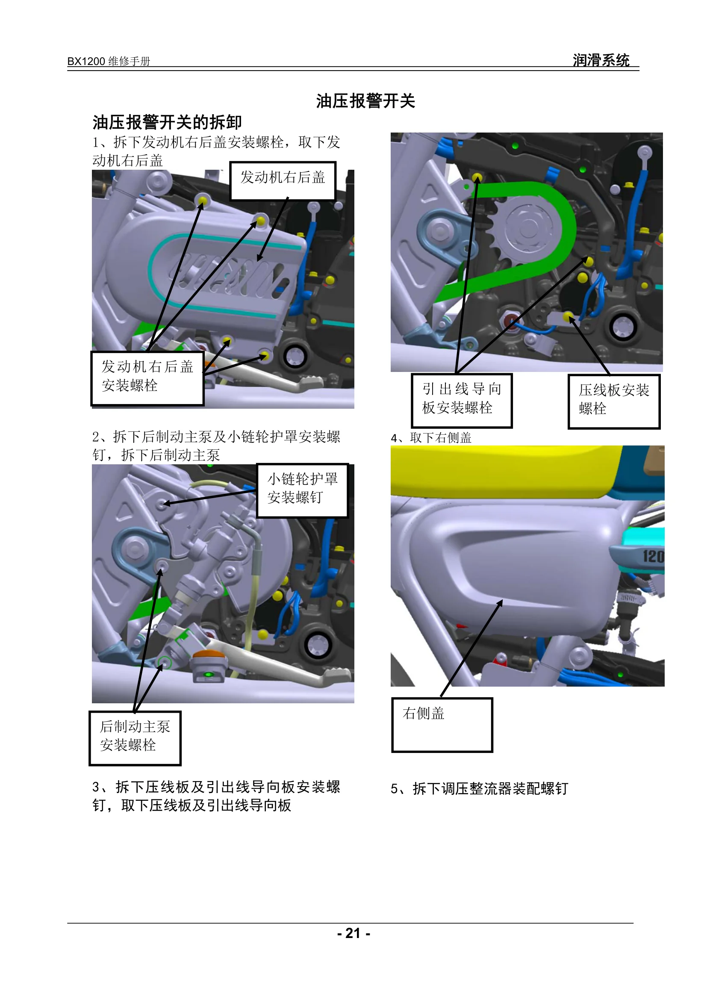

**----- Start of picture text -----** 
1、拆下发动机右后盖安装螺栓，取下发 动机右后盖 发动机右后盖 发动机右后盖 安装螺栓 **----- End of picture text -----** 

## 2、拆下后制动主泵及小链轮护罩安装螺钉，拆下后制动主泵 

**----- Start of picture text -----** 
小链轮护罩 安装螺钉 后制动主泵 后制动主泵 安装螺栓 **----- End of picture text -----** 

- 3、拆下压线板及引出线导向板安装螺钉，取下压线板及引出线导向板 

**----- Start of picture text -----** 
引出线导向压线板安装 板安装螺栓螺栓 **----- End of picture text -----** 

**----- Start of picture text -----** 
4 、取下右侧盖 **----- End of picture text -----** 

**----- Start of picture text -----** 
右侧盖 **----- End of picture text -----** 

## 5、拆下调压整流器装配螺钉 

润滑系统 

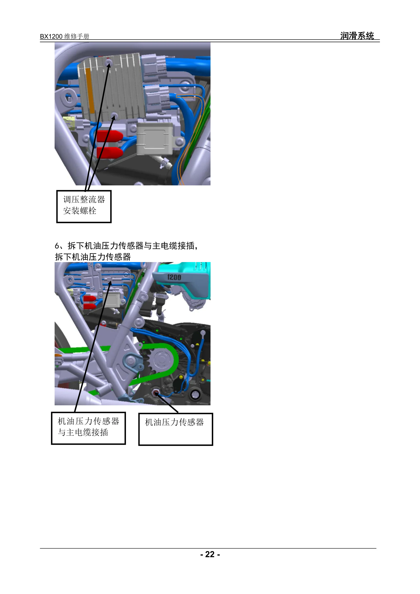

**----- Start of picture text -----** 
调压整流器 安装螺栓 **----- End of picture text -----** 

## 6、拆下机油压力传感器与主电缆接插，拆下机油压力传感器 

**----- Start of picture text -----** 
机油压力传感器机油压力传感器 与主电缆接插 **----- End of picture text -----** 

润滑系统 

## 油水泵 

## 油水泵的拆卸： 

- ·排放冷却液。 

- ·放掉发动机机油。 

- ·拆卸油底壳。 

- ·拆卸离合器。 

- 1 、取下粗滤器。 

- 2 、取下粗滤密封圈。 

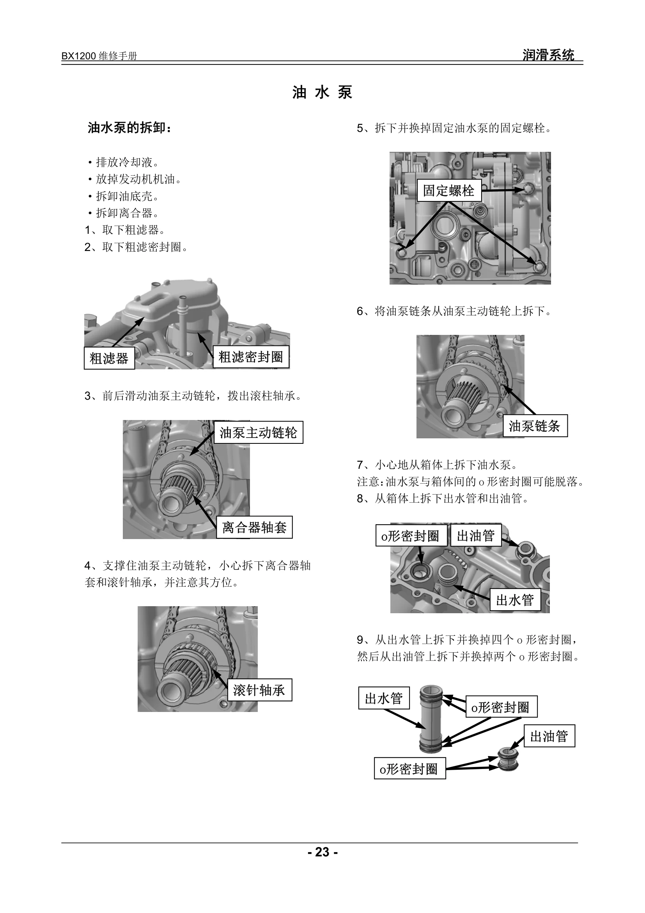

**----- Start of picture text -----** 
粗滤器粗滤密封圈 **----- End of picture text -----** 

- 3 、前后滑动油泵主动链轮，拨出滚柱轴承。 

**----- Start of picture text -----** 
油泵主动链轮 离合器轴套 **----- End of picture text -----** 

- 4 、支撑住油泵主动链轮，小心拆下离合器轴套和滚针轴承，并注意其方位。 

**----- Start of picture text -----** 
滚针轴承 **----- End of picture text -----** 

- 5 、拆下并换掉固定油水泵的固定螺栓。 

**----- Start of picture text -----** 
固定螺栓 **----- End of picture text -----** 

- 6 、将油泵链条从油泵主动链轮上拆下。 

**----- Start of picture text -----** 
油泵链条 **----- End of picture text -----** 

- 7 、小心地从箱体上拆下油水泵。 

注意：油水泵与箱体间的o 形密封圈可能脱落。 

- 8 、从箱体上拆下出水管和出油管。 

**----- Start of picture text -----** 
o形密封圈出油管 出水管 **----- End of picture text -----** 

- 9 、从出水管上拆下并换掉四个o 形密封圈，然后从出油管上拆下并换掉两个o 形密封圈。 

**----- Start of picture text -----** 
出水管 o形密封圈 出油管 o形密封圈 **----- End of picture text -----** 

润滑系统 

## 10 、从箱体上拆下并扔掉o 形密封圈。 

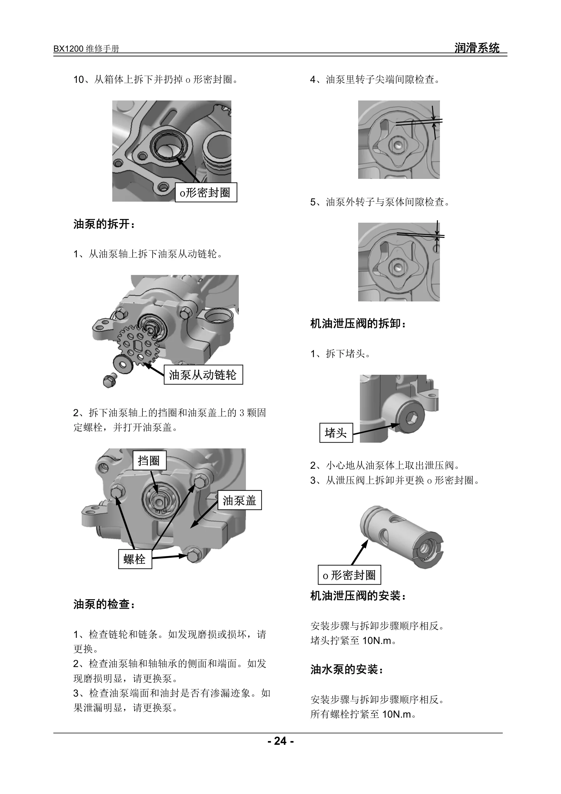

**----- Start of picture text -----** 
o形密封圈 **----- End of picture text -----** 

## 油泵的拆开： 

- 1 、从油泵轴上拆下油泵从动链轮。 

**----- Start of picture text -----** 
油泵从动链轮 **----- End of picture text -----** 

- 2 、拆下油泵轴上的挡圈和油泵盖上的3 颗固定螺栓，并打开油泵盖。 

**----- Start of picture text -----** 
挡圈 油泵盖 螺栓 **----- End of picture text -----** 

## 油泵的检查： 

- 1 、检查链轮和链条。如发现磨损或损坏，请更换。 

- 2 、检查油泵轴和轴轴承的侧面和端面。如发现磨损明显，请更换泵。 

- 3 、检查油泵端面和油封是否有渗漏迹象。如果泄漏明显，请更换泵。 

- 4 、油泵里转子尖端间隙检查。 

- 5 、油泵外转子与泵体间隙检查。 

## 机油泄压阀的拆卸： 

- 1 、拆下堵头。 

**----- Start of picture text -----** 
堵头 **----- End of picture text -----** 

- 2 、小心地从油泵体上取出泄压阀。 

- 3 、从泄压阀上拆卸并更换o 形密封圈。 

**----- Start of picture text -----** 
o 形密封圈 **----- End of picture text -----** 

## 机油泄压阀的安装： 

安装步骤与拆卸步骤顺序相反。堵头拧紧至 10N.m 。 

## 油水泵的安装： 

安装步骤与拆卸步骤顺序相反。所有螺栓拧紧至 10N.m 。 

检查与调整 

## 3 检查与调整 

维修须知怠速火花塞制动系统正时相位行走系统润滑油离合器操纵线冷却液驱动链条缸压蓄电池正时链条张紧力前照灯调光气门间隙立管转向轴承空气滤清器及集油器悬挂系统油门操纵螺栓、螺母及紧固件 

检查与调整 

## 维修须知 

本节介绍 GK1200 型两轮摩托车各部位的检查和调整。同时介绍检查、调整时的技术要求。 

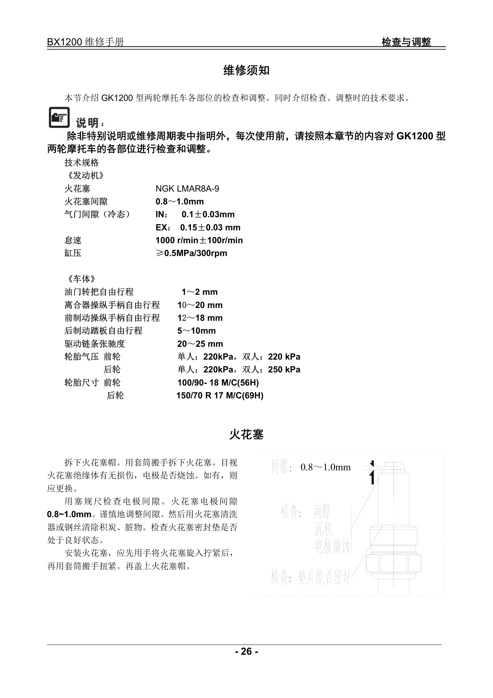

除非特别说明或维修周期表中指明外，每次使用前，请按照本章节的内容对 **GK1200** 型两轮摩托车的各部位进行检查和调整。 

技术规格《发动机》火花塞 NGK LMAR8A-9 火花塞间隙 **0.8** ～ **1.0mm** 气门间隙（冷态） **IN** ： **0.1** ± **0.03mm EX** ： **0.15** ± **0.03 mm** 怠速 **1000 r/min** ± **100r/min** 缸压 ≥ **0.5MPa/300rpm** 

《车体》油门转把自由行程 **1** ～ **2 mm** 离合器操纵手柄自由行程 **1** 0～ **20 mm** 前制动操纵手柄自由行程 **1** 2～ **18 mm** 后制动踏板自由行程 **5** ～ **10mm** 驱动链条张驰度 **20** ～ **25 mm** 轮胎气压前轮单人： **220kPa** ，双人： **220 kPa** 后轮单人： **220kPa** ，双人： **250 kPa** 轮胎尺寸前轮 **100/90- 18 M/C(56H)** 后轮 **150/70 R 17 M/C(69H)** 

## 火花塞 

拆下火花塞帽。用套筒搬手拆下火花塞。目视火花塞绝缘体有无损伤，电极是否烧蚀。如有，则应更换。 

0.8～1.0mm 

用塞规尺检查电极间隙。火花塞电极间隙 **0.8~1.0mm** 。谨慎地调整间隙。然后用火花塞清洗器或钢丝清除积炭、脏物。检查火花塞密封垫是否处于良好状态。 

安装火花塞，应先用手将火花塞旋入拧紧后，再用套筒搬手扭紧。再盖上火花塞帽。 

检查与调整 

## 正时相位 

## 在新车时或对正时相位有怀疑时进行。 

①、拆下右前盖，顺时针旋转转子紧固螺栓，使转子上的孔与上箱体定位孔对准，②、拆下气缸头盖，检查凸轮轴定位台阶是否与气缸头盖面平齐（如图）。 

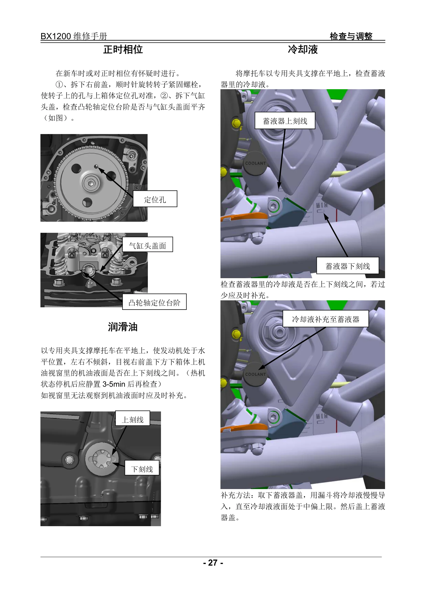

**----- Start of picture text -----** 
定位孔 气缸头盖面 凸轮轴定位台阶 **----- End of picture text -----** 

## 润滑油 

以专用夹具支撑摩托车在平地上，使发动机处于水平位置，左右不倾斜，目视右前盖下方下箱体上机油视窗里的机油液面是否在上下刻线之间。（热机状态停机后应静置 3-5min 后再检查）如视窗里无法观察到机油液面时应及时补充。 

**----- Start of picture text -----** 
上刻线 下刻线 **----- End of picture text -----** 

## 冷却液 

将摩托车以专用夹具支撑在平地上，检查蓄液器里的冷却液。 

**----- Start of picture text -----** 
蓄液器上刻线 蓄液器下刻线 **----- End of picture text -----** 

检查蓄液器里的冷却液是否在上下刻线之间，若过少应及时补充。 

**----- Start of picture text -----** 
冷却液补充至蓄液器 **----- End of picture text -----** 

补充方法：取下蓄液器盖，用漏斗将冷却液慢慢导入，直至冷却液液面处于中偏上限。然后盖上蓄液器盖。 

检查与调整 

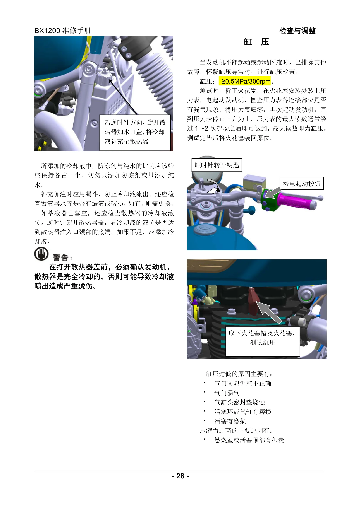

**----- Start of picture text -----** 
沿逆时针方向，旋开散 热器加水口盖,将冷却 液补充至散热器 **----- End of picture text -----** 

所添加的冷却液中，防冻剂与纯水的比例应该始终保持各占一半。切勿只添加防冻剂或只添加纯水。 

补充加注时应用漏斗，防止冷却液流出。还应检查蓄液器水管是否有漏液或破损，如有，则需更换。 

如蓄液器已罄空，还应检查散热器的冷却液液位。逆时针旋开散热器盖，看冷却液的液位是否达到散热器注入口颈部的底端。如果不足，应添加冷却液。 

## 在打开散热器盖前，必须确认发动机、散热器是完全冷却的，否则可能导致冷却液喷出造成严重烫伤。 

## 缸压 

当发动机不能起动或起动困难时，已排除其他故障，怀疑缸压异常时，进行缸压检查。 

## 缸压： **≥** 0.5MPa/300rpm 。 

测试时，拆下火花塞，在火花塞安装处装上压力表，电起动发动机，检查压力表各连接部位是否有漏气现象。将压力表归零，再次起动发动机，直到压力表停止上升为止。压力表的最大读数通常经过 1 ～ 2 次起动之后即可达到。最大读数即为缸压。测试完毕后将火花塞装回原位。 

**----- Start of picture text -----** 
顺时针转开钥匙 按电起动按钮 **----- End of picture text -----** 

**----- Start of picture text -----** 
取下火花塞帽及火花塞， 测试缸压 **----- End of picture text -----** 

## 缸压过低的原因主要有： 

- 气门间隙调整不正确 

- 气门漏气 

- 气缸头密封垫烧蚀 

- 活塞环或气缸有磨损 

- 活塞有磨损 

- 压缩力过高的主要原因有： 

- 燃烧室或活塞顶部有积炭 

检查与调整 

## 空气滤清器 

## 空气滤清器滤芯的清洗、更换 

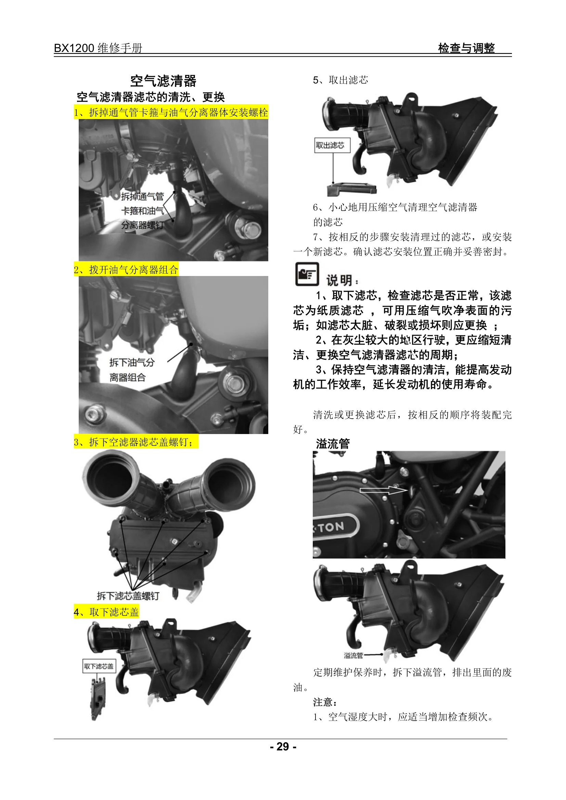

**----- Start of picture text -----** 
1、拆掉通气管卡箍与油气分离器体安装螺栓 **----- End of picture text -----** 

**----- Start of picture text -----** 
2、拨开油气分离器组合 **----- End of picture text -----** 

**----- Start of picture text -----** 
3、拆下空滤器滤芯盖螺钉； **----- End of picture text -----** 

**----- Start of picture text -----** 
4 、取下滤芯盖 **----- End of picture text -----** 

## 5 、取出滤芯 

6、小心地用压缩空气清理空气滤清器的滤芯 

7、按相反的步骤安装清理过的滤芯，或安装一个新滤芯。确认滤芯安装位置正确并妥善密封。 

1、取下滤芯，检查滤芯是否正常，该滤芯为纸质滤芯，可用压缩气吹净表面的污垢；如滤芯太脏、破裂或损坏则应更换； 2、在灰尘较大的地区行驶，更应缩短清洁、更换空气滤清器滤芯的周期； 

- 3、保持空气滤清器的清洁，能提高发动 

- 机的工作效率，延长发动机的使用寿命。 

清洗或更换滤芯后，按相反的顺序将装配完 

好。 

**----- Start of picture text -----** 
溢流管 **----- End of picture text -----** 

定期维护保养时，拆下溢流管，排出里面的废油。注意： 

1、空气湿度大时，应适当增加检查频次。 

检查与调整 

2、操作完毕，一定要确认溢流管装回原位。 

## 怠速 

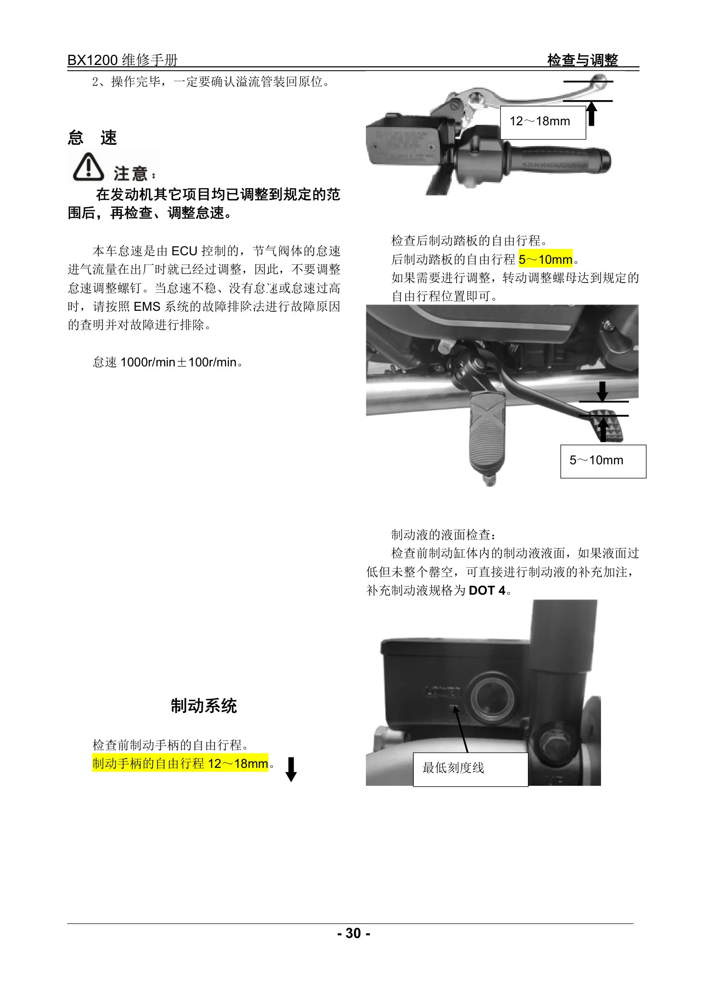

## 在发动机其它项目均已调整到规定的范围后，再检查、调整怠速。 

本车怠速是由 ECU 控制的，节气阀体的怠速进气流量在出厂时就已经过调整，因此，不要调整怠速调整螺钉。当怠速不稳、没有怠速或怠速过高时，请按照 EMS 系统的故障排除法进行故障原因的查明并对故障进行排除。 

怠速 1000r/min ± 100r/min 。 

**----- Start of picture text -----** 
12 ～ 18mm **----- End of picture text -----** 

检查后制动踏板的自由行程。后制动踏板的自由行程 5 ～ 10mm 。如果需要进行调整，转动调整螺母达到规定的自由行程位置即可。 

**----- Start of picture text -----** 
5 ～ 10mm **----- End of picture text -----** 

## 制动液的液面检查： 

检查前制动缸体内的制动液液面，如果液面过低但未整个罄空，可直接进行制动液的补充加注，补充制动液规格为 **DOT 4** 。 

## 制动系统 

检查前制动手柄的自由行程。制动手柄的自由行程 12 ～ 18mm 。 

**----- Start of picture text -----** 
最低刻度线 **----- End of picture text -----** 

检查与调整 

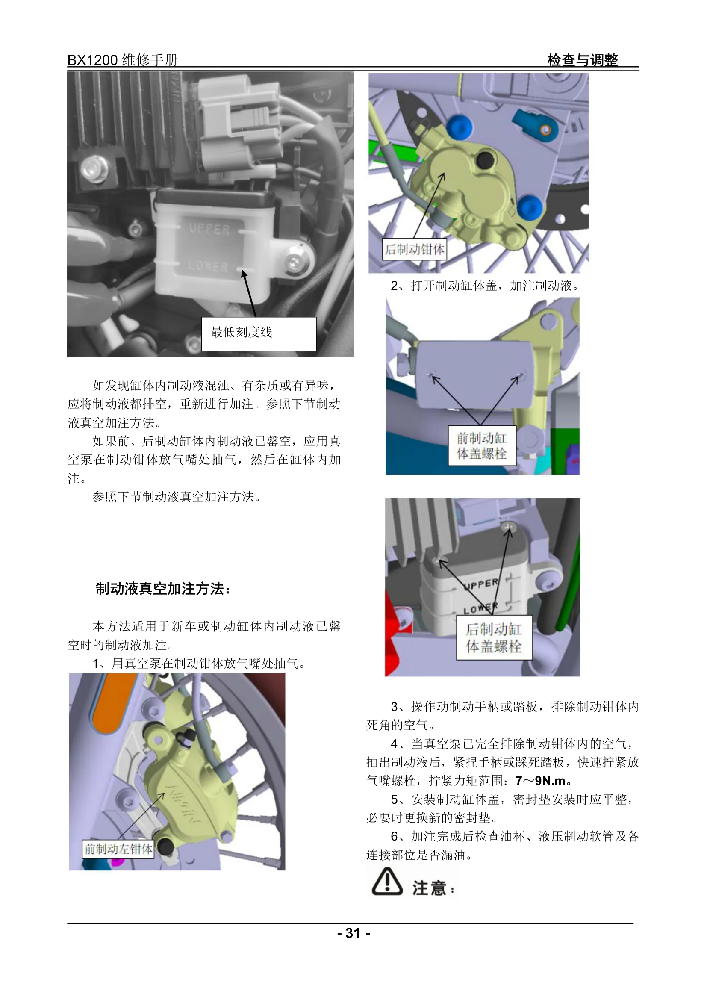

**----- Start of picture text -----** 
最低刻度线 **----- End of picture text -----** 

如发现缸体内制动液混浊、有杂质或有异味，应将制动液都排空，重新进行加注。参照下节制动液真空加注方法。 

如果前、后制动缸体内制动液已罄空，应用真空泵在制动钳体放气嘴处抽气，然后在缸体内加注。 

参照下节制动液真空加注方法。 

## 制动液真空加注方法： 

本方法适用于新车或制动缸体内制动液已罄空时的制动液加注。 

1 、用真空泵在制动钳体放气嘴处抽气。 

**----- Start of picture text -----** 
2 、打开制动缸体盖，加注制动液。 **----- End of picture text -----** 

- 3 、操作动制动手柄或踏板，排除制动钳体内 

- 死角的空气。 

4 、当真空泵已完全排除制动钳体内的空气，抽出制动液后，紧捏手柄或踩死踏板，快速拧紧放气嘴螺栓，拧紧力矩范围： **7** ～ **9N.m** 。 

5 、安装制动缸体盖，密封垫安装时应平整，必要时更换新的密封垫。 

6 、加注完成后检查油杯、液压制动软管及各连接部位是否漏油。 

检查与调整 

## 1、制动液牌号是DOT4 非石油基制动液。 2、制动液不能混入其他杂质，否则会发生化学变化降低制动性能。 

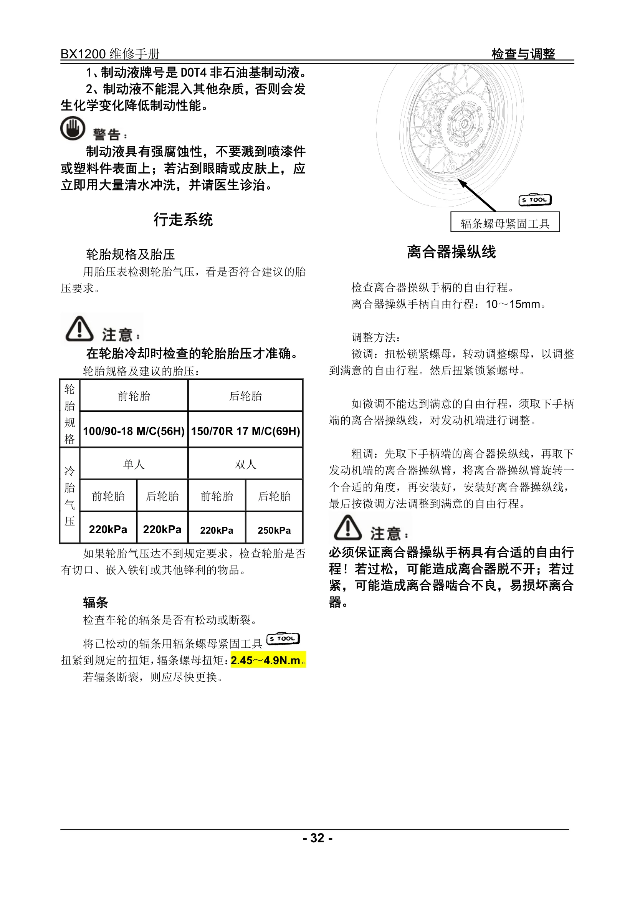

制动液具有强腐蚀性，不要溅到喷漆件或塑料件表面上；若沾到眼睛或皮肤上，应立即用大量清水冲洗，并请医生诊治。 

## 行走系统 

## 轮胎规格及胎压 

用胎压表检测轮胎气压，看是否符合建议的胎压要求。 

## 在轮胎冷却时检查的轮胎胎压才准确。 

## 轮胎规格及建议的胎压： 

|轮 胎 规 格|前轮胎|前轮胎|后轮胎|后轮胎|
|---|---|---|---|---|
||**100/90-18 M/C(56H) **||**150/70R 17 M/C(69H)**||
|冷 胎 气 压|单人||双人||
||前轮胎|后轮胎|前轮胎|后轮胎|
||**220kPa**|**220kPa**|**220kPa**|**250kPa**|

如果轮胎气压达不到规定要求，检查轮胎是否有切口、嵌入铁钉或其他锋利的物品。 

## 辐条 

**----- Start of picture text -----** 
辐条螺母紧固工具 **----- End of picture text -----** 

## 离合器操纵线 

检查离合器操纵手柄的自由行程。离合器操纵手柄自由行程： 10 ～ 15mm 。 

## 调整方法： 

微调：扭松锁紧螺母，转动调整螺母，以调整到满意的自由行程。然后扭紧锁紧螺母。 

如微调不能达到满意的自由行程，须取下手柄端的离合器操纵线，对发动机端进行调整。 

粗调：先取下手柄端的离合器操纵线，再取下发动机端的离合器操纵臂，将离合器操纵臂旋转一个合适的角度，再安装好，安装好离合器操纵线，最后按微调方法调整到满意的自由行程。 

必须保证离合器操纵手柄具有合适的自由行程！若过松，可能造成离合器脱不开；若过紧，可能造成离合器啮合不良，易损坏离合器。 

检查车轮的辐条是否有松动或断裂。 

将已松动的辐条用辐条螺母紧固工具扭紧到规定的扭矩，辐条螺母扭矩： **2.45** ～ **4.9N.m** 。若辐条断裂，则应尽快更换。 

检查与调整 

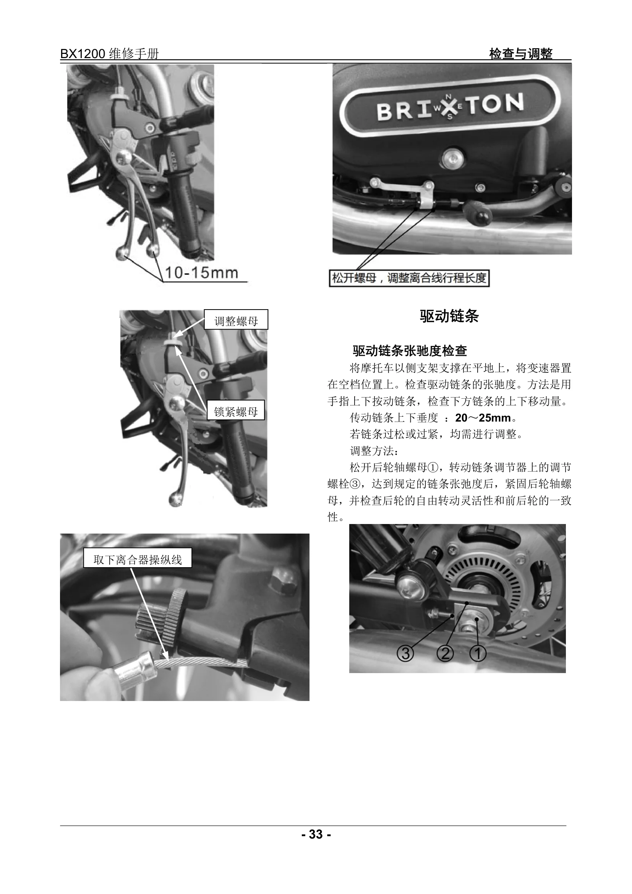

**----- Start of picture text -----** 
调整螺母 锁紧螺母 **----- End of picture text -----** 

**----- Start of picture text -----** 
取下离合器操纵线 **----- End of picture text -----** 

## 驱动链条 

## 驱动链条张驰度检查 

将摩托车以侧支架支撑在平地上，将变速器置在空档位置上。检查驱动链条的张驰度。方法是用手指上下按动链条，检查下方链条的上下移动量。 

- 传动链条上下垂度： **20** ～ **25mm** 。若链条过松或过紧，均需进行调整。调整方法： 

松开后轮轴螺母①，转动链条调节器上的调节螺栓③，达到规定的链条张弛度后，紧固后轮轴螺母，并检查后轮的自由转动灵活性和前后轮的一致性。 

检查与调整 

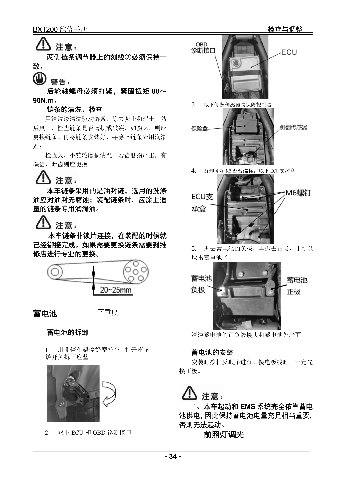

## 两侧链条调节器上的刻线②必须保持一 

## 致。 

## 后轮轴螺母必须打紧，紧固扭矩 **80** ～ **90N.m** 。 

## 链条的清洗、检查 

用清洗液清洗驱动链条，除去灰尘和泥土，然后风干，检查链条是否磨损或破裂，如损坏，则应更换链条。再将链条安装好，并涂上链条专用润滑剂； 

检查大、小链轮磨损情况。若齿磨损严重，有缺齿、断齿则应更换。 

## 本车链条采用的是油封链，选用的洗涤油应对油封无腐蚀；装配链条时，应涂上适量的链条专用润滑油。 

## 本车链条非锁片连接，在装配的时候就已经铆接完成。如果需要更换链条需要到维修店进行专业的更换。 

## 上下垂度 

## 蓄电池 

## 蓄电池的拆卸 

1. 用侧停车架停好摩托车，打开座垫锁开关拆下座垫 

2. 取下 ECU 和 OBD 诊断接口 

**----- Start of picture text -----** 
3. 取下侧翻传感器与保险控制盒 **----- End of picture text -----** 

4. 拆卸4 颗M6 凸台螺栓，取下ECU 支撑盒 

5. 拆去蓄电池的负极，再拆去正极，便可以取出蓄电池了。 

清洁蓄电池的正负级接头和蓄电池外表面。 

## 蓄电池的安装 

安装时按相反顺序进行。接电极线时，一定先接正极。 

1、本车起动和 **EMS** 系统完全依靠蓄电池供电，因此保持蓄电池电量充足相当重要，否则无法起动。 

## 前照灯调光 

检查与调整 

## 悬挂系统 

行车前检查前照灯光方向。 

前照灯光可以进行竖直方向的调整。调整方法： 

用内六角扳手松开前照灯安装螺栓，上下旋转前照灯绕过限位槽，调整到想要的高度，拧紧安装螺栓。 

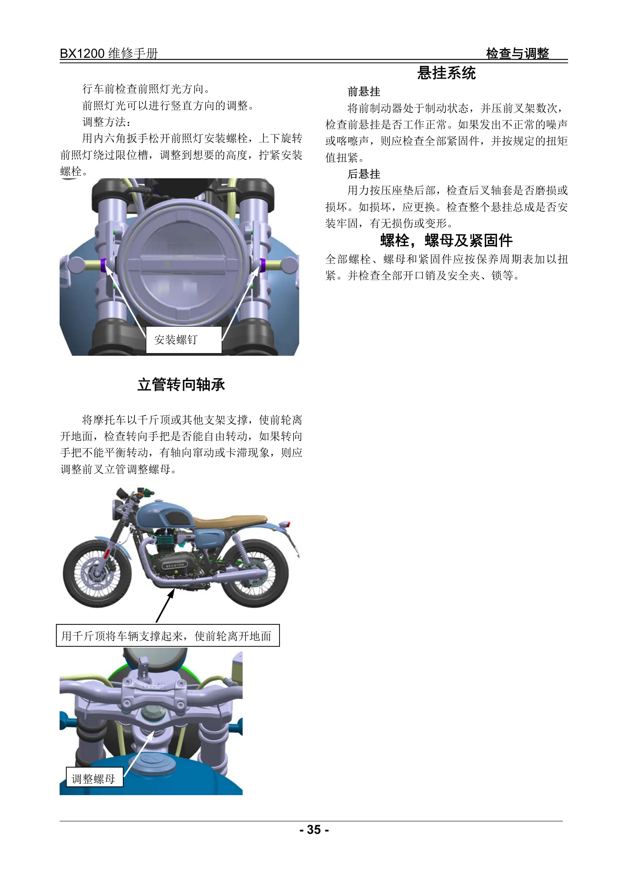

**----- Start of picture text -----** 
安装螺钉 **----- End of picture text -----** 

## 前悬挂 

将前制动器处于制动状态，并压前叉架数次，检查前悬挂是否工作正常。如果发出不正常的噪声或喀嚓声，则应检查全部紧固件，并按规定的扭矩值扭紧。 

## 后悬挂 

用力按压座垫后部，检查后叉轴套是否磨损或损坏。如损坏，应更换。检查整个悬挂总成是否安装牢固，有无损伤或变形。 

## 螺栓，螺母及紧固件 

全部螺栓、螺母和紧固件应按保养周期表加以扭紧。并检查全部开口销及安全夹、锁等。 

## 立管转向轴承 

将摩托车以千斤顶或其他支架支撑，使前轮离开地面，检查转向手把是否能自由转动，如果转向手把不能平衡转动，有轴向窜动或卡滞现象，则应调整前叉立管调整螺母。 

**----- Start of picture text -----** 
用千斤顶将车辆支撑起来，使前轮离开地面 **----- End of picture text -----** 

**----- Start of picture text -----** 
调整螺母 **----- End of picture text -----** 

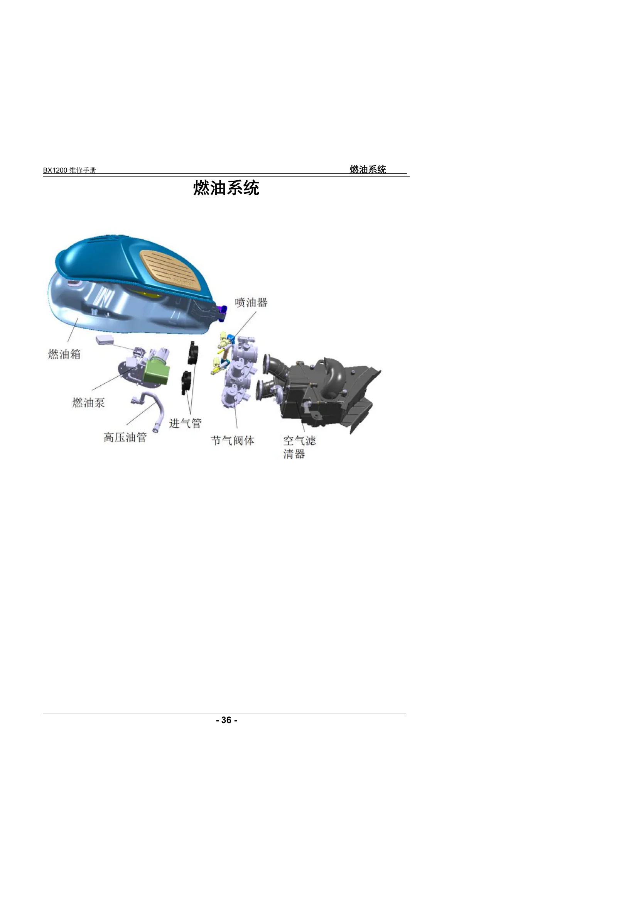

**----- Start of picture text -----** 
燃油系统 **----- End of picture text -----** 

**----- Start of picture text -----** 
BX1200  维修手册 燃油系统 **----- End of picture text -----** 

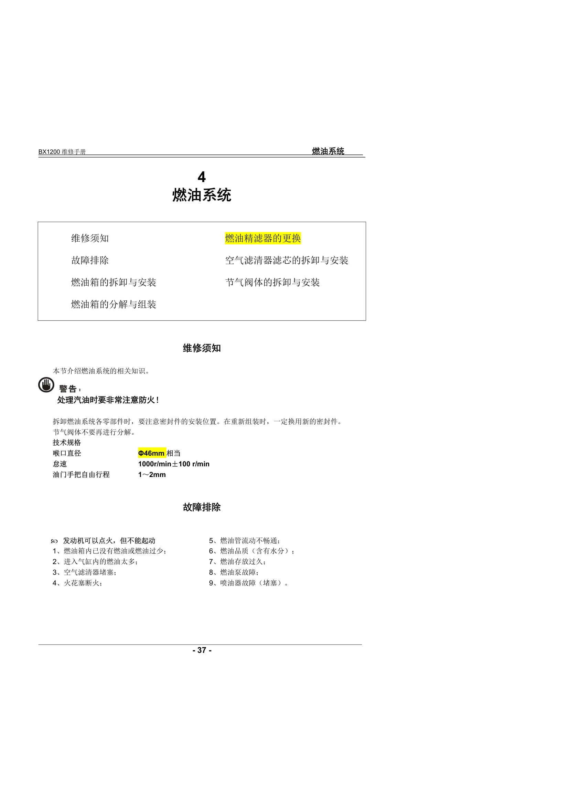

**----- Start of picture text -----** 
BX1200  维修手册 **----- End of picture text -----** 

**----- Start of picture text -----** 
燃油系统 **----- End of picture text -----** 

## **4** 燃油系统 

维修须知燃油精滤器的更换故障排除空气滤清器滤芯的拆卸与安装燃油箱的拆卸与安装节气阀体的拆卸与安装燃油箱的分解与组装 

## 维修须知 

本节介绍燃油系统的相关知识。 

## 处理汽油时要非常注意防火！ 

拆卸燃油系统各零部件时，要注意密封件的安装位置。在重新组装时，一定换用新的密封件。节气阀体不要再进行分解。 

技术规格 

喉口直径 **Φ46mm** 相当怠速 **1000r/min** ± **100 r/min** 油门手把自由行程 **1** ～ **2mm** 

## 故障排除 

- 发动机可以点火，但不能起动 5 、燃油管流动不畅通； 

- 1 、燃油箱内已没有燃油或燃油过少； 6 、燃油品质（含有水分）； 

- 2 、进入气缸内的燃油太多； 

- 3 、空气滤清器堵塞； 

   - 7 、燃油存放过久； 

   - 8 、燃油泵故障； 

- 4 、火花塞断火； 9 、喷油器故障（堵塞）。 

燃油系统 

## 燃油箱的拆卸与安装 

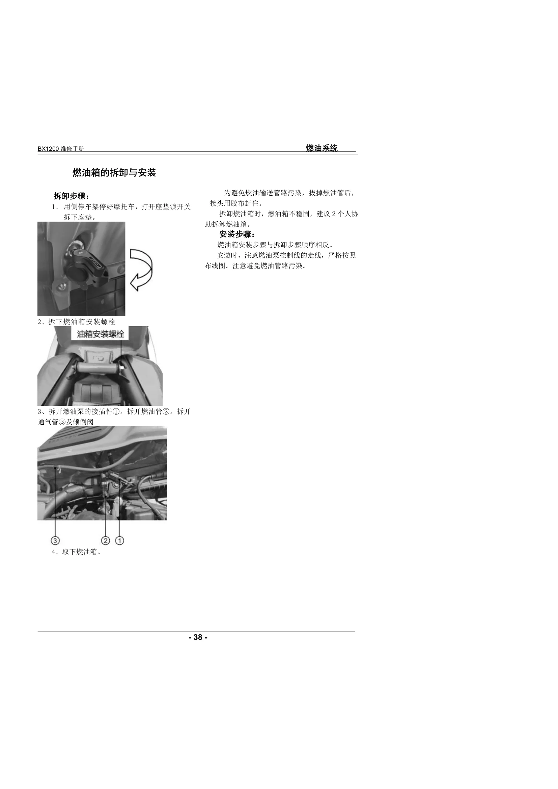

**----- Start of picture text -----** 
拆卸步骤： 1、用侧停车架停好摩托车，打开座垫锁开关 拆下座垫。 2、拆下燃油箱安装螺栓 3、拆开燃油泵的接插件①。拆开燃油管②。拆开 通气管③及倾倒阀 4、取下燃油箱。 **----- End of picture text -----** 

为避免燃油输送管路污染，拔掉燃油管后，接头用胶布封住。拆卸燃油箱时，燃油箱不稳固，建议2 个人协助拆卸燃油箱。安装步骤：燃油箱安装步骤与拆卸步骤顺序相反。安装时，注意燃油泵控制线的走线，严格按照布线图。注意避免燃油管路污染。 

燃油系统 

## 燃油箱的拆卸/安装 

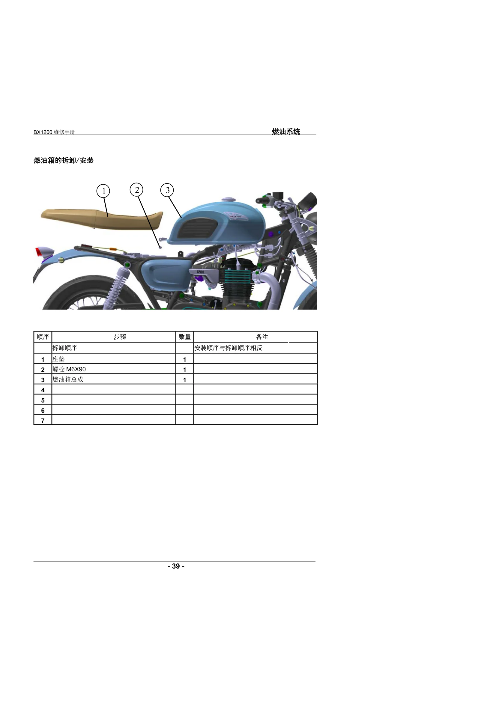

**----- Start of picture text -----** 
1 2 3 **----- End of picture text -----** 

|顺序|步骤|数量|备注 ~~1~~|
|---|---|---|---|
||拆卸顺序||安装顺序与拆卸顺序相反 |
|**1**|座垫|**1**||
|**2**|螺栓M6X90|**1**||
|**3**|燃油箱总成|**1**||
|**4**||||
|**5**||||
|**6**||||
|**7**||||

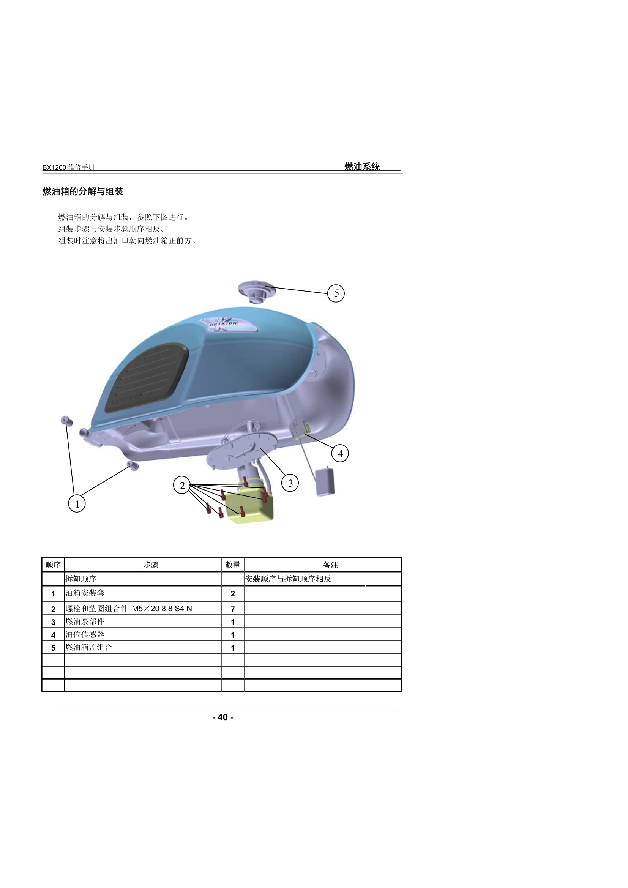

**----- Start of picture text -----** 
燃油系统 **----- End of picture text -----** 

## 燃油箱的分解与组装 

**----- Start of picture text -----** 
燃油箱的分解与组装，参照下图进行。 组装步骤与安装步骤顺序相反。 组装时注意将出油口朝向燃油箱正前方。 5 4 2 3 1 **----- End of picture text -----** 

|顺序|步骤|数量|备注|
|---|---|---|---|
||拆卸顺序||安装顺序与拆卸顺序相反 ~~4~~|
|**1**|油箱安装套|**2**||
|**2**|螺栓和垫圈组合件M5×20 8.8 S4 N|**7**||
|**3**|燃油泵部件|**1**||
|**4**|油位传感器|**1**||
|**5**|燃油箱盖组合|**1**||
|||||
|||||
|||||
|||||
|**- 40 -** 2||||

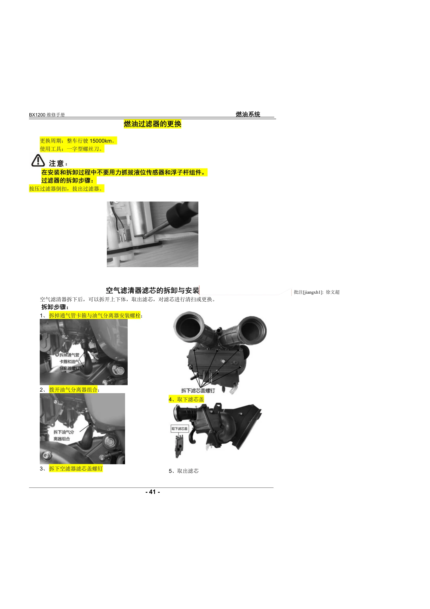

**----- Start of picture text -----** 
BX1200  维修手册燃油系统 燃油过滤器的更换 更换周期：整车行驶 15000km 。 使用工具：一字型螺丝刀。 在安装和拆卸过程中不要用力抓拔液位传感器和浮子杆组件。 过滤器的拆卸步骤： 按压过滤器倒扣，拔出过滤器。 **----- End of picture text -----** 

## 空气滤清器滤芯的拆卸与安装 

批注[jiangxh1]: 徐文超 

空气滤清器拆下后，可以拆开上下体，取出滤芯，对滤芯进行清扫或更换。 

**----- Start of picture text -----** 
拆卸步骤： **----- End of picture text -----** 

**----- Start of picture text -----** 
1 、拆掉通气管卡箍与油气分离器安装螺栓； 2 、拨开油气分离器组合； 4 、取下滤芯盖 3 、拆下空滤器滤芯盖螺钉 5 、取出滤芯 **----- End of picture text -----** 

**----- Start of picture text -----** 
- 41 - **----- End of picture text -----** 

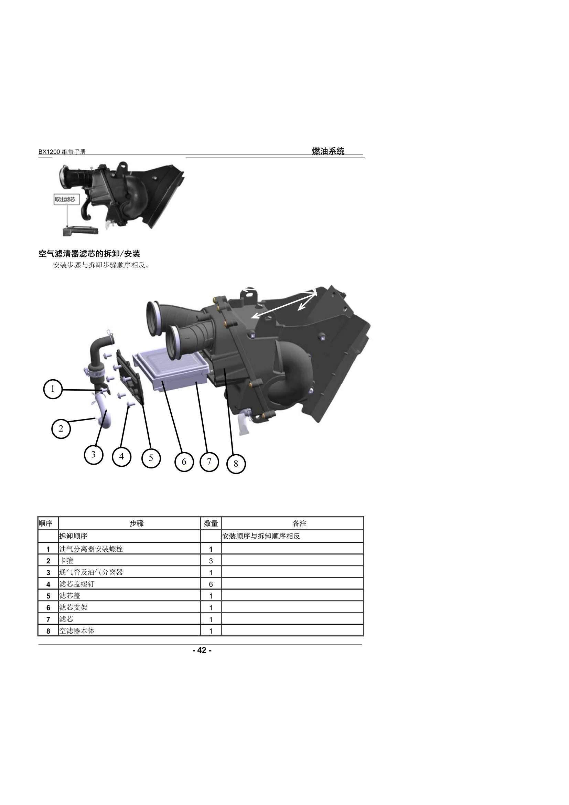

**----- Start of picture text -----** 
BX1200  维修手册燃油系统 空气滤清器滤芯的拆卸/安装 安装步骤与拆卸步骤顺序相反。 1 2 3 4 5 6 7 8 **----- End of picture text -----** 

|顺序|步骤|数量|备注|
|---|---|---|---|
||拆卸顺序||安装顺序与拆卸顺序相反 1|
|**1**|油气分离器安装螺栓|**1**||
|**2**|卡箍|3||
|**3**|通气管及油气分离器|1||
|**4**|滤芯盖螺钉|6||
|**5**|滤芯盖|1||
|**6**|滤芯支架|1||
|**7**|滤芯|1||
|**8**|空滤器本体|1||
|||||
|**- 42 -**||||

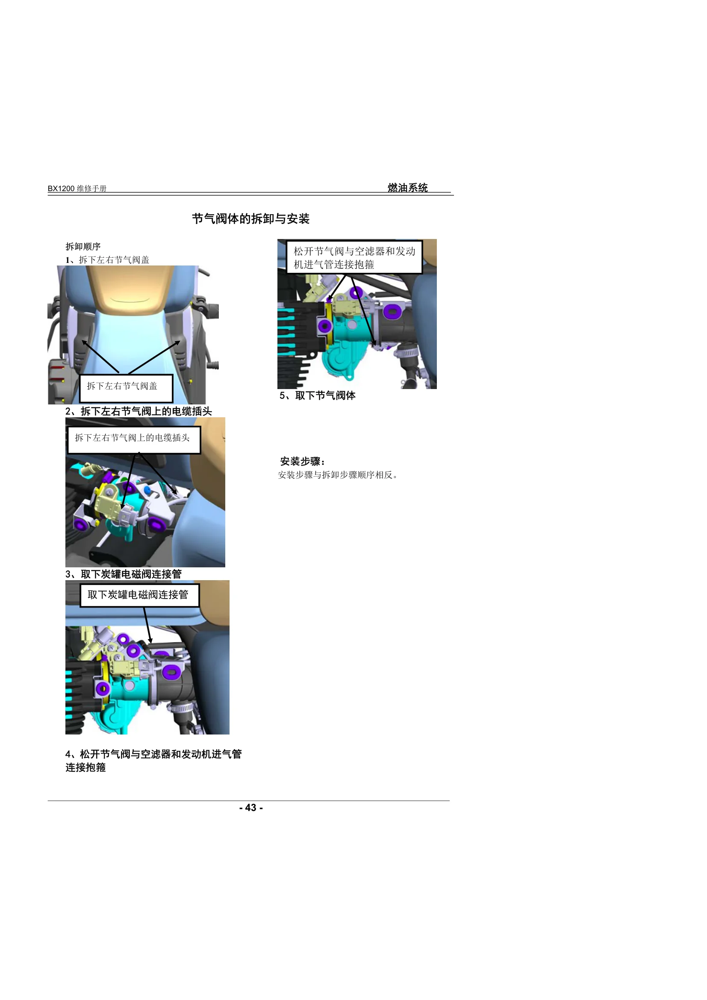

**----- Start of picture text -----** 
BX1200  维修手册 **----- End of picture text -----** 

**----- Start of picture text -----** 
燃油系统 **----- End of picture text -----** 

## 节气阀体的拆卸与安装 

**----- Start of picture text -----** 
拆卸顺序 1 、拆下左右节气阀盖 拆下左右节气阀盖 2、拆下左右节气阀上的电缆插头 拆下左右节气阀上的电缆插头 3、取下炭罐电磁阀连接管 取下炭罐电磁阀连接管 4、松开节气阀与空滤器和发动机进气管 连接抱箍 **----- End of picture text -----** 

**----- Start of picture text -----** 
松开节气阀与空滤器和发动 机进气管连接抱箍 5、取下节气阀体 安装步骤： 安装步骤与拆卸步骤顺序相反。 **----- End of picture text -----** 

燃油系统 

|||1|||||||1||
|---|---|---|---|---|---|---|---|---|---|---|
|||||||3|||||
|||5|||||||||
|4|||||||||||
|||6 2|5||||1||||
||||||||||||
|顺序|||步骤||||数量||备注||
|||拆卸顺序|||||||安装顺序与拆卸顺序相反||
|**1**||拆卸节气阀左右盖组合|||||各**1**||||
|**2** **3**||拆掉节气阀电缆接插 取下炭罐电磁阀连接管||~~3~~ 3|~~3~~|||**4** **1**|||
|**4**||松开节气阀与发动机进气管连接处抱箍||||||**2**|||
|**5**||松开节气阀与空滤器连接管处抱箍||||||**2**|||
|**6**||取下节气阀体||||||**2**|||
||拆下的节气阀体不要进一步的分解，若其上的若干传感器需更换，请在EMS系统专家的指导下进行。||||||||||

冷却系统 

## 冷却系统 

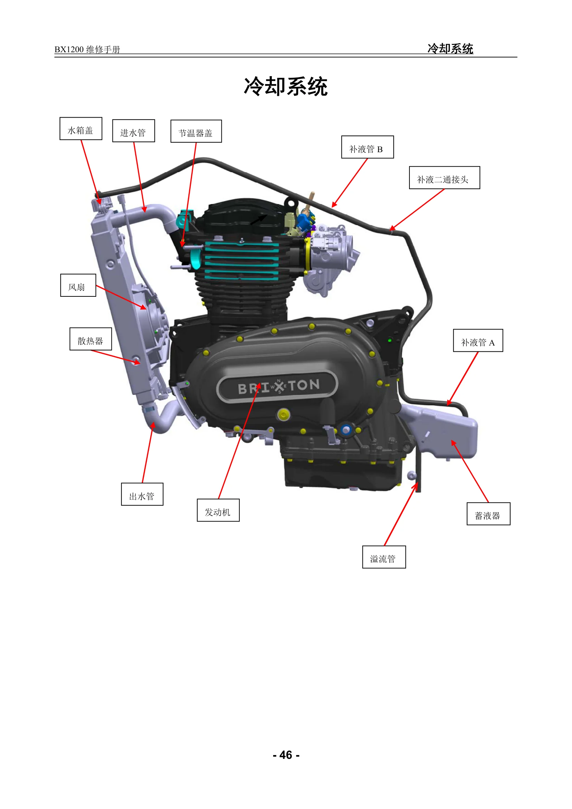

**----- Start of picture text -----** 
水箱盖进水管节温器盖 补液管 B 补液二通接头 风扇 散热器补液管 A 出水管 发动机 蓄液器 溢流管 **----- End of picture text -----** 

冷却系统 

## **5** 

## 冷却系统 

维修须知油水泵故障排除节温器性能检查冷却电气系统散热器 

## 维修须知 

本部分的维护，一定要在冷或低温下进行。 

本部分的维护可在车上进行。 

冷却液的补充由蓄液器进行。散热器盖除了在冷却系统拆卸之后所进行的冷却液再次补充，或者抽出散热器之外，不得拆卸。 

在检查、维修之后，使用散热器检测器对各个连接部分，以及密封部分进行有无漏水的检查。 

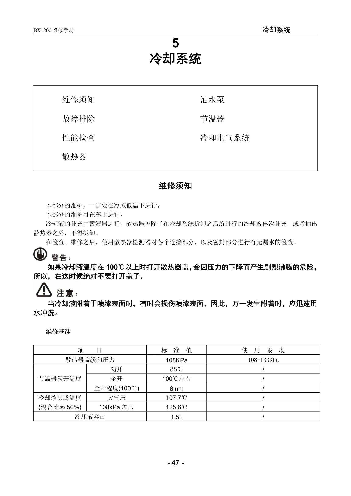

## 如果冷却液温度在 **100** ℃以上时打开散热器盖，会因压力的下降而产生剧烈沸腾的危险，所以，在这时候绝对不要打开盖子。 

当冷却液附着于喷漆表面时，有时会损伤喷漆表面，因此，万一发生附着时，应迅速用水冲洗。 

## 维修基准 

|项 目|项 目|标 准 值|使 用 限 度|
|---|---|---|---|
|散热器盖缓和压力||108KPa|108-133KPa|
|节温器阀开温度|初开|88℃|/|
||全开|100℃左右|/|
||全开程度(100℃)|8mm|/|
|冷却液沸腾温度 (混合比率50%)|大气压|107.7℃|/|
||108kPa 加压|125.6℃|/|
|冷却液容量||1.5L|/|

冷却系统 

## 冷却液混合比率表 

|使用地区最低气温|使用地区最低气温|混合比率|混合比率|防冻剂（**ml**）|纯水（**ml**）|
|---|---|---|---|---|---|
||-9℃||20%|300|1200|
||-16℃||30%|450|1050|
||-25℃||40%|600|900|
||**-37**℃||**50%**|**750**|**750**|
|-44.5℃|||55%|825|675|

## 加粗字为本车出厂时冷却液加注的混合比率。 

补充时，使用高金指定的冷却液。避免与其他牌号的冷却液混合。本冷却液具有毒性，绝对不可饮用。对于使用地区的最低气温，应该选择具有 -5 ℃左右余地的混合比率。 

## 故障排除 

- 水温上升过高 

   - 1 、风扇开关不良； 

   - 2 、散热器盖不良； 

   - 3 、节温器不良； 

   - 4 、冷却液太少； 

   - 5 、水喉管或者水管套堵塞； 

   - 6 、散热器叶片堵塞； 

   - 7 、散热器堵塞； 

   - 水温上升不了或者上升不佳 

      - 1 、风扇开关不良； 

      - 2 、节温器不良； 

      - 3 、电缆短路。 

   - 漏水 

      - 1 、机械密封不良； 

      - 2 、O 型圈类的劣化、粘着不良； 

      - 3 、水喉管损伤、劣化。 

- 8 、油水泵异常； 

- 9 、电缆短路。 

冷却系统 

## 性能检查 

## 散热器盖的检查 

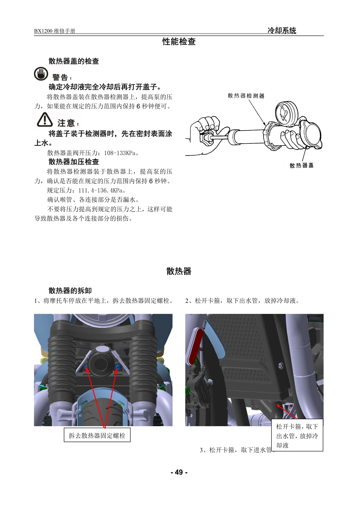

## 确定冷却液完全冷却后再打开盖子。 

将散热器盖装在散热器检测器上，提高泵的压 

- 力，如果能在规定的压力范围内保持 6 秒钟便可。 

## 将盖子装于检测器时，先在密封表面涂 

## 上水。 

散热器盖阀开压力：108-133KPa。散热器加压检查 

- 将散热器检测器装于散热器上，提高泵的压 

- 力，确认是否能在规定的压力范围内保持 6 秒钟。规定压力：111.4-136.4KPa。 

   - 确认喉管、各连接部分是否漏水。 

   - 不要将压力提高到规定的压力之上，这样可能 

- 导致散热器及各个连接部分的损伤。 

## 散热器 

## 散热器的拆卸 

1、将摩托车停放在平地上，拆去散热器固定螺栓。 2、松开卡箍，取下出水管，放掉冷却液。 

**----- Start of picture text -----** 
拆去散热器固定螺栓 **----- End of picture text -----** 

**----- Start of picture text -----** 
松开卡箍，取下 出水管，放掉冷 却液 3、松开卡箍，取下进水管。 **----- End of picture text -----** 

冷却系统 

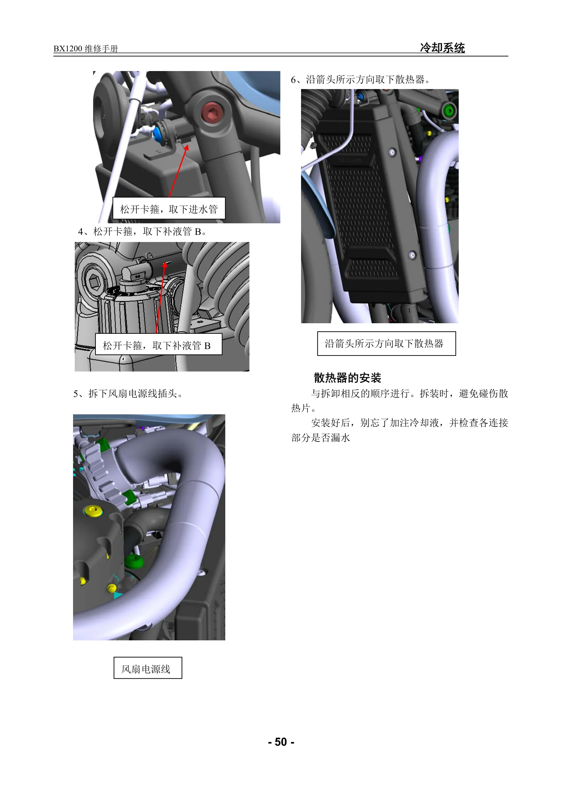

松开卡箍，取下进水管 

- 4、松开卡箍，取下补液管 B。 

**----- Start of picture text -----** 
松开卡箍，取下补液管 B **----- End of picture text -----** 

## 6、沿箭头所示方向取下散热器。 

沿箭头所示方向取下散热器 

## 散热器的安装 

## 5、拆下风扇电源线插头。 

与拆卸相反的顺序进行。拆装时，避免碰伤散热片。 

安装好后，别忘了加注冷却液，并检查各连接部分是否漏水 

风扇电源线 

冷却系统 

## 散热器的拆卸/安装 

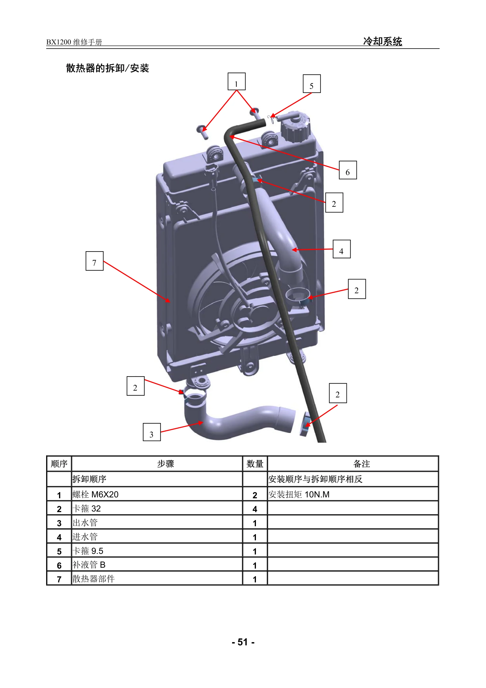

**----- Start of picture text -----** 
1 5 6 2 4 7 2 2 2 3 **----- End of picture text -----** 

|顺序|步骤|数量|备注|
|---|---|---|---|
||拆卸顺序||安装顺序与拆卸顺序相反|
|**1**|螺栓M6X20|**2**|安装扭矩10N.M|
|**2**|卡箍32|**4**||
|**3**|出水管|**1**||
|**4**|进水管|**1**||
|**5**|卡箍9.5|**1**||
|**6**|补液管B|**1**||
|**7**|散热器部件|**1**||

冷却系统 

## 散热器部件的分解/组装 

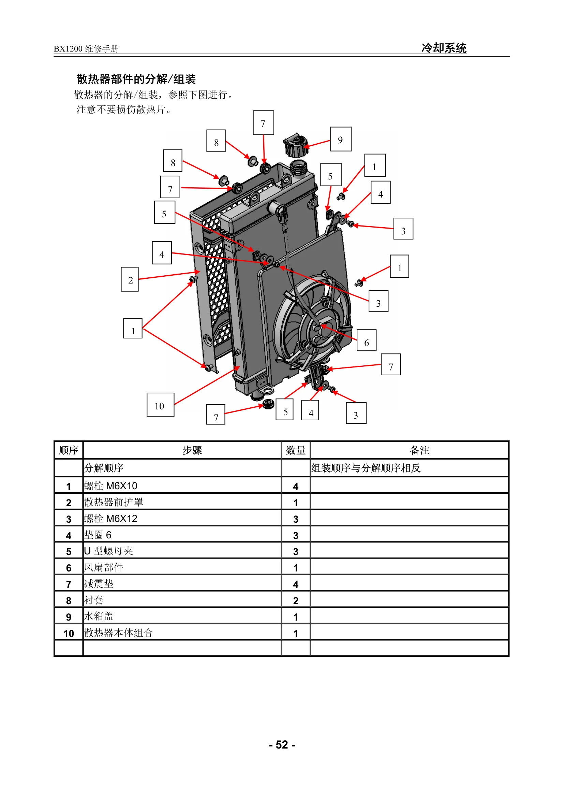

**----- Start of picture text -----** 
散热器的分解/组装，参照下图进行。 注意不要损伤散热片。 7 8 9 8 1 5 7 4 5 3 4 1 2 3 1 6 7 10 7 5 4 3 **----- End of picture text -----** 

|顺序|步骤|数量|备注|
|---|---|---|---|
||分解顺序||组装顺序与分解顺序相反|
|**1**|螺栓M6X10|**4**||
|**2**|散热器前护罩|**1**||
|**3**|螺栓M6X12|**3**||
|**4**|垫圈6|**3**||
|**5**|U型螺母夹|**3**||
|**6**|风扇部件|**1**||
|**7**|减震垫|**4**||
|**8**|衬套|**2**||
|**9**|水箱盖|**1**||
|**10**|散热器本体组合|**1**||
|||||

冷却系统 

## 油水泵 

当油水泵出现故障时，需拆下进行维修或更换。本部分包括以下主要内容：油水泵的拆卸步骤及图解；油水泵的安装步骤；油水泵的分解与组装等。注意：油泵和水泵为一个总成，不能分离。油水泵的拆卸步骤及图解： 

- ·排放冷却液。 

- ·放掉发动机机油。 

- ·拆卸油底壳。 

- ·拆卸离合器。 

- 1、取下粗滤组合。 

- 2、取下粗滤组合密封圈并扔掉。 

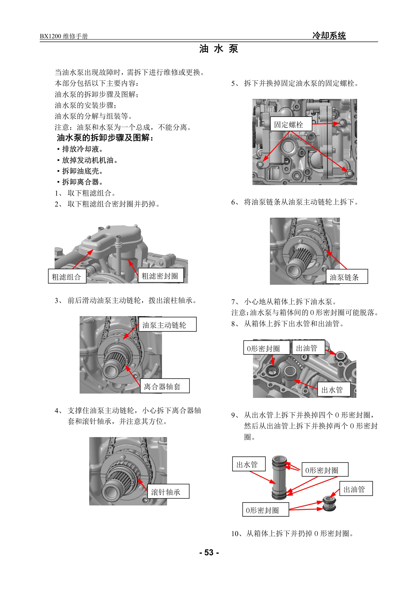

**----- Start of picture text -----** 
粗滤组合粗滤密封圈 **----- End of picture text -----** 

- 5、拆下并换掉固定油水泵的固定螺栓。 

**----- Start of picture text -----** 
固定螺栓 、将油泵链条从油泵主动链轮上拆下。 油泵链条 **----- End of picture text -----** 

   - 6、将油泵链条从油泵主动链轮上拆下。 

- 3、前后滑动油泵主动链轮，拨出滚柱轴承。 

**----- Start of picture text -----** 
油泵主动链轮 离合器轴套 **----- End of picture text -----** 

- 7、小心地从箱体上拆下油水泵。注意：油水泵与箱体间的O 形密封圈可能脱落。 

- 8、从箱体上拆下出水管和出油管。 

**----- Start of picture text -----** 
O形密封圈出油管 出水管 **----- End of picture text -----** 

- 4、支撑住油泵主动链轮，小心拆下离合器轴套和滚针轴承，并注意其方位。 

**----- Start of picture text -----** 
滚针轴承 **----- End of picture text -----** 

- 9、从出水管上拆下并换掉四个O 形密封圈，然后从出油管上拆下并换掉两个O 形密封圈。 

**----- Start of picture text -----** 
出水管 O形密封圈 出油管 O形密封圈 **----- End of picture text -----** 

- 10、从箱体上拆下并扔掉O 形密封圈。 

冷却系统 

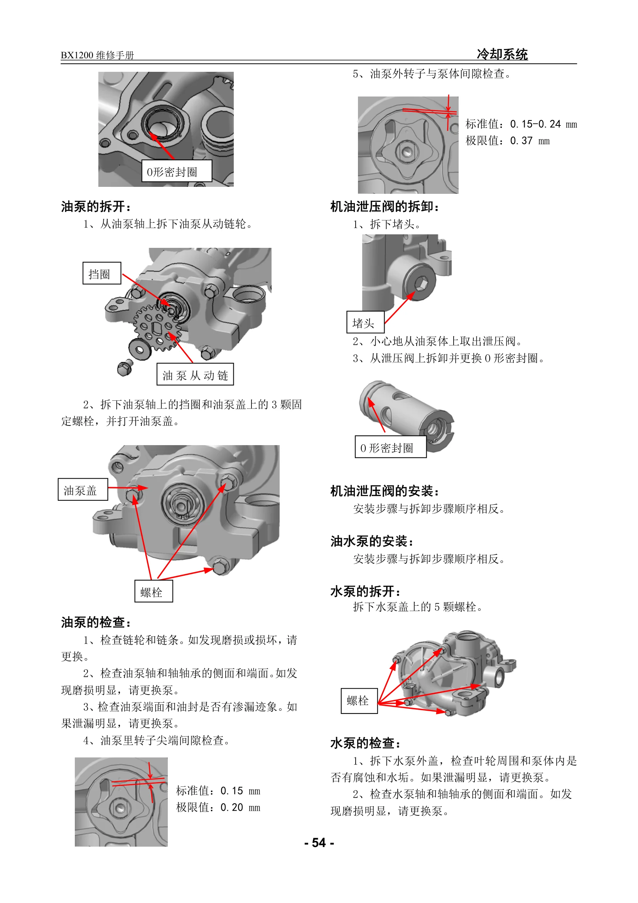

**----- Start of picture text -----** 
O形密封圈 **----- End of picture text -----** 

## 油泵的拆开： 

- 1、从油泵轴上拆下油泵从动链轮。 

**----- Start of picture text -----** 
挡圈 油泵从动链 **----- End of picture text -----** 

- 2、拆下油泵轴上的挡圈和油泵盖上的3 颗固 

- 定螺栓，并打开油泵盖。 

**----- Start of picture text -----** 
油泵盖 螺栓 **----- End of picture text -----** 

## 5、油泵外转子与泵体间隙检查。 

标准值：0.15-0.24 mm 极限值：0.37 mm 

## 机油泄压阀的拆卸： 

- 1、拆下堵头。 

**----- Start of picture text -----** 
堵头 **----- End of picture text -----** 

- 2、小心地从油泵体上取出泄压阀。 

- 3、从泄压阀上拆卸并更换O 形密封圈。 

**----- Start of picture text -----** 
O 形密封圈 **----- End of picture text -----** 

## 机油泄压阀的安装： 

安装步骤与拆卸步骤顺序相反。 

## 油水泵的安装： 

安装步骤与拆卸步骤顺序相反。 

## 水泵的拆开： 

拆下水泵盖上的5 颗螺栓。 

## 油泵的检查： 

- 1、检查链轮和链条。如发现磨损或损坏，请 

- 更换。 

- 2、检查油泵轴和轴轴承的侧面和端面。如发 

- 现磨损明显，请更换泵。 

- 3、检查油泵端面和油封是否有渗漏迹象。如 

- 果泄漏明显，请更换泵。 

   - 4、油泵里转子尖端间隙检查。 

标准值：0.15 mm 极限值：0.20 mm 

**----- Start of picture text -----** 
螺栓 **----- End of picture text -----** 

## 水泵的检查： 

1、拆下水泵外盖，检查叶轮周围和泵体内是否有腐蚀和水垢。如果泄漏明显，请更换泵。 

2、检查水泵轴和轴轴承的侧面和端面。如发现磨损明显，请更换泵。 

冷却系统 

- 3、检查水泵端面和水封是否有渗漏迹象。如 

- 果泄漏明显，请更换泵。 

## 节温器 

## 节温器的拆装 

## 节温器的检查 

使用工具松开固定螺栓，拆去节温器盖，拔出节温器。 

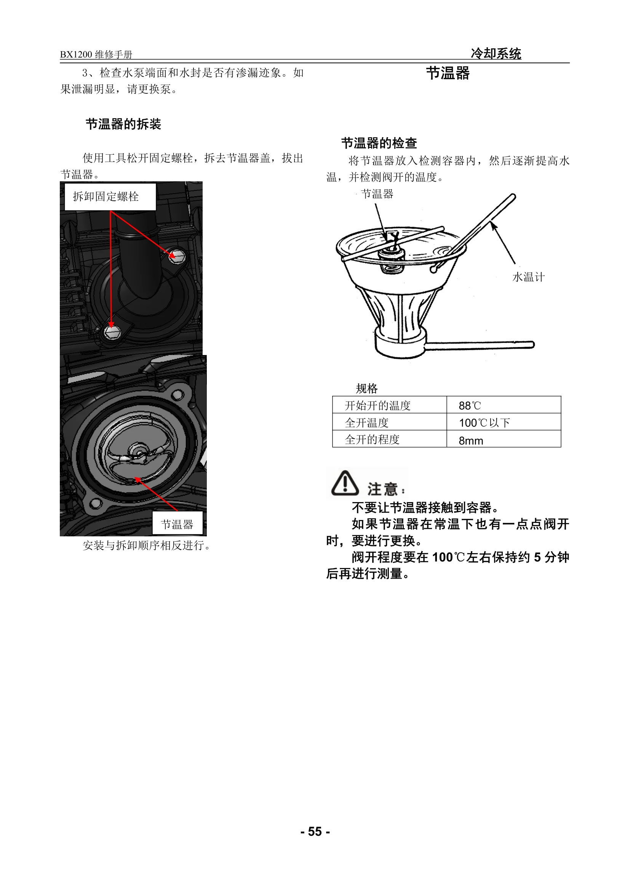

**----- Start of picture text -----** 
拆卸固定螺栓 **----- End of picture text -----** 

**----- Start of picture text -----** 
节温器 **----- End of picture text -----** 

安装与拆卸顺序相反进行。 

## 将节温器放入检测容器内，然后逐渐提高水温，并检测阀开的温度。 

**----- Start of picture text -----** 
节温器 水温计 **----- End of picture text -----** 

## 规格 

|规格||
|---|---|
|开始开的温度|88℃|
|全开温度|100℃以下|
|全开的程度|8mm|

## 不要让节温器接触到容器。 

如果节温器在常温下也有一点点阀开时，要进行更换。 

阀开程度要在 **100** ℃左右保持约 **5** 分钟后再进行测量。 

冷却系统 

## 节温器的拆卸/安装 

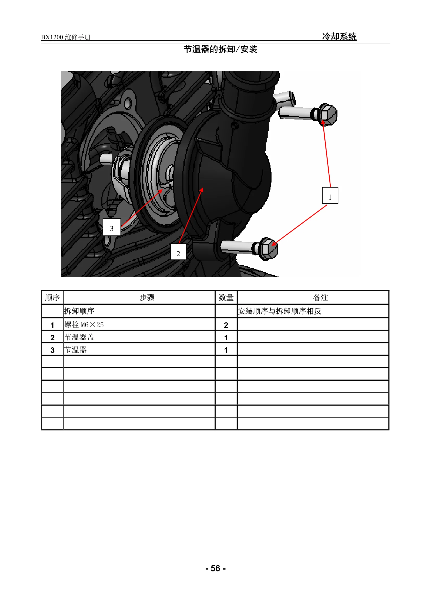

**----- Start of picture text -----** 
1 3 2 **----- End of picture text -----** 

|顺序|步骤|数量|备注|
|---|---|---|---|
||拆卸顺序||安装顺序与拆卸顺序相反|
|**1**|螺栓M6×25|**2**||
|**2**|节温器盖|**1**||
|**3**|节温器|**1**||
|||||
|||||
|||||
|||||
|||||
|||||

冷却系统 

## 冷却电气系统 

## 概述 

- 当发动机工作温度达到一个限值时，冷却液将通过散热器循环，温度继续升高，通过 ECU 控制，接通风扇电源，风扇旋转工作，带走冷却液循环中的发动机热量，水温下降，至设定停转温度，风扇停止运转。 

## 电路原理图 

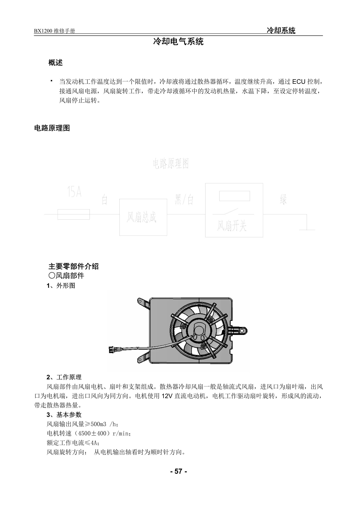

## 主要零部件介绍 

○风扇部件 

**1** 、外形图 

## **2** 、工作原理 

风扇部件由风扇电机、扇叶和支架组成。散热器冷却风扇一般是轴流式风扇，进风口为扇叶端，出风口为电机端，进出口风向为同方向。电机使用 12V 直流电动机，电机工作驱动扇叶旋转，形成风的流动，带走散热器热量。 

**3** 、基本参数风扇输出风量≥500m3 /h；电机转速（4500±400）r/min；额定工作电流≤4A； 

风扇旋转方向：从电机输出轴看时为顺时针方向。 

冷却系统 

**4** 、故障模式风扇电机开路失效；风扇电机短路失效；扇叶与支架干涉，风扇运转时噪音大；扇叶与电机轴连接处打滑；支架断裂。 

## 主要故障诊断 

|故障现象|可能引起的原因|解决方法|
|---|---|---|
|水温已报警风扇仍不转|线路断路； 风扇开关断路失效； 风扇电机失效； 扇叶被卡住或打滑。|连接修复； 更换风扇开关； 更换风扇电机； 检查修复。|
|风扇常转|线路短路； 风扇开关断路失效|维修排除； 更换风扇开关|
|风扇噪音过大|扇叶与支架干涉； 扇叶松动或断裂； 支架断裂。|检查维修； 紧固或更换； 更换支架。|

发动机拆卸及安装 

## **6** 发动机拆卸及安装 

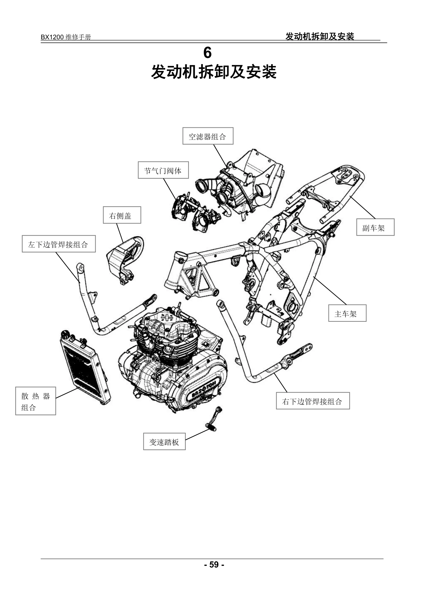

**----- Start of picture text -----** 
空滤器组合 节气门阀体 右侧盖 副车架 左下边管焊接组合 6 主车架 散热器 右下边管焊接组合 组合 变速踏板 **----- End of picture text -----** 

发动机拆卸及安装 

## 发动机拆卸及安装 

维修须知 

发动机的安装 

发动机的拆卸 

## 维修须知 

- 只有在对发动机的曲轴、平衡轴、传动部分等进行维护（剖箱）时，才有必要将发动机从车架上拆卸 

- 下来。维护发动机其他部分时，不必将发动机从车架上拆卸下来。 

   - 拆卸发动机前，摩托车以侧支架支撑在平地上，放尽冷却水、发动机润滑油。 

   - 如需维护气缸头、气缸体、活塞等热机部分，需拆卸覆盖件、油箱、散热器、节气阀体等。安装的顺序与拆卸顺序相反。 

安装恢复时，所有线管需按布线图布线，拆下的箍带需更换新的。 

## 规格 

发动机净重量 **87kg** 发动机油量 **3.2L** 冷却水容量 **1.5L** 

## 重要扭矩值 

发动机悬挂螺栓 **M12** ： **70** ～ **85N.m** 

发动机拆卸及安装 

## 发动机的拆卸 

摩托车停放在平地上，放尽冷却水、发动机润滑油。 

拆下覆盖件、油箱、消音器、散热器（参见相关章节）。 

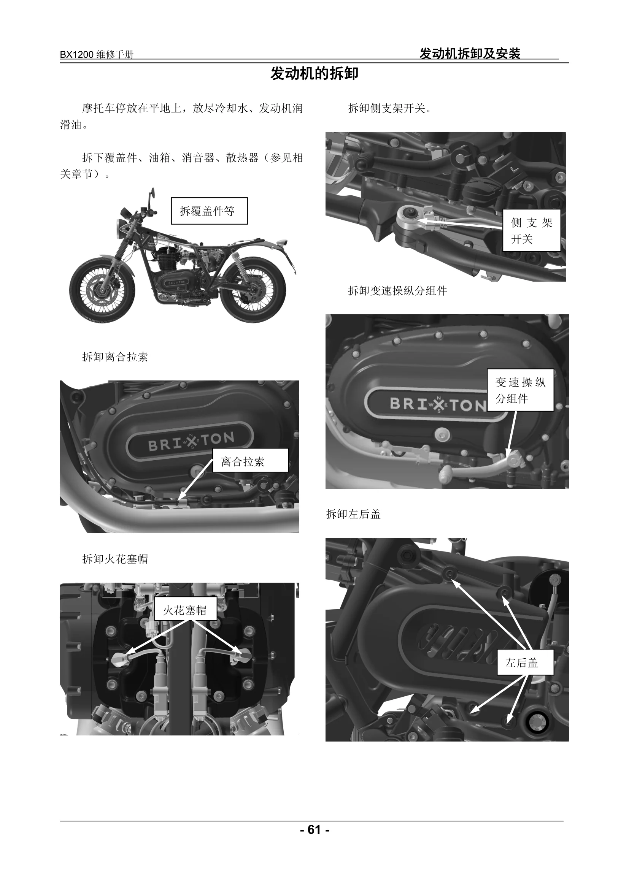

**----- Start of picture text -----** 
拆覆盖件等 **----- End of picture text -----** 

拆卸离合拉索 

**----- Start of picture text -----** 
离合拉索 **----- End of picture text -----** 

拆卸火花塞帽 

**----- Start of picture text -----** 
火花塞帽 **----- End of picture text -----** 

拆卸侧支架开关。 

**----- Start of picture text -----** 
侧支架 开关 **----- End of picture text -----** 

拆卸变速操纵分组件 

**----- Start of picture text -----** 
变速操纵 分组件 **----- End of picture text -----** 

拆卸左后盖 

**----- Start of picture text -----** 
左后盖 **----- End of picture text -----** 

发动机拆卸及安装 

## 拆下驱动链条 

## 拆下喷油器线 

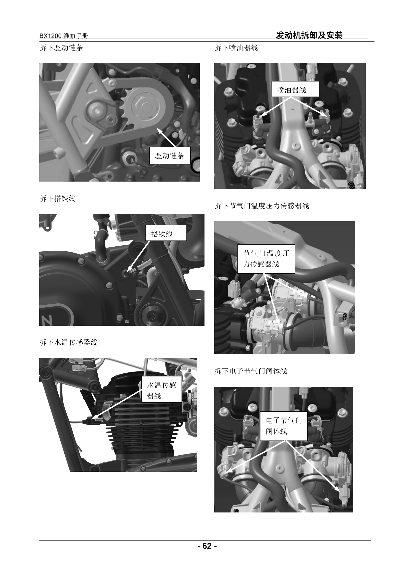

**----- Start of picture text -----** 
喷油器线 驱动链条 **----- End of picture text -----** 

拆下搭铁线 

拆下节气门温度压力传感器线 

**----- Start of picture text -----** 
搭铁线 **----- End of picture text -----** 

## 拆下水温传感器线 

**----- Start of picture text -----** 
水温传感 器线 **----- End of picture text -----** 

**----- Start of picture text -----** 
节气门温度压 力传感器线 **----- End of picture text -----** 

拆下电子节气门阀体线 

**----- Start of picture text -----** 
电子节气门 阀体线 **----- End of picture text -----** 

发动机拆卸及安装 

## 拆下调压整流器 

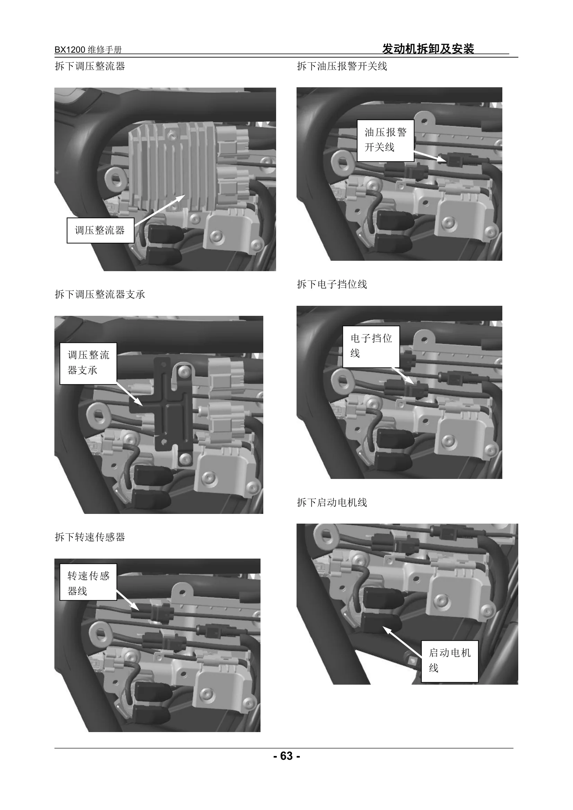

**----- Start of picture text -----** 
调压整流器 **----- End of picture text -----** 

## 拆下油压报警开关线 

**----- Start of picture text -----** 
油压报警 开关线 **----- End of picture text -----** 

拆下电子挡位线 

## 拆下调压整流器支承 

**----- Start of picture text -----** 
调压整流 器支承 **----- End of picture text -----** 

拆下转速传感器 

**----- Start of picture text -----** 
转速传感 器线 **----- End of picture text -----** 

**----- Start of picture text -----** 
电子挡位 线 拆下启动电机线 启动电机 线 **----- End of picture text -----** 

发动机拆卸及安装 

拆下电池正极线 

## 拆下左前下管焊接组合 

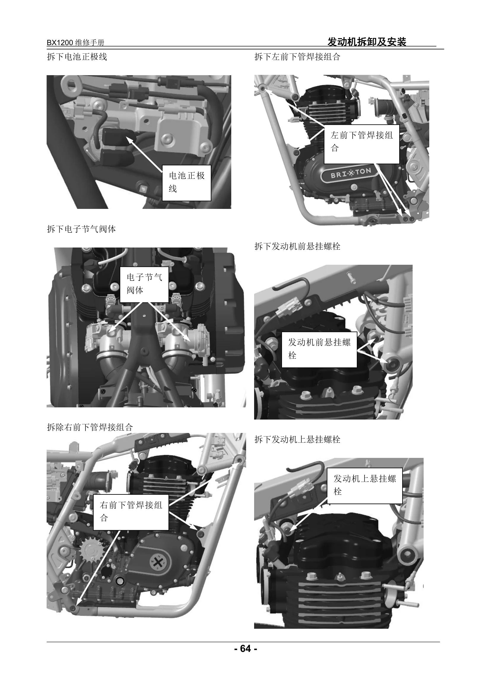

**----- Start of picture text -----** 
电池正极 线 **----- End of picture text -----** 

## 拆下电子节气阀体 

**----- Start of picture text -----** 
电子节气 阀体 **----- End of picture text -----** 

**----- Start of picture text -----** 
左前下管焊接组 合 **----- End of picture text -----** 

## 拆下发动机前悬挂螺栓 

**----- Start of picture text -----** 
发动机前悬挂螺 栓 **----- End of picture text -----** 

## 拆除右前下管焊接组合 

**----- Start of picture text -----** 
拆下发动机上悬挂螺栓 发动机上悬挂螺 栓 右前下管焊接组 合 **----- End of picture text -----** 

发动机拆卸及安装 

## 拆下发动机后悬挂螺栓 

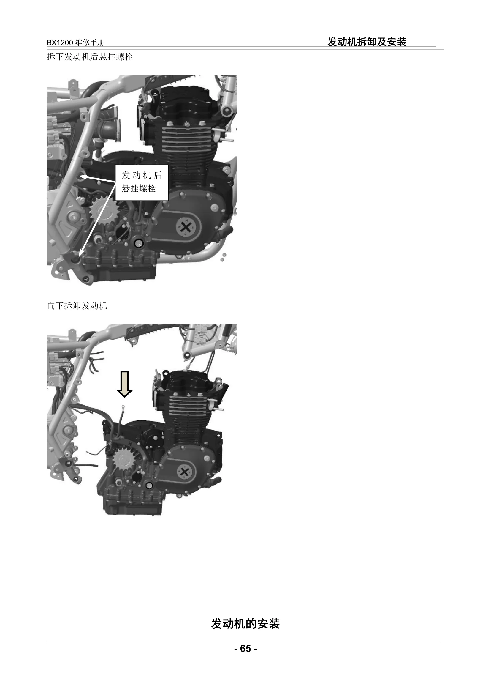

**----- Start of picture text -----** 
发动机后 悬挂螺栓 **----- End of picture text -----** 

## 向下拆卸发动机 

## 发动机的安装 

发动机拆卸及安装 

## 发动机的安装顺序与拆卸顺序相反。 

## 在安装过程中，安装时注意线缆，布线按照布线图进行布置。 

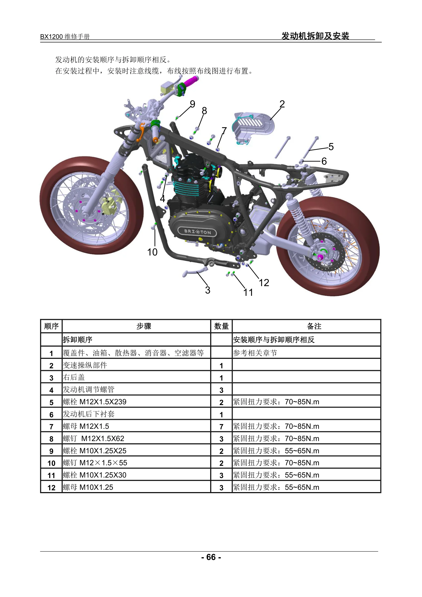

**----- Start of picture text -----** 
9 2 8 7 5 6 4 10 12 3 11 **----- End of picture text -----** 

|顺序|步骤|数量|备注|
|---|---|---|---|
||拆卸顺序||安装顺序与拆卸顺序相反|
|**1**|覆盖件、油箱、散热器、消音器、空滤器等||参考相关章节|
|**2**|变速操纵部件|**1**||
|**3**|右后盖|**1**||
|**4**|发动机调节螺管|**3**||
|**5**|螺栓M12X1.5X239|**2**|紧固扭力要求：70~85N.m|
|**6**|发动机后下衬套|**1**||
|**7**|螺母M12X1.5|**7**|紧固扭力要求：70~85N.m|
|**8**|螺钉M12X1.5X62|**3**|紧固扭力要求：70~85N.m|
|**9**|螺栓M10X1.25X25|**2**|紧固扭力要求：55~65N.m|
|**10**|螺钉M12×1.5×55|**2**|紧固扭力要求：70~85N.m|
|**11**|螺栓M10X1.25X30|**3**|紧固扭力要求：55~65N.m|
|**12**|螺母M10X1.25|**3**|紧固扭力要求：55~65N.m|

气缸头系统 

## 气缸头系统 

维修须知凸轮轴维修基准表气门间隙调整张紧器气缸头正时链条和正时惰轮气门正时链条导向板 

## 维修须知 

进行本部分的维护检修时，一般是发动机热机系统出现问题，需要如更换活塞、调整气门间隙等操作。需要先拆卸气缸头盖和右前盖等零部件才能进行。 

在装配之前，请检查所有油道是否通畅并进行清理。 

用清洗剂清洁所有零部件，并用压缩空气吹干，最后对有相对运动的零部件配合处涂抹机油。如凸轮轴轴径、凸桃等。 

气缸头系统 

## 气缸头和气门技术规格及维修基准 

|气缸头 气门杆径 气门导管孔径 气门与气门导管 间隙 气门与气门座圈 配合宽度 气门座圈宽度 气门弹簧力值 气门间隙|平面度|0.03 mm|
|---|---|---|
||进气|4.975 ~ 4.990 mm（标准值）|
|||4.965 mm（极限值）|
||排气|4.970 ~ 4.980 mm（标准值）|
|||4.960 mm（极限值）|
||进气|5.000 ~ 5.015 mm（标准值）|
|||5.043 mm（极限值）|
||排气|5.000 ~ 5.015 mm（标准值）|
|||5.043 mm（极限值）|
||进气|0.010 ~ 0.040 mm（标准值）|
|||0.078 mm（极限值）|
||排气|0.020 ~ 0.045 mm（标准值）|
|||0.083 mm（极限值）|
||进气|1.200 ~ 1.300 mm（标准值）|
|||1.700 mm（极限值）|
||排气|1.200 ~ 1.300 mm（标准值）|
|||1.700 mm（极限值）|
|||1.50~1.85 mm|
|||214±10 N / 39.5 mm|
||进气|0.05~0.13 mm|
||排气|0.08~0.18 mm|

## 凸轮轴技术规格及维修基准 

|凸轮轴轴径|22.930~22.960 mm|
|---|---|
|凸轮轴轴径与凸轮轴座孔径间隙|0.040 ~ 0.091 mm（标准值）|
||0.130 mm（极限值）|
|凸轮轴座孔径|23.000~23.021 mm|
|凸轮轴窜动|0.05 ~ 0.20 mm（标准值）|
|凸轮轴跳动|0.015 mm（标准值）|

气缸头系统 

## 张紧器 

## 张紧器拆卸： 

- 1、旋转曲轴，用工具从磁电机转子通孔处，插入上曲轴箱体和曲轴相应孔内。 

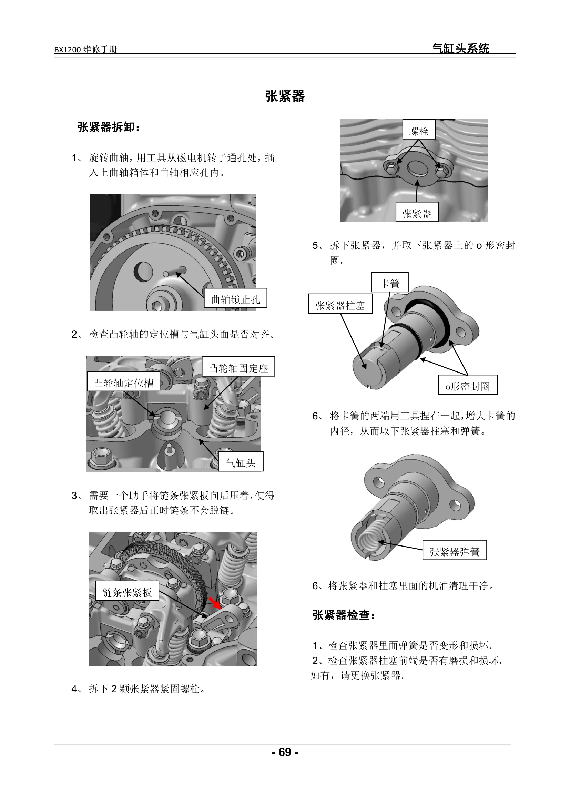

**----- Start of picture text -----** 
曲轴锁止孔 **----- End of picture text -----** 

- 2、检查凸轮轴的定位槽与气缸头面是否对齐。 

**----- Start of picture text -----** 
凸轮轴固定座 凸轮轴定位槽 气缸头 **----- End of picture text -----** 

- 3、需要一个助手将链条张紧板向后压着，使得取出张紧器后正时链条不会脱链。 

**----- Start of picture text -----** 
链条张紧板 **----- End of picture text -----** 

**----- Start of picture text -----** 
螺栓 张紧器 **----- End of picture text -----** 

- 5、拆下张紧器，并取下张紧器上的 o 形密封圈。 

**----- Start of picture text -----** 
卡簧 张紧器柱塞 o形密封圈 **----- End of picture text -----** 

- 6、将卡簧的两端用工具捏在一起，增大卡簧的内径，从而取下张紧器柱塞和弹簧。 

**----- Start of picture text -----** 
张紧器弹簧 **----- End of picture text -----** 

- 6、将张紧器和柱塞里面的机油清理干净。 

## 张紧器检查： 

   - 1、检查张紧器里面弹簧是否变形和损坏。 

   - 2、检查张紧器柱塞前端是否有磨损和损坏。 

   - 如有，请更换张紧器。 

- 4、拆下 2 颗张紧器紧固螺栓。 

气缸头系统 

## 张紧器安装： 

- 1、将张紧器和柱塞里面机油排出。 

- 2、装入卡簧和张紧器弹簧。 

- 3、将卡簧的两端用工具捏在一起，增大卡簧的内径，从而装上张紧器柱塞。 

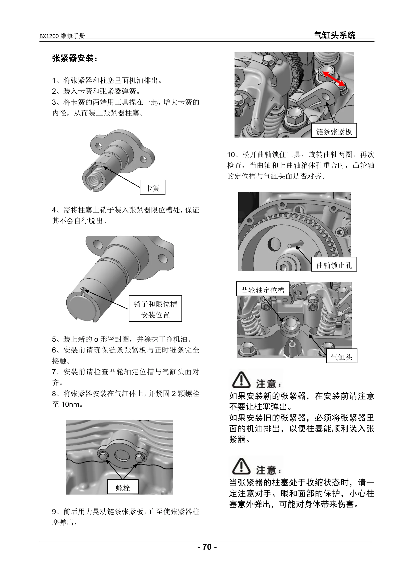

**----- Start of picture text -----** 
卡簧 **----- End of picture text -----** 

- 4、需将柱塞上销子装入张紧器限位槽处，保证其不会自行脱出。 

**----- Start of picture text -----** 
销子和限位槽 安装位置 **----- End of picture text -----** 

- 5、装上新的 o 形密封圈，并涂抹干净机油。 

- 6、安装前请确保链条张紧板与正时链条完全接触。 

- 7、安装前请检查凸轮轴定位槽与气缸头面对齐。 

- 8、将张紧器安装在气缸体上，并紧固 2 颗螺栓至 10nm。 

**----- Start of picture text -----** 
螺栓 **----- End of picture text -----** 

- 9、前后用力晃动链条张紧板，直至使张紧器柱塞弹出。 

**----- Start of picture text -----** 
链条张紧板 **----- End of picture text -----** 

10、松开曲轴锁住工具，旋转曲轴两圈，再次检查，当曲轴和上曲轴箱体孔重合时，凸轮轴的定位槽与气缸头面是否对齐。 

**----- Start of picture text -----** 
曲轴锁止孔 凸轮轴定位槽 气缸头 **----- End of picture text -----** 

如果安装新的张紧器，在安装前请注意不要让柱塞弹出。 

如果安装旧的张紧器，必须将张紧器里面的机油排出，以便柱塞能顺利装入张紧器。 

当张紧器的柱塞处于收缩状态时，请一定注意对手、眼和面部的保护，小心柱塞意外弹出，可能对身体带来伤害。 

气缸头系统 

## 正时链条和正时惰轮 

## 正时链条和正时惰轮拆卸： 

## 正时链条检查： 

- 1、拆下气缸头、气缸体。 

- 2、拆下右前盖及磁电机转子。 

- 3、转动曲轴，使得正时惰轮上的定位孔与上曲轴箱体的孔对齐。并使用工具将惰轮主副轴锁住。 

- 1、检查链条是否有烧蚀出现的变色。 

- 2、检查所有销钉有无松动。 

- 3、检查外链板是否开裂或深度划伤。 

- 4、检查内链板是否有严重的磨损情况。 

- 5、如有必要和条件请检查链条的伸长情况。 

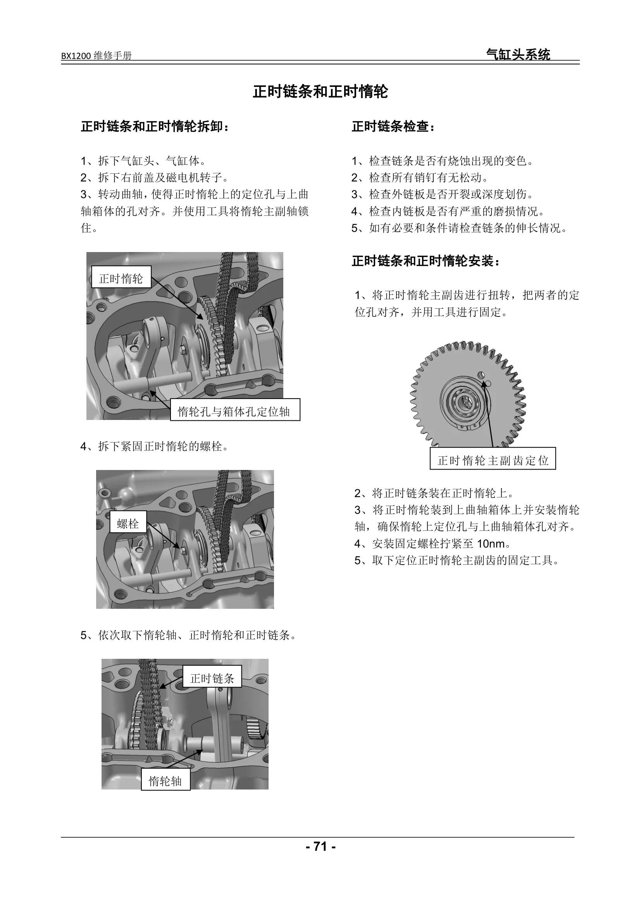

**----- Start of picture text -----** 
正时惰轮 惰轮孔与箱体孔定位轴 **----- End of picture text -----** 

- 4、拆下紧固正时惰轮的螺栓。 

**----- Start of picture text -----** 
螺栓 **----- End of picture text -----** 

## 正时链条和正时惰轮安装： 

- 1、将正时惰轮主副齿进行扭转，把两者的定位孔对齐，并用工具进行固定。 

**----- Start of picture text -----** 
正时惰轮主副齿定位 **----- End of picture text -----** 

   - 2、将正时链条装在正时惰轮上。 

   - 3、将正时惰轮装到上曲轴箱体上并安装惰轮轴，确保惰轮上定位孔与上曲轴箱体孔对齐。 

   - 4、安装固定螺栓拧紧至 10nm。 

   - 5、取下定位正时惰轮主副齿的固定工具。 

- 5、依次取下惰轮轴、正时惰轮和正时链条。 

**----- Start of picture text -----** 
正时链条 惰轮轴 **----- End of picture text -----** 

气缸头系统 

## 正时链条导向板 

## 正时链条导向板拆卸： 

- 1、将发动机曲轴旋转至正时位置，用工具插入上曲轴箱体和惰轮的定位孔。 

- 2、拆下气缸头。 

- 3、直接将正时链条导向板取下。 

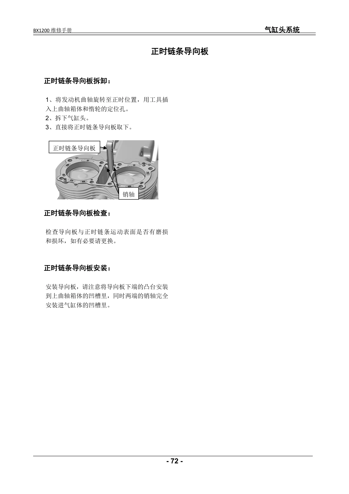

**----- Start of picture text -----** 
正时链条导向板 销轴 **----- End of picture text -----** 

## 正时链条导向板检查： 

检查导向板与正时链条运动表面是否有磨损和损坏，如有必要请更换。 

## 正时链条导向板安装： 

安装导向板，请注意将导向板下端的凸台安装到上曲轴箱体的凹槽里，同时两端的销轴完全安装进气缸体的凹槽里。 

气缸头系统 

## 凸轮轴 

## 凸轮轴拆卸： 

   - 8、将正时链条从凸轮轴上拆下。 

   - 9、将凸轮轴向右滑动，从气缸头上取下。 

- 1、旋转曲轴，用工具从磁电机转子通孔处，插入上曲轴箱体和曲轴相应孔内。 

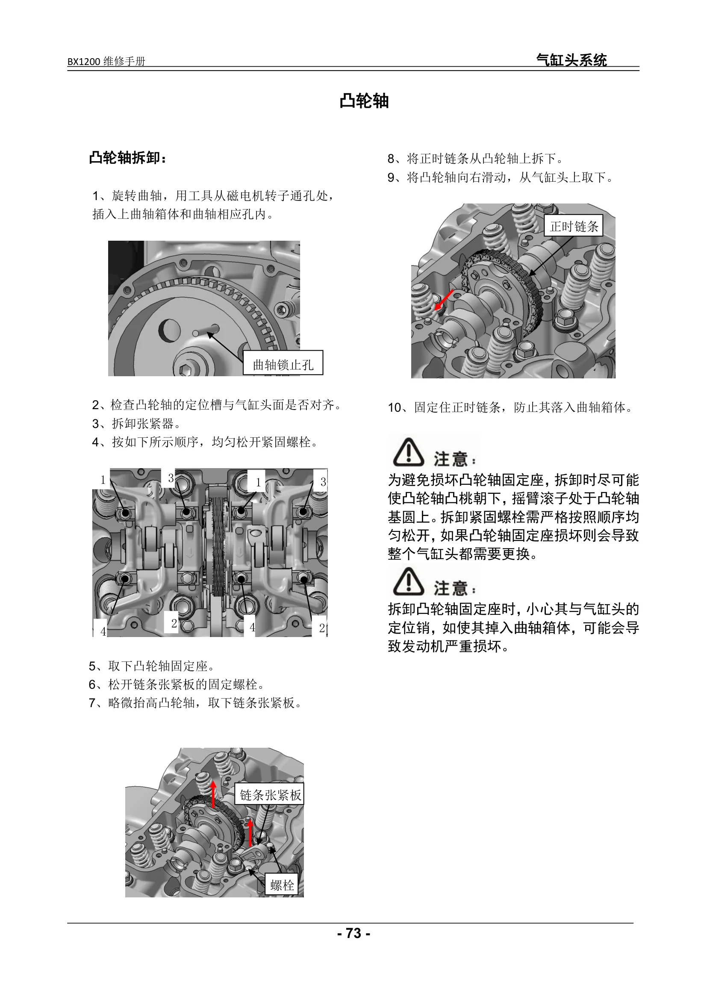

**----- Start of picture text -----** 
曲轴锁止孔 **----- End of picture text -----** 

**----- Start of picture text -----** 
正时链条 **----- End of picture text -----** 

- 2、检查凸轮轴的定位槽与气缸头面是否对齐。 

   - 10、固定住正时链条，防止其落入曲轴箱体。 

- 3、拆卸张紧器。 

- 4、按如下所示顺序，均匀松开紧固螺栓。 

**----- Start of picture text -----** 
1 3 1 3 2 4 4 2 **----- End of picture text -----** 

为避免损坏凸轮轴固定座，拆卸时尽可能使凸轮轴凸桃朝下，摇臂滚子处于凸轮轴基圆上。拆卸紧固螺栓需严格按照顺序均匀松开，如果凸轮轴固定座损坏则会导致整个气缸头都需要更换。 

拆卸凸轮轴固定座时，小心其与气缸头的定位销，如使其掉入曲轴箱体，可能会导致发动机严重损坏。 

- 5、取下凸轮轴固定座。 

- 6、松开链条张紧板的固定螺栓。 

- 7、略微抬高凸轮轴，取下链条张紧板。 

**----- Start of picture text -----** 
链条张紧板 螺栓 **----- End of picture text -----** 

气缸头系统 

## 凸轮轴检查： 

- 1、检查凸轮轴上从动链轮是否损坏、磨损或断齿。 

- 2、检查气缸头和凸轮轴固定座与凸轮轴配合的内孔表面，如发现有磨损或损坏，则必须更换气缸头和凸轮轴固定座。 

- 3、检查正时链条磨损情况。 

- 4、检查凸轮轴排气减压机构工作是否正常。 

- 5、测量凸轮轴轴径和其配合的孔径，计算其配合间隙。如配合间隙超出规定，则需要更换整个气缸头。 

## 凸轮轴安装 

- 1、安装上曲轴箱体和曲轴相对应孔的定位销轴。 

- 2、彻底清洁凸轮轴和轴颈，在安装前请用干净的机油涂抹。 

- 3、如安装新的凸轮轴，则需要将从动链轮固定螺栓取下。 

- 4、将凸轮轴从其右侧放入气缸头上，把正时链条挂入从动链轮上。 

- 5、将凸轮轴端面的定位槽对准气缸头上表面。 

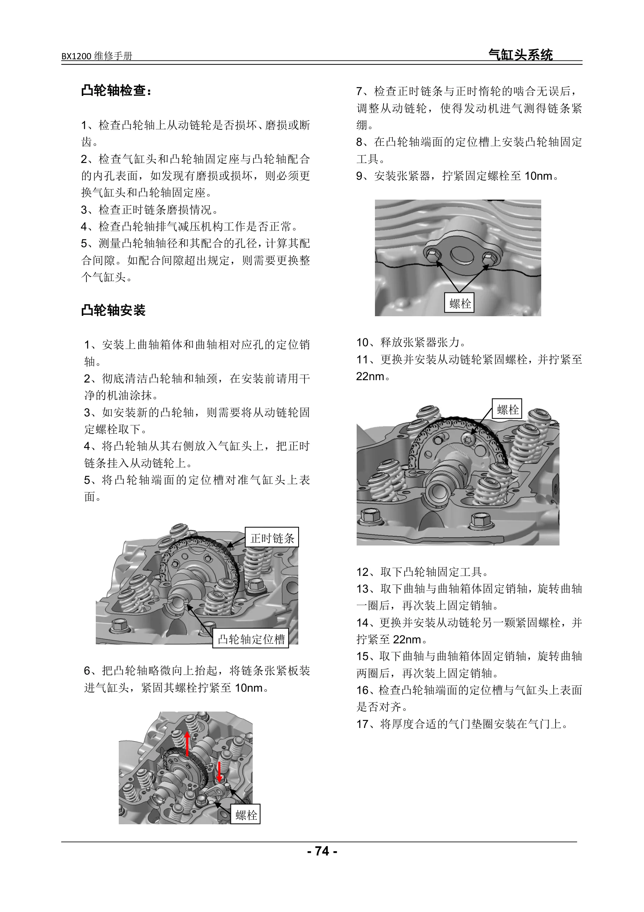

**----- Start of picture text -----** 
正时链条 凸轮轴定位槽 **----- End of picture text -----** 

- 6、把凸轮轴略微向上抬起，将链条张紧板装进气缸头，紧固其螺栓拧紧至 10nm。 

**----- Start of picture text -----** 
螺栓 **----- End of picture text -----** 

- 7、检查正时链条与正时惰轮的啮合无误后，调整从动链轮，使得发动机进气测得链条紧绷。 

- 8、在凸轮轴端面的定位槽上安装凸轮轴固定工具。 

- 9、安装张紧器，拧紧固定螺栓至 10nm。 

**----- Start of picture text -----** 
螺栓 **----- End of picture text -----** 

## 10、释放张紧器张力。 

- 11、更换并安装从动链轮紧固螺栓，并拧紧至 22nm。 

**----- Start of picture text -----** 
螺栓 **----- End of picture text -----** 

- 12、取下凸轮轴固定工具。 

- 13、取下曲轴与曲轴箱体固定销轴，旋转曲轴一圈后，再次装上固定销轴。 

- 14、更换并安装从动链轮另一颗紧固螺栓，并拧紧至 22nm。 

- 15、取下曲轴与曲轴箱体固定销轴，旋转曲轴两圈后，再次装上固定销轴。 

- 16、检查凸轮轴端面的定位槽与气缸头上表面是否对齐。 

- 17、将厚度合适的气门垫圈安装在气门上。 

气缸头系统 

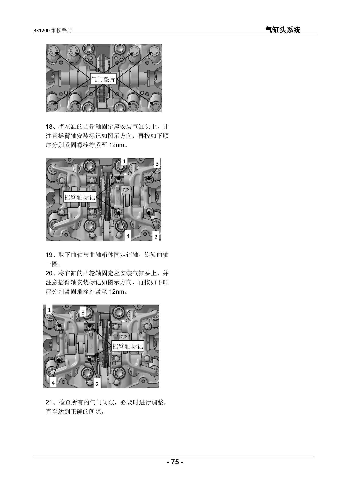

**----- Start of picture text -----** 
气门垫片 **----- End of picture text -----** 

18、将左缸的凸轮轴固定座安装气缸头上，并注意摇臂轴安装标记如图示方向，再按如下顺序分别紧固螺栓拧紧至 12nm。 

**----- Start of picture text -----** 
1 3 摇臂轴标记 4 2 **----- End of picture text -----** 

19、取下曲轴与曲轴箱体固定销轴，旋转曲轴一圈。 

20、将右缸的凸轮轴固定座安装气缸头上，并注意摇臂轴安装标记如图示方向，再按如下顺序分别紧固螺栓拧紧至 12nm。 

**----- Start of picture text -----** 
1 3 摇臂轴标记 4 2 **----- End of picture text -----** 

- 21、检查所有的气门间隙，必要时进行调整，直至达到正确的间隙。 

气缸头系统 

## 气门间隙调整 

凸轮轴、气门、气门垫片和气门座圈均存在工作的磨损，这种磨损会改变摇臂和气门垫片之间的间隙，造成发动机噪声或工作不正常。会对气门机构中的零件造成永久损伤，从而影响发动机性能。 

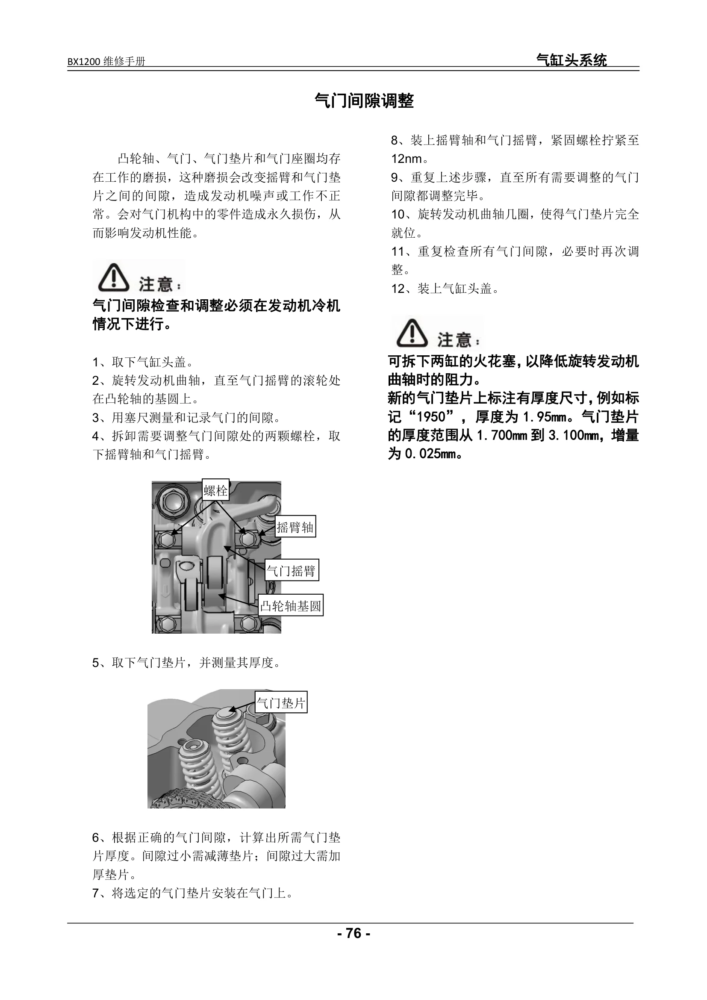

## 气门间隙检查和调整必须在发动机冷机情况下进行。 

- 1、取下气缸头盖。 

- 2、旋转发动机曲轴，直至气门摇臂的滚轮处在凸轮轴的基圆上。 

- 3、用塞尺测量和记录气门的间隙。 

- 4、拆卸需要调整气门间隙处的两颗螺栓，取下摇臂轴和气门摇臂。 

- 8、装上摇臂轴和气门摇臂，紧固螺栓拧紧至 12nm。 

- 9、重复上述步骤，直至所有需要调整的气门间隙都调整完毕。 

- 10、旋转发动机曲轴几圈，使得气门垫片完全就位。 

- 11、重复检查所有气门间隙，必要时再次调整。 

- 12、装上气缸头盖。 

## 可拆下两缸的火花塞，以降低旋转发动机曲轴时的阻力。 

新的气门垫片上标注有厚度尺寸，例如标记“1950”，厚度为1.95mm。气门垫片的厚度范围从1.700mm 到3.100mm，增量为0.025mm。 

**----- Start of picture text -----** 
螺栓 摇臂轴 气门摇臂 凸轮轴基圆 **----- End of picture text -----** 

- 5、取下气门垫片，并测量其厚度。 

**----- Start of picture text -----** 
气门垫片 **----- End of picture text -----** 

- 6、根据正确的气门间隙，计算出所需气门垫片厚度。间隙过小需减薄垫片；间隙过大需加厚垫片。 

- 7、将选定的气门垫片安装在气门上。 

气缸头系统 

## 气缸头 

## 气缸头拆卸： 

## 气缸头安装： 

- 1、记录气门垫片的安装位置，小心地从气缸头上取下 8 颗气门垫片。 

- 2、按如下所示顺序逐步松开缸头螺栓。 

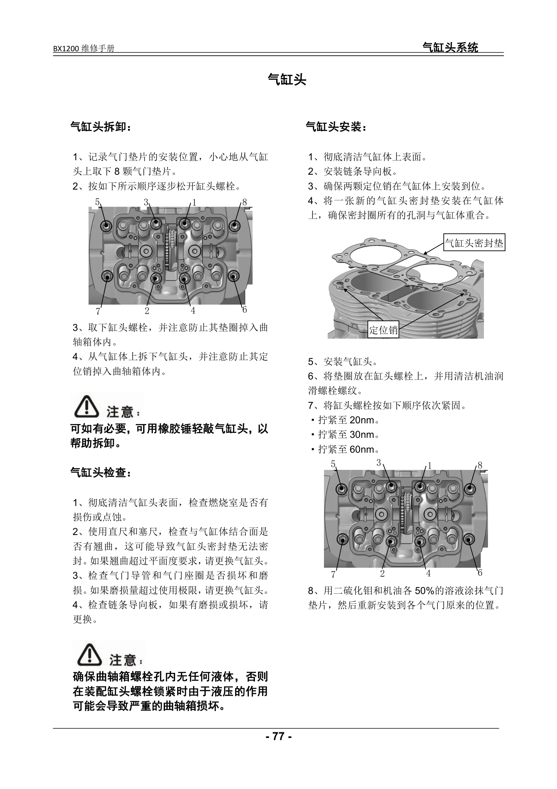

**----- Start of picture text -----** 
5 3 1 8 7 2 4 6 **----- End of picture text -----** 

- 3、取下缸头螺栓，并注意防止其垫圈掉入曲轴箱体内。 

- 4、从气缸体上拆下气缸头，并注意防止其定位销掉入曲轴箱体内。 

## 可如有必要，可用橡胶锤轻敲气缸头，以帮助拆卸。 

## 气缸头检查： 

- 1、彻底清洁气缸头表面，检查燃烧室是否有损伤或点蚀。 

- 2、使用直尺和塞尺，检查与气缸体结合面是否有翘曲，这可能导致气缸头密封垫无法密封。如果翘曲超过平面度要求，请更换气缸头。 

- 3、检查气门导管和气门座圈是否损坏和磨损。如果磨损量超过使用极限，请更换气缸头。 4、检查链条导向板，如果有磨损或损坏，请更换。 

- 1、彻底清洁气缸体上表面。 

- 2、安装链条导向板。 

- 3、确保两颗定位销在气缸体上安装到位。 

- 4、将一张新的气缸头密封垫安装在气缸体 

- 上，确保密封圈所有的孔洞与气缸体重合。 

**----- Start of picture text -----** 
气缸头密封垫 定位销 **----- End of picture text -----** 

- 5、安装气缸头。 

- 6、将垫圈放在缸头螺栓上，并用清洁机油润滑螺栓螺纹。 

- 7、将缸头螺栓按如下顺序依次紧固。 

- ·拧紧至 20nm。 

- ·拧紧至 30nm。 

- ·拧紧至 60nm。 

**----- Start of picture text -----** 
5 3 1 8 7 2 4 6 **----- End of picture text -----** 

- 8、用二硫化钼和机油各 50%的溶液涂抹气门垫片，然后重新安装到各个气门原来的位置。 

## 确保曲轴箱螺栓孔内无任何液体，否则在装配缸头螺栓锁紧时由于液压的作用可能会导致严重的曲轴箱损坏。 

气缸头系统 

## 气门 

## 气门拆卸与安装： 

- 1、采用专用工具将气缸头上气门取下。 

- 2、拆卸零件包括：气门锁夹、上弹簧座、气门弹簧、气门、挡油罩、下弹簧座。 

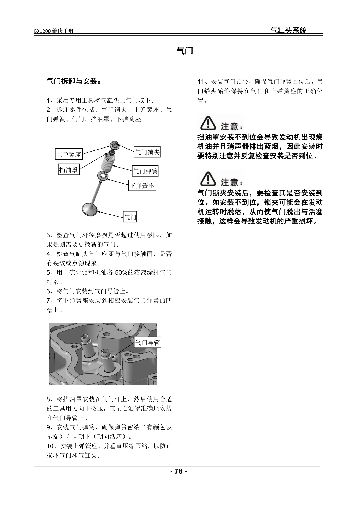

**----- Start of picture text -----** 
气门锁夹 上弹簧座 挡油罩气门弹簧 下弹簧座 气门 **----- End of picture text -----** 

11、安装气门锁夹，确保气门弹簧回位后，气门锁夹始终保持在气门和上弹簧座的正确位置。 

## 挡油罩安装不到位会导致发动机出现烧机油并且消声器排出蓝烟，因此安装时要特别注意并反复检查安装是否到位。 

气门锁夹安装后，要检查其是否安装到位。如安装不到位，锁夹可能会在发动机运转时脱落，从而使气门脱出与活塞接触，这样会导致发动机的严重损坏。 

- 3、检查气门杆径磨损是否超过使用极限，如果是则需要更换新的气门。 

- 4、检查气缸头气门座圈与气门接触面，是否有裂纹或点蚀现象。 

- 5、用二硫化钼和机油各 50%的溶液涂抹气门杆部。 

- 6、将气门安装到气门导管上。 

- 7、将下弹簧座安装到相应安装气门弹簧的凹槽上。 

**----- Start of picture text -----** 
气门导管 **----- End of picture text -----** 

- 8、将挡油罩安装在气门杆上，然后使用合适的工具用力向下按压，直至挡油罩准确地安装在气门导管上。 

- 9、安装气门弹簧，确保弹簧密端（有颜色表示端）方向朝下（朝向活塞）。 

- 10、安装上弹簧座，并垂直压缩压缩，以防止损坏气门和气缸头。 

离合器 

## 离合器 

维修须知离合器参数离合器拆卸 

摩擦盘和钢片检查离合器片组合高度检查离合器安装 

## 维修须知 

进行本部分的维护检修时，可以不必将发动机从车架上拆下。先拆去离合拉索线，松开左曲轴向盖螺栓并拆下左盖、将离合器从发动机上拆下，注意在拆卸时用干净的无纺布将左盖侧与箱体相通的孔进行遮挡，避免零件拆卸时不慎落入箱体内部。 

在装配之前，应用清洗剂清洁所有零部件，并用压缩空气吹干。 

装配离合器时，应松开离合器弹簧，在摩擦片上涂抹机油；若是更换新的离合器，摩擦片必须浸油 24h 以上方可装配。 

## 离合器参数 

|摩擦盘数量|8|
|---|---|
|离合器板平面度|0.15 mm（极限值）|
|摩擦盘平面度|0.20 mm（极限值）|
|摩擦盘厚度|2.90-3.10 mm（标准值）|
||2.80 mm（极限值）|
|离合器片组合高度|38.00 mm+0.34/-0.66 mm|

离合器 

## 离合器 

## 离合器拆卸： 

- 1、松开3 颗紧固螺栓，拆下压板和压盘。 

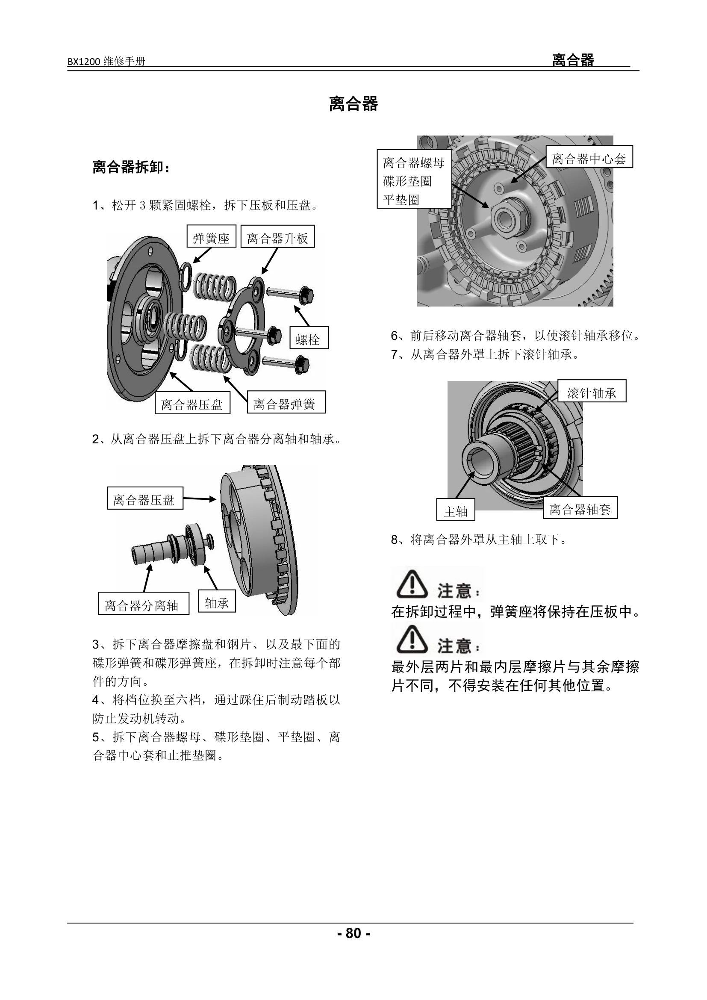

**----- Start of picture text -----** 
弹簧座离合器升板 螺栓 离合器压盘离合器弹簧 **----- End of picture text -----** 

- 2、从离合器压盘上拆下离合器分离轴和轴承。 

**----- Start of picture text -----** 
离合器压盘 离合器分离轴轴承 **----- End of picture text -----** 

- 3、拆下离合器摩擦盘和钢片、以及最下面的碟形弹簧和碟形弹簧座，在拆卸时注意每个部件的方向。 

**----- Start of picture text -----** 
离合器中心套 离合器螺母 碟形垫圈 平垫圈 **----- End of picture text -----** 

- 6、前后移动离合器轴套，以使滚针轴承移位。 

- 7、从离合器外罩上拆下滚针轴承。 

**----- Start of picture text -----** 
滚针轴承 主轴离合器轴套 **----- End of picture text -----** 

- 8、将离合器外罩从主轴上取下。 

在拆卸过程中，弹簧座将保持在压板中。 

最外层两片和最内层摩擦片与其余摩擦片不同，不得安装在任何其他位置。 

- 4、将档位换至六档，通过踩住后制动踏板以防止发动机转动。 

- 5、拆下离合器螺母、碟形垫圈、平垫圈、离合器中心套和止推垫圈。 

离合器 

## 摩擦盘和离合器板检查： 

1、测量离合器摩擦盘厚度。如果任何摩擦盘的厚度超过使用极限，就需要更换新的摩擦盘。 

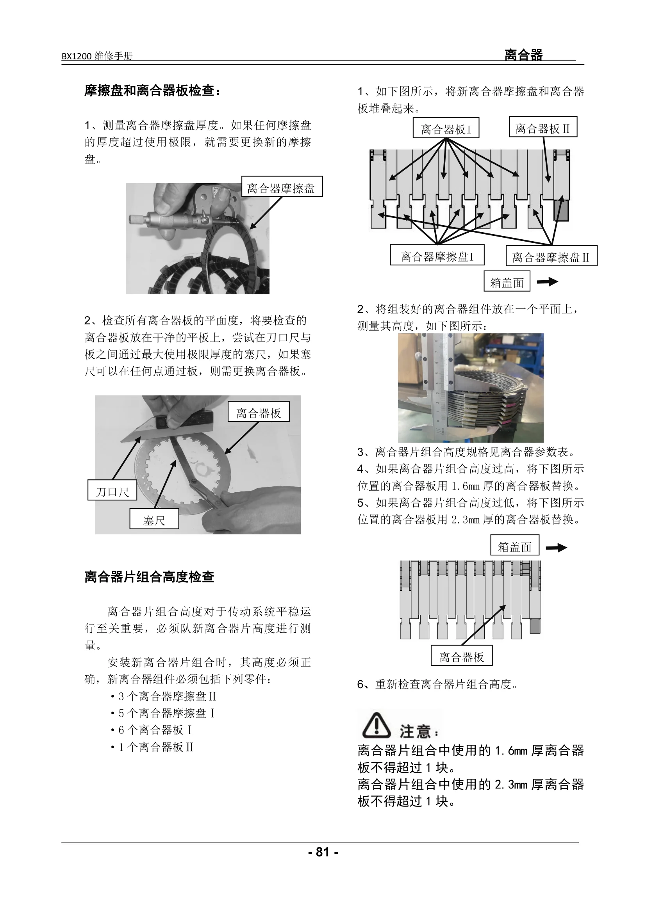

**----- Start of picture text -----** 
离合器摩擦盘 **----- End of picture text -----** 

2、检查所有离合器板的平面度，将要检查的离合器板放在干净的平板上，尝试在刀口尺与板之间通过最大使用极限厚度的塞尺，如果塞尺可以在任何点通过板，则需更换离合器板。 

**----- Start of picture text -----** 
离合器板 刀口尺 塞尺 **----- End of picture text -----** 

## 离合器片组合高度检查 

离合器片组合高度对于传动系统平稳运行至关重要，必须队新离合器片高度进行测量。 

安装新离合器片组合时，其高度必须正确，新离合器组件必须包括下列零件： 

- 1、如下图所示，将新离合器摩擦盘和离合器板堆叠起来。 

**----- Start of picture text -----** 
离合器板I 离合器板Ⅱ 离合器摩擦盘I 离合器摩擦盘Ⅱ 箱盖面 **----- End of picture text -----** 

2、将组装好的离合器组件放在一个平面上，测量其高度，如下图所示： 

3、离合器片组合高度规格见离合器参数表。 

- 4、如果离合器片组合高度过高，将下图所示位置的离合器板用1.6mm 厚的离合器板替换。 5、如果离合器片组合高度过低，将下图所示位置的离合器板用2.3mm 厚的离合器板替换。 

**----- Start of picture text -----** 
箱盖面 离合器板 **----- End of picture text -----** 

   - 6 、重新检查离合器片组合高度。 

- ·3 个离合器摩擦盘Ⅱ 

- ·5 个离合器摩擦盘Ⅰ 

- ·6 个离合器板Ⅰ 

- ·1 个离合器板Ⅱ 

离合器片组合中使用的1.6mm 厚离合器板不得超过1 块。 

离合器片组合中使用的2.3mm 厚离合器板不得超过1 块。 

离合器 

## 离合器安装 

- 1、目视检查油泵链条与油泵主、从动链轮是否完全啮合。 

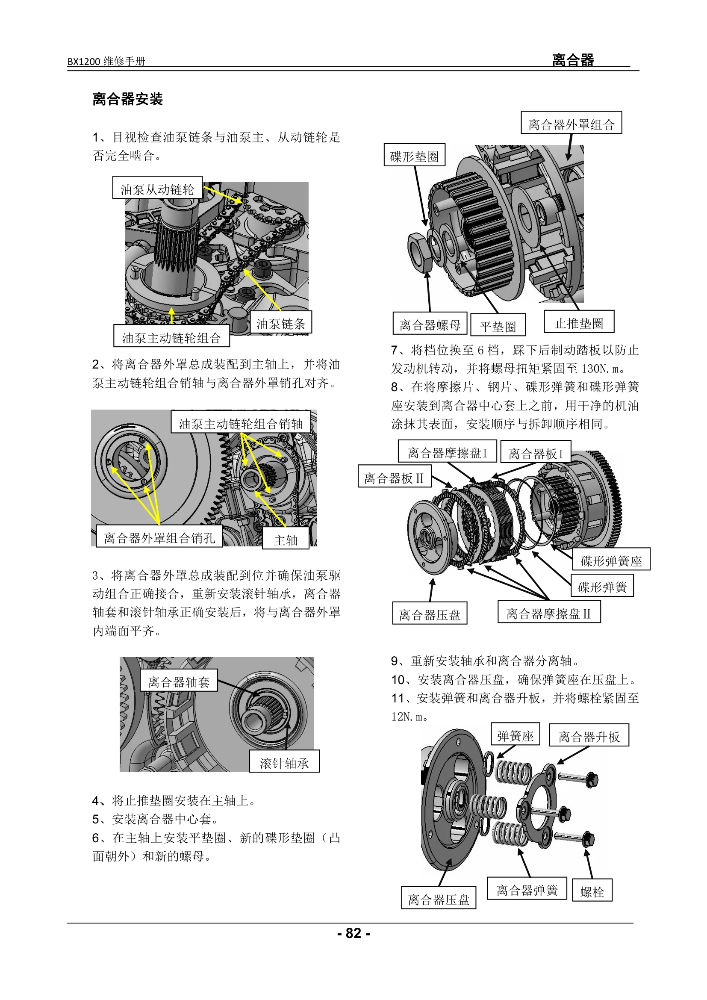

**----- Start of picture text -----** 
油泵从动链轮 油泵链条 油泵主动链轮组合 **----- End of picture text -----** 

- 2、将离合器外罩总成装配到主轴上，并将油泵主动链轮组合销轴与离合器外罩销孔对齐。 

**----- Start of picture text -----** 
油泵主动链轮组合销轴 离合器外罩组合销孔主轴 **----- End of picture text -----** 

3、将离合器外罩总成装配到位并确保油泵驱动组合正确接合，重新安装滚针轴承，离合器轴套和滚针轴承正确安装后，将与离合器外罩内端面平齐。 

**----- Start of picture text -----** 
离合器轴套 滚针轴承 **----- End of picture text -----** 

- 4 、将止推垫圈安装在主轴上。 

- 5、安装离合器中心套。 

- 6、在主轴上安装平垫圈、新的碟形垫圈（凸面朝外）和新的螺母。 

**----- Start of picture text -----** 
离合器外罩组合 碟形垫圈 离合器中心套 离合器螺母平垫圈止推垫圈 **----- End of picture text -----** 

7、将档位换至6 档，踩下后制动踏板以防止发动机转动，并将螺母扭矩紧固至130N.m。 8、在将摩擦片、钢片、碟形弹簧和碟形弹簧座安装到离合器中心套上之前，用干净的机油涂抹其表面，安装顺序与拆卸顺序相同。 

**----- Start of picture text -----** 
离合器摩擦盘I 离合器板I 离合器板Ⅱ 碟形弹簧座 碟形弹簧 离合器压盘离合器摩擦盘Ⅱ **----- End of picture text -----** 

- 9、重新安装轴承和离合器分离轴。 

- 10、安装离合器压盘，确保弹簧座在压盘上。 

- 11、安装弹簧和离合器升板，并将螺栓紧固至 12N.m。 

**----- Start of picture text -----** 
弹簧座离合器升板 离合器弹簧螺栓 离合器压盘 **----- End of picture text -----** 

离合器 

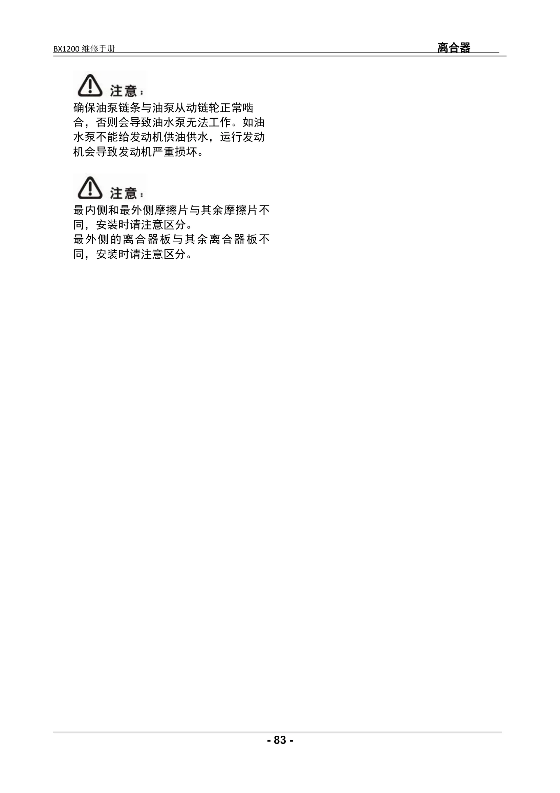

确保油泵链条与油泵从动链轮正常啮合，否则会导致油水泵无法工作。如油水泵不能给发动机供油供水，运行发动机会导致发动机严重损坏。 

最内侧和最外侧摩擦片与其余摩擦片不同，安装时请注意区分。 

最外侧的离合器板与其余离合器板不同，安装时请注意区分。 

曲轴和曲轴箱系统 

## 曲轴和曲轴箱系统 

维修须知连杆维修基准表轴瓦选择曲轴箱进水盖曲轴油气分离盖 

## 维修须知 

进行本部分的维护检修时，为修理曲轴、平衡轴或变速传动系统，必须将上、下曲轴箱体分开，俗称剖箱。在剖箱之前，应拆去发动机的下列零部件： 

- 1 、左曲轴箱盖、离合器、换档机构； 

- 2 、右前盖； 

- 3 、油底壳、油水泵组合、粗滤组合； 

- 可不用拆气缸头、气缸体、活塞等零件，将发动机翻转过来，下曲轴箱体朝上进行剖箱。 

- 在装配之前，应用清洗剂清洁所有零部件，并用压缩空气吹干。 

曲轴和曲轴箱系统 

## 曲轴技术规格及维修基准 

|曲轴连杆端轴径|38.000 ~ 37.984 mm（标准值）|
|---|---|
||37.947 mm（极限值）|
|曲轴连杆端轴瓦间隙|0.036 ~ 0.061 mm（标准值）|
||0.100 mm（极限值）|
|曲轴主轴径|43.108 ~ 43.092 mm（标准值）|
||43.052 mm（极限值）|
|曲轴主轴瓦间隙|0.018 ~ 0.042 mm（标准值）|
||0.100 mm（极限值）|
|曲轴窜动|0.05 ~ 0.20 mm（标准值）|
||0.50 mm（极限值）|
|曲轴跳动|0.02 mm（标准值）|
||0.035 mm（极限值）|
|连杆大头端孔径|41.000 ~ 41.009 mm（标准值）|
|连杆大头端窜动间隙|0.15 ~ 0.30 mm（标准值）|
||0.50 mm（极限值）|

曲轴和曲轴箱系统 

## 曲轴箱 

## 曲轴箱拆卸： 

- 1 、从上曲轴箱体两个通孔处，通过工具分别锁住惰轮主副齿轮和曲轴与箱体的位置。 

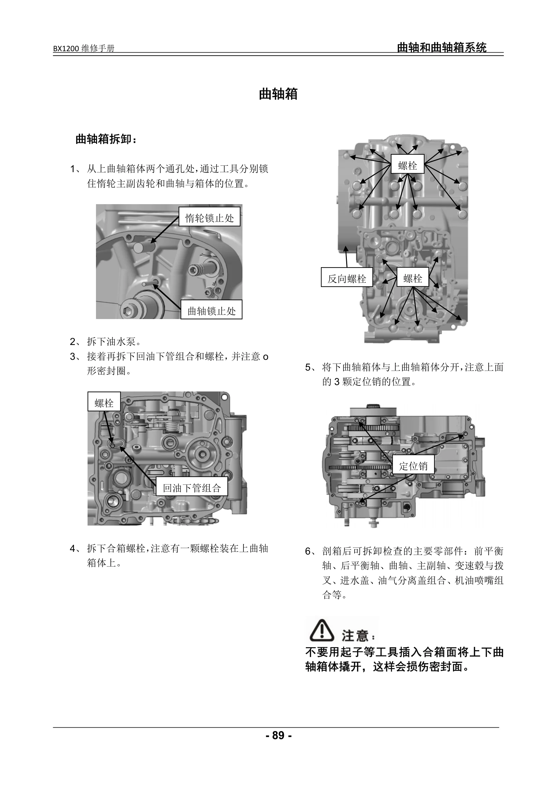

**----- Start of picture text -----** 
惰轮锁止处 曲轴锁止处 **----- End of picture text -----** 

- 2 、拆下油水泵。 

- 3 、接着再拆下回油下管组合和螺栓，并注意 o 形密封圈。 

**----- Start of picture text -----** 
螺栓 回油下管组合 **----- End of picture text -----** 

- 4 、拆下合箱螺栓，注意有一颗螺栓装在上曲轴箱体上。 

**----- Start of picture text -----** 
螺栓 反向螺栓螺栓 **----- End of picture text -----** 

- 5 、将下曲轴箱体与上曲轴箱体分开，注意上面的 3 颗定位销的位置。 

**----- Start of picture text -----** 
定位销 **----- End of picture text -----** 

- 6 、剖箱后可拆卸检查的主要零部件：前平衡轴、后平衡轴、曲轴、主副轴、变速毂与拨叉、进水盖、油气分离盖组合、机油喷嘴组合等。 

## 不要用起子等工具插入合箱面将上下曲轴箱体撬开，这样会损伤密封面。 

曲轴和曲轴箱系统 

- 8 、合箱时，需要一个助手来辅助定位曲轴箱。 

## 曲轴箱装配： 

- 1 、用清洁剂清洗曲轴箱合箱面，用无纺布擦拭干净。 

- 2 、将主副轴和变速毂均置于空档位置。 

- 3 、确保三颗定位销位于上曲轴箱体上。 

- 4 、在曲轴轴瓦处涂抹干净机油。 

- 5 、按图示要求下曲轴箱合箱面上均匀的涂敷 

- 2mm 宽左右的密封胶 ThreeBond 1215 。 

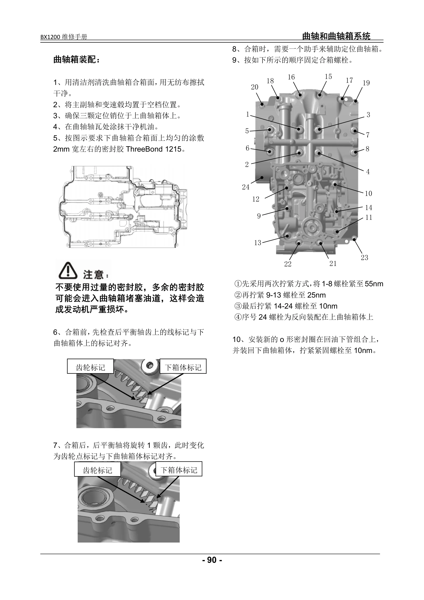

## 不要使用过量的密封胶，多余的密封胶可能会进入曲轴箱堵塞油道，这样会造成发动机严重损坏。 

- 9 、按如下所示的顺序固定合箱螺栓。 

**----- Start of picture text -----** 
16 15 18 17 19 20 1 3 5 7 6 8 2 4 24 10 12 14 9 11 13 23 22 21 **----- End of picture text -----** 

①先采用两次拧紧方式，将 1-8 螺栓紧至 55nm ②再拧紧 9-13 螺栓至 25nm 

③最后拧紧 14-24 螺栓至 10nm 

④序号 24 螺栓为反向装配在上曲轴箱体上 

6 、合箱前，先检查后平衡轴齿上的线标记与下曲轴箱体上的标记对齐。 

10 、安装新的 o 形密封圈在回油下管组合上，并装回下曲轴箱体，拧紧紧固螺栓至 10nm 。 

**----- Start of picture text -----** 
齿轮标记下箱体标记 **----- End of picture text -----** 

- 7 、合箱后，后平衡轴将旋转 1 颗齿，此时变化为齿轮点标记与下曲轴箱体标记对齐。 

**----- Start of picture text -----** 
齿轮标记下箱体标记 **----- End of picture text -----** 

曲轴和曲轴箱系统 

## 曲轴 

## 曲轴拆卸： 

- 1 、剖箱。 

- 2 、按照前平衡轴拆卸过程，从上曲轴箱体上取下曲轴。 

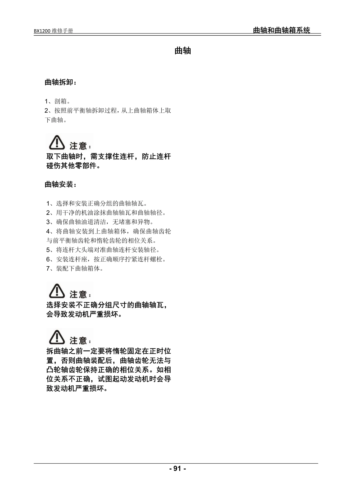

## 取下曲轴时，需支撑住连杆，防止连杆碰伤其他零部件。 

## 曲轴安装： 

- 1 、选择和安装正确分组的曲轴轴瓦。 

- 2 、用干净的机油涂抹曲轴轴瓦和曲轴轴径。 

- 3 、确保曲轴油道清洁，无堵塞和异物。 

- 4 、将曲轴安装到上曲轴箱体，确保曲轴齿轮与前平衡轴齿轮和惰轮齿轮的相位关系。 

- 5 、将连杆大头端对准曲轴连杆安装轴径。 

- 6 、安装连杆座，按正确顺序拧紧连杆螺栓。 

- 7 、装配下曲轴箱体。 

## 选择安装不正确分组尺寸的曲轴轴瓦，会导致发动机严重损坏。 

拆曲轴之前一定要将惰轮固定在正时位置，否则曲轴装配后，曲轴齿轮无法与凸轮轴齿轮保持正确的相位关系。如相位关系不正确，试图起动发动机时会导致发动机严重损坏。 

曲轴和曲轴箱系统 

## 连杆 

## 连杆拆卸： 

- 1 、拆下连杆螺栓。 

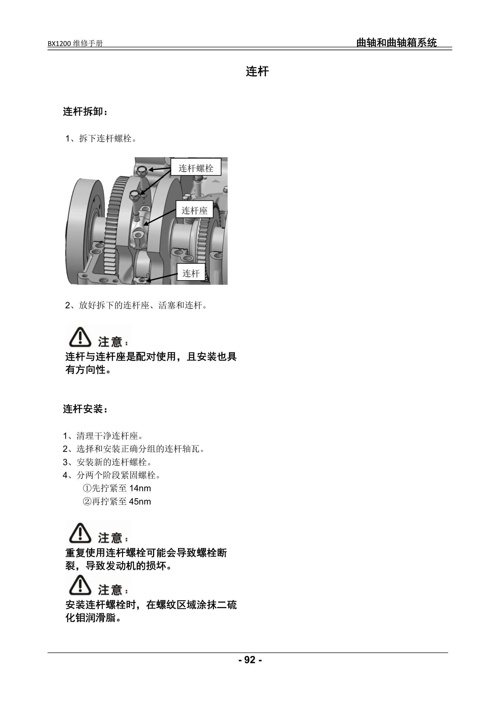

**----- Start of picture text -----** 
连杆螺栓 连杆座 连杆 **----- End of picture text -----** 

- 2 、放好拆下的连杆座、活塞和连杆。 

连杆与连杆座是配对使用，且安装也具有方向性。 

## 连杆安装： 

- 1 、清理干净连杆座。 

- 2 、选择和安装正确分组的连杆轴瓦。 

- 3 、安装新的连杆螺栓。 

- 4 、分两个阶段紧固螺栓。 

   - ①先拧紧至 14nm 

   - ②再拧紧至 45nm 

重复使用连杆螺栓可能会导致螺栓断裂，导致发动机的损坏。 

安装连杆螺栓时，在螺纹区域涂抹二硫化钼润滑脂。 

曲轴和曲轴箱系统 

## 轴瓦选择 

## 连杆轴瓦选择： 

- 1 、从曲轴上拆下连杆和连杆轴瓦。 

- 2 、测量曲轴上连杆安装处轴径尺寸并记录。 

- 3 、测量连杆大端孔内径尺寸并记录。 

- 4 、按下表所示进行轴瓦选择。 

|轴瓦颜色标记|连杆大端孔径尺寸|曲轴安装轴径尺寸|
|---|---|---|
|白色|41.000 ~ 41.009mm|37.993 ~ 38.000mm|
|红色|41.000 ~ 41.009mm|37.984 ~ 37.992mm|

## 曲轴轴瓦选择： 

- 1 、从上曲轴箱体上拆下曲轴。 

- 2 、依次测量四处曲轴主轴径尺寸并记录。 

- 3 、依次测量四处曲轴箱体孔径尺寸并记录。 

- 4 、按下表所示进行轴瓦选择。 

|轴瓦颜色标记|曲轴箱体孔径尺寸|曲轴轴径尺寸|
|---|---|---|
|红色|46.105 ~ 46.097mm|43.099 ~ 43.092mm|
|红色|46.114 ~ 46.106mm|43.108 ~ 43.100mm|
|蓝色|46.114 ~ 46.106mm|43.099 ~ 43.092mm|
|蓝色|46.123 ~ 46.115mm|43.108 ~ 43.100mm|
|绿色|46.123 ~ 46.115mm|43.099 ~ 43.092mm|

曲轴和曲轴箱系统 

## 进水盖 

## 进水盖的拆卸与装配： 

- 1 、从上曲轴箱体上拆下五颗进水盖紧固螺栓，取下进水盖。 

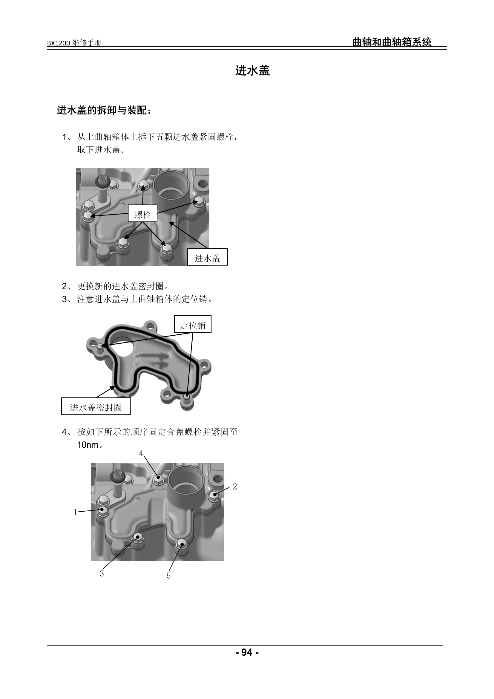

**----- Start of picture text -----** 
螺栓 进水盖 **----- End of picture text -----** 

- 2 、更换新的进水盖密封圈。 

- 3 、注意进水盖与上曲轴箱体的定位销。 

**----- Start of picture text -----** 
定位销 进水盖密封圈 **----- End of picture text -----** 

- 4 、按如下所示的顺序固定合盖螺栓并紧固至 10nm 。 

**----- Start of picture text -----** 
4 2 1 3 5 **----- End of picture text -----** 

曲轴和曲轴箱系统 

## 油气分离盖 

## 油气分离盖的拆卸与安装： 

1 、从上曲轴箱体上拆下回油上管组合的一颗螺栓，将回油上管组合取下及其 o 形密封圈。 2 、拆下油气分离盖的 7 颗紧固螺栓，取下油气分离盖和油气分离网。 

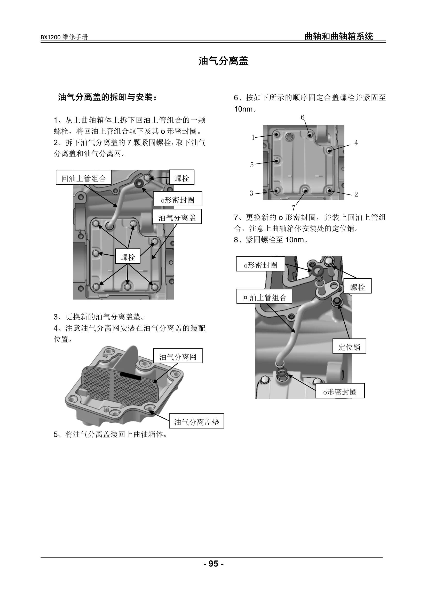

**----- Start of picture text -----** 
回油上管组合螺栓 o形密封圈 油气分离盖 螺栓 **----- End of picture text -----** 

- 3 、更换新的油气分离盖垫。 

- 4 、注意油气分离网安装在油气分离盖的装配位置。 

**----- Start of picture text -----** 
油气分离网 油气分离盖垫 5 、将油气分离盖装回上曲轴箱体。 **----- End of picture text -----** 

6 、按如下所示的顺序固定合盖螺栓并紧固至 10nm 。 

**----- Start of picture text -----** 
6 1 4 5 3 2 7 **----- End of picture text -----** 

- 7 、更换新的 o 形密封圈，并装上回油上管组合，注意上曲轴箱体安装处的定位销。 

- 8 、紧固螺栓至 10nm 。 

**----- Start of picture text -----** 
o形密封圈 螺栓 回油上管组合 定位销 o形密封圈 **----- End of picture text -----** 

传动系统 

## 传动系统 

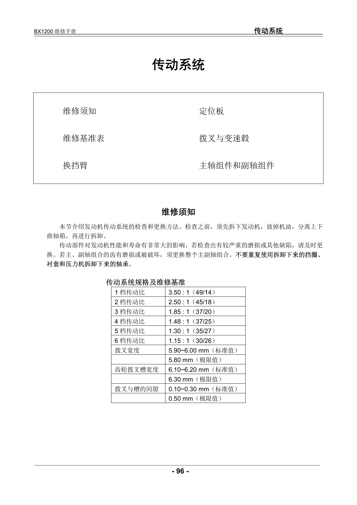

**----- Start of picture text -----** 
维修须知定位板 维修基准表拨叉与变速毂 换挡臂主轴组件和副轴组件 **----- End of picture text -----** 

## 维修须知 

本节介绍发动机传动系统的检查和更换方法。检查之前，须先拆下发动机，放掉机油，分离上下曲轴箱，再进行拆卸。 

传动部件对发动机性能和寿命有非常大的影响，若检查出有较严重的磨损或其他缺陷，请及时更换。若主、副轴组合的齿有磨损或被破坏，须更换整个主副轴组合。不要重复使用拆卸下来的挡圈、衬套和压力机拆卸下来的轴承。 

## 传动系统规格及维修基准 

|1 档传动比|3.50 : 1（49/14）|
|---|---|
|2 档传动比|2.50 : 1（45/18）|
|3 档传动比|1.85 : 1（37/20）|
|4 档传动比|1.48 : 1（37/25）|
|5 档传动比|1.30 : 1（35/27）|
|6 档传动比|1.15 : 1（30/26）|
|拨叉宽度|5.90~6.00 mm（标准值）|
||5.80 mm（极限值）|
|齿轮拨叉槽宽度|6.10~6.20 mm（标准值）|
||6.30 mm（极限值）|
|拨叉与槽的间隙|0.10~0.30 mm（标准值）|
||0.50 mm（极限值）|

传动系统 

## 换挡臂 

## 换挡臂的拆卸： 

- 1 、拆下螺栓，从曲轴箱上拆下油泵链条导向板组合。 

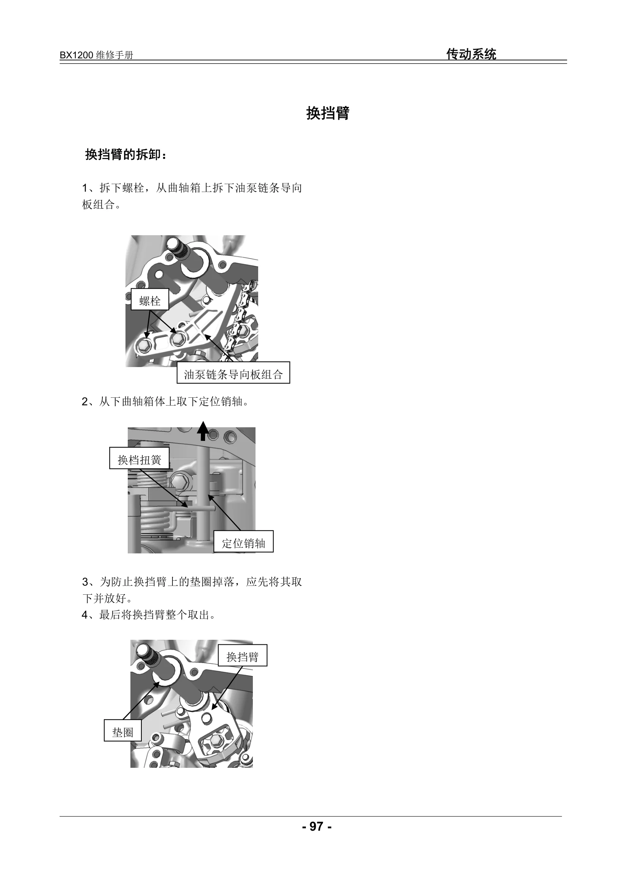

**----- Start of picture text -----** 
螺栓 油泵链条导向板组合 **----- End of picture text -----** 

- 2 、从下曲轴箱体上取下定位销轴。 

**----- Start of picture text -----** 
换档扭簧 定位销轴 **----- End of picture text -----** 

- 3 、为防止换挡臂上的垫圈掉落，应先将其取下并放好。 

- 4 、最后将换挡臂整个取出。 

**----- Start of picture text -----** 
换挡臂 垫圈 **----- End of picture text -----** 

## 传动系统 

## 换挡臂的检查： 

检测换挡臂组合和弹簧是否损坏或磨损，弹簧是否过伸（即线圈之间的间隙异常）。必要时更新组件。 

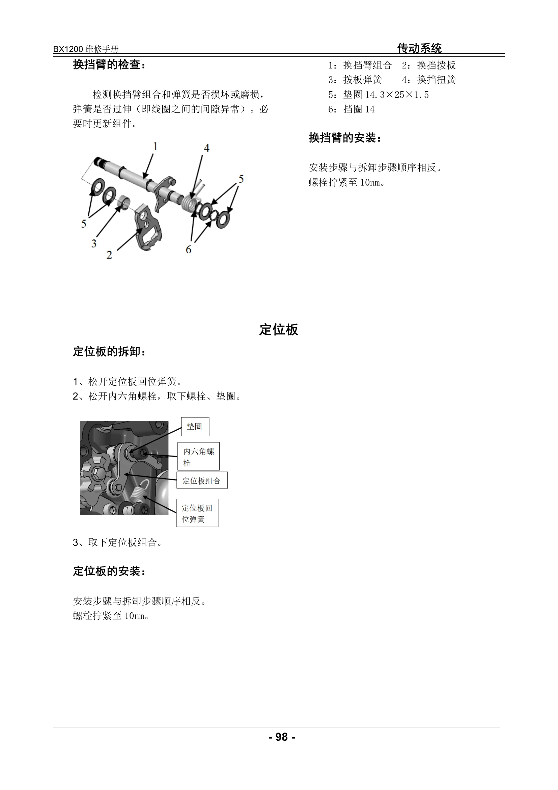

1：换挡臂组合 2：换挡拨板 3：拨板弹簧 4：换挡扭簧 5：垫圈14.3×25×1.5 6：挡圈14 

## 换挡臂的安装： 

安装步骤与拆卸步骤顺序相反。螺栓拧紧至10nm。 

## 定位板 

## 定位板的拆卸： 

- 1 、松开定位板回位弹簧。 

- 2 、松开内六角螺栓，取下螺栓、垫圈。 

- 3 、取下定位板组合。 

## 定位板的安装： 

安装步骤与拆卸步骤顺序相反。螺栓拧紧至10nm。 

传动系统 

## 拨叉与变速毂 

## 拨叉与变速毂的拆卸： 

- 1 、拆卸螺栓，取下拨叉轴挡板。 

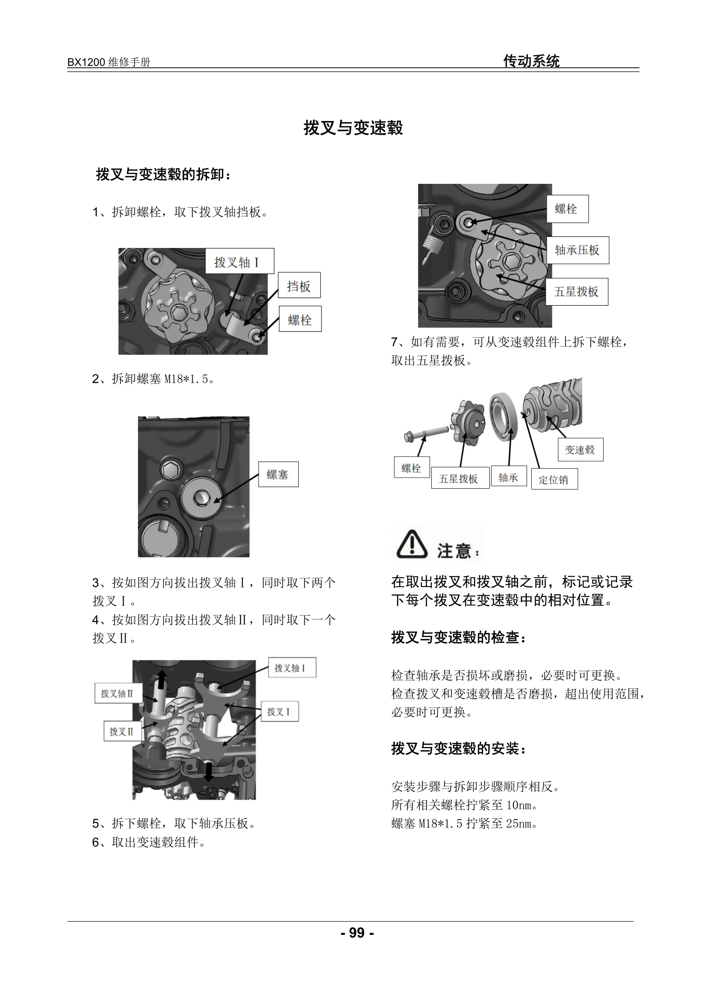

- 2 、拆卸螺塞M18*1.5。 

- 3 、按如图方向拔出拨叉轴Ⅰ，同时取下两个拨叉Ⅰ。 

- 4 、按如图方向拔出拨叉轴Ⅱ，同时取下一个拨叉Ⅱ。 

- 5 、拆下螺栓，取下轴承压板。 

- 7 、如有需要，可从变速毂组件上拆下螺栓，取出五星拨板。 

## 在取出拨叉和拨叉轴之前，标记或记录下每个拨叉在变速毂中的相对位置。 

## 拨叉与变速毂的检查： 

检查轴承是否损坏或磨损，必要时可更换。检查拨叉和变速毂槽是否磨损，超出使用范围，必要时可更换。 

## 拨叉与变速毂的安装： 

安装步骤与拆卸步骤顺序相反。所有相关螺栓拧紧至10nm。螺塞M18*1.5 拧紧至25nm。 

- 6 、取出变速毂组件。 

传动系统 

## 主轴组件和副轴组件 

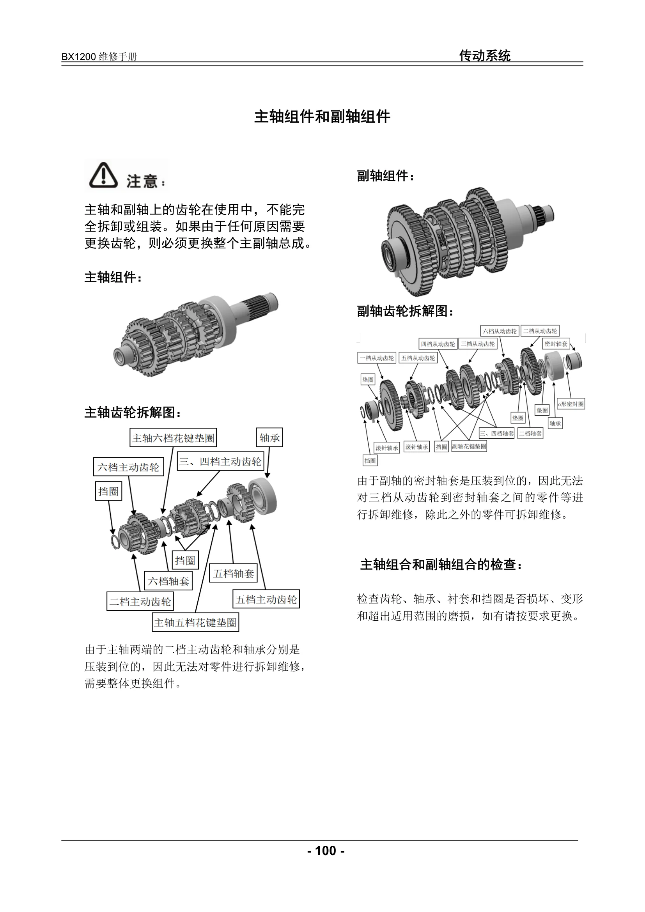

主轴和副轴上的齿轮在使用中，不能完全拆卸或组装。如果由于任何原因需要更换齿轮，则必须更换整个主副轴总成。 

## 主轴组件： 

## 主轴齿轮拆解图： 

## 副轴组件： 

副轴齿轮拆解图： 

由于副轴的密封轴套是压装到位的，因此无法对三档从动齿轮到密封轴套之间的零件等进行拆卸维修，除此之外的零件可拆卸维修。 

## 主轴组合和副轴组合的检查： 

检查齿轮、轴承、衬套和挡圈是否损坏、变形和超出适用范围的磨损，如有请按要求更换。 

由于主轴两端的二档主动齿轮和轴承分别是压装到位的，因此无法对零件进行拆卸维修，需要整体更换组件。 

缸体和活塞系统 

## 缸头和活塞系统 

维修须知活塞环维修基准表活塞气缸体 

## 维修须知 

进行本部分的维护检修时，一般是发动机热机系统出现问题，需要如更换活塞、气缸等操作。需要先拆卸气缸头和右前盖等零部件才能进行。 

在装配之前，请检查所有油道是否通畅并进行清理。 

用清洗剂清洁所有零部件，并用压缩空气吹干，最后对有相对运动的零部件配合处涂抹机油。如活塞销等。 

缸体和活塞系统 

## 缸头和活塞技术规格及维修基准 

|活塞直径||98.570 ~ 98.580 mm（标准值）|
|---|---|---|
|||98.530 mm（极限值）|
|活塞环与环槽的 间隙|A环|0.02 ~ 0.07 mm（标准值）|
|||0.085 mm（极限值）|
||B环|0.02 ~ 0.06 mm（标准值）|
|||0.075 mm（极限值）|
|活塞的环槽宽度|A 环|1.21 ~ 1.24 mm（标准值）|
||B 环|1.01 ~ 1.03 mm（标准值）|
||油环|2.51 ~ 2.53 mm（标准值）|
|活塞环闭环间隙|A环|0.183 ~ 0.383 mm（标准值）|
|||0.503 mm（极限值）|
||B环|0.353 ~ 0.553 mm（标准值）|
|||0.673 mm（极限值）|
||油环|0.153 ~ 0.703 mm（标准值）|
|||0.843 mm（极限值）|
|活塞的销孔内径||21.004 ~ 21.012 mm（标准值）|
|||21.040 mm（极限值）|
|活塞销直径||20.995 ~ 21.000 mm（标准值）|
|||20.985 mm（极限值）|
|连杆的销孔内径||1.50~1.85 mm|

缸体和活塞系统 

## 气缸体 

## 气缸体拆卸： 

   - 4 、确保活塞环开口朝向正确的位置。 

   - 5 、用干净的机油涂抹活塞环和气缸体缸孔。 

- 1 、清理缸孔内的异物（如积碳），防止取气缸体时异物其掉入曲轴箱体内。 

- 2 、保持活塞水平位置，朝上抬起气缸体。 

- 3 、取下气缸体，注意其 2 颗定位销不要掉入曲轴箱体。 

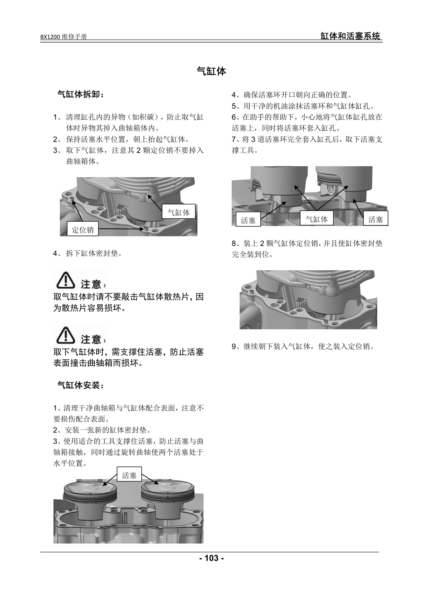

**----- Start of picture text -----** 
气缸体 **----- End of picture text -----** 

**----- Start of picture text -----** 
定位销 **----- End of picture text -----** 

- 4 、拆下缸体密封垫。 

## 取气缸体时请不要敲击气缸体散热片，因为散热片容易损坏。 

## 取下气缸体时，需支撑住活塞，防止活塞表面撞击曲轴箱而损坏。 

- 6 、在助手的帮助下，小心地将气缸体缸孔放在活塞上，同时将活塞环套入缸孔。 

- 7 、将 3 道活塞环完全套入缸孔后，取下活塞支撑工具。 

**----- Start of picture text -----** 
活塞气缸体活塞 **----- End of picture text -----** 

- 8 、装上 2 颗气缸体定位销，并且使缸体密封垫完全装到位。 

- 9 、继续朝下装入气缸体，使之装入定位销。 

## 气缸体安装： 

- 1 、清理干净曲轴箱与气缸体配合表面，注意不要损伤配合表面。 

- 2 、安装一张新的缸体密封垫。 

- 3 、使用适合的工具支撑住活塞，防止活塞与曲轴箱接触，同时通过旋转曲轴使两个活塞处于 

- 水平位置。 

**----- Start of picture text -----** 
活塞 **----- End of picture text -----** 

缸体和活塞系统 

## 活塞环 

## 活塞环拆卸： 

## 活塞环闭环间隙检查： 

- 1 、将活塞环 A 环从开口处向外张开膨胀，并将其从活塞上取下。 

- 2 、用同样的方法取下活塞环 B 环。 

- 3 、同样再拆下油环。 

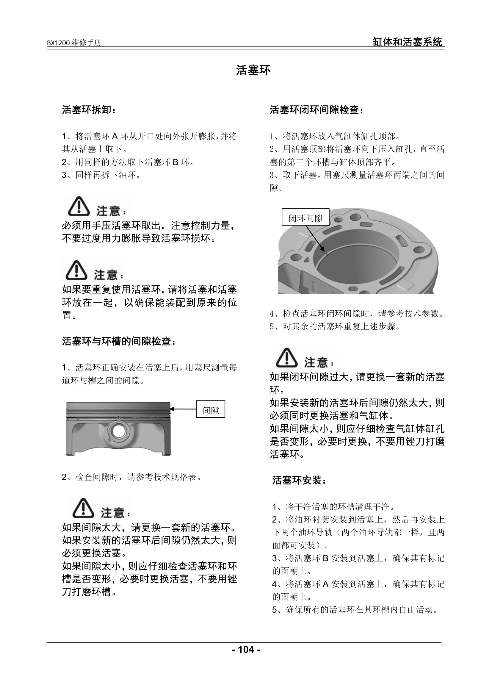

## 必须用手压活塞环取出，注意控制力量，不要过度用力膨胀导致活塞环损坏。 

如果要重复使用活塞环，请将活塞和活塞环放在一起，以确保能装配到原来的位置。 

- 1、将活塞环放入气缸体缸孔顶部。 

- 2、用活塞顶部将活塞环向下压入缸孔，直至活塞的第三个环槽与缸体顶部齐平。 

- 3、取下活塞，用塞尺测量活塞环两端之间的间隙。 

**----- Start of picture text -----** 
闭环间隙 **----- End of picture text -----** 

- 4、检查活塞环闭环间隙时，请参考技术参数。 

- 5、对其余的活塞环重复上述步骤。 

## 活塞环与环槽的间隙检查： 

- 1 、活塞环正确安装在活塞上后，用塞尺测量每道环与槽之间的间隙。 

**----- Start of picture text -----** 
间隙 **----- End of picture text -----** 

如果闭环间隙过大，请更换一套新的活塞环。 

如果安装新的活塞环后间隙仍然太大，则必须同时更换活塞和气缸体。 

如果间隙太小，则应仔细检查气缸体缸孔是否变形，必要时更换，不要用锉刀打磨活塞环。 

- 2 、检查间隙时，请参考技术规格表。 

## 活塞环安装： 

如果间隙太大，请更换一套新的活塞环。如果安装新的活塞环后间隙仍然太大，则必须更换活塞。 

如果间隙太小，则应仔细检查活塞环和环槽是否变形，必要时更换活塞，不要用锉刀打磨环槽。 

- 1 、将干净活塞的环槽清理干净。 

- 2 、将油环衬套安装到活塞上，然后再安装上下两个油环导轨（两个油环导轨都一样，且两面都可安装）。 

- 3 、将活塞环 B 安装到活塞上，确保其有标记的面朝上。 

- 4 、将活塞环 A 安装到活塞上，确保其有标记的面朝上。 

- 5 、确保所有的活塞环在其环槽内自由活动。 

缸体和活塞系统 

- 6 、按如下方式定位活塞环闭口位置。 

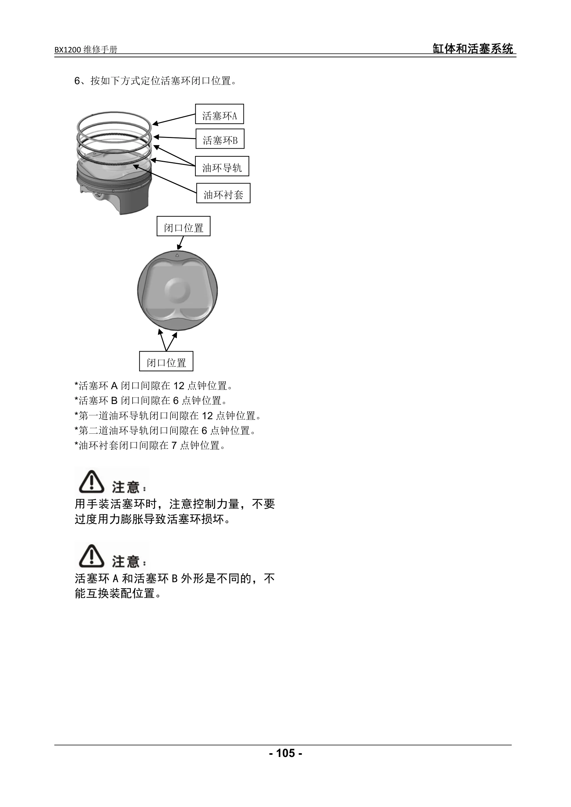

**----- Start of picture text -----** 
活塞环A 活塞环B 油环导轨 油环衬套 闭口位置 闭口位置 **----- End of picture text -----** 

- 活塞环 A 闭口间隙在 12 点钟位置。 

- 活塞环 B 闭口间隙在 6 点钟位置。 

- 第一道油环导轨闭口间隙在 12 点钟位置。 

- 第二道油环导轨闭口间隙在 6 点钟位置。 

- 油环衬套闭口间隙在 7 点钟位置。 

## 用手装活塞环时，注意控制力量，不要过度用力膨胀导致活塞环损坏。 

活塞环A 和活塞环B 外形是不同的，不能互换装配位置。 

缸体和活塞系统 

## 活塞 

## 活塞拆卸： 

   - 3 、参考技术规格表。 

- 1 、从活塞的一侧拆下活塞销挡圈。 

   - 4 、如果超出规定范围，请更换活塞和活塞环。 

- 2 、将活塞销向拆下挡圈的一侧推出取下。 

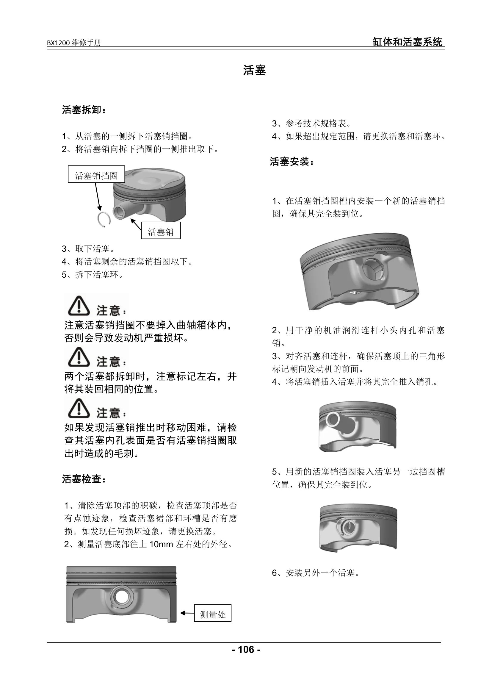

**----- Start of picture text -----** 
活塞销挡圈 活塞销 **----- End of picture text -----** 

- 3 、取下活塞。 

- 4 、将活塞剩余的活塞销挡圈取下。 

- 5 、拆下活塞环。 

## 注意活塞销挡圈不要掉入曲轴箱体内，否则会导致发动机严重损坏。 

## 两个活塞都拆卸时，注意标记左右，并将其装回相同的位置。 

如果发现活塞销推出时移动困难，请检查其活塞内孔表面是否有活塞销挡圈取出时造成的毛刺。 

## 活塞检查： 

- 1 、清除活塞顶部的积碳，检查活塞顶部是否有点蚀迹象，检查活塞裙部和环槽是否有磨损。如发现任何损坏迹象，请更换活塞。 

- 2 、测量活塞底部往上 10mm 左右处的外径。 

**----- Start of picture text -----** 
测量处 **----- End of picture text -----** 

## 活塞安装： 

- 1 、在活塞销挡圈槽内安装一个新的活塞销挡圈，确保其完全装到位。 

- 2 、用干净的机油润滑连杆小头内孔和活塞销。 

- 3 、对齐活塞和连杆，确保活塞顶上的三角形标记朝向发动机的前面。 

- 4 、将活塞销插入活塞并将其完全推入销孔。 

- 5 、用新的活塞销挡圈装入活塞另一边挡圈槽位置，确保其完全装到位。 

- 6 、安装另外一个活塞。 

缸体和活塞系统 

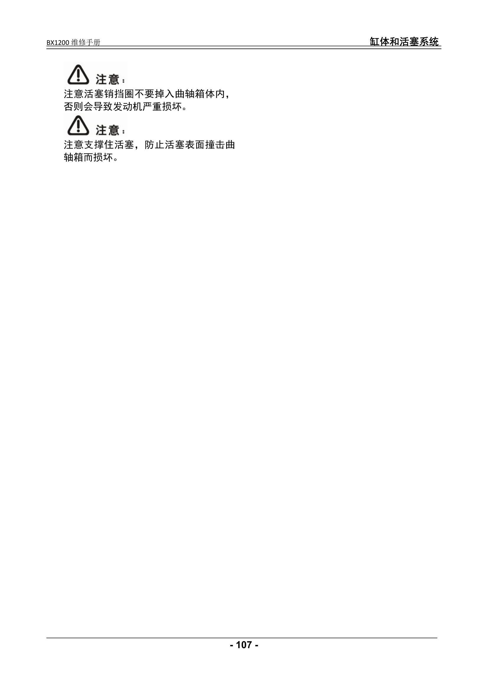

注意活塞销挡圈不要掉入曲轴箱体内，否则会导致发动机严重损坏。 

注意支撑住活塞，防止活塞表面撞击曲轴箱而损坏。 

发动机箱盖 

## **10** 发动机箱盖 

维修须知左曲轴箱盖油底壳气缸头盖右前盖 

## 维修须知 

为修理发动机内部零部件，需拆下相应的发动机箱盖以方便维修。 

- 1 、拆卸油底壳——如维修油水泵等； 

- 2 、拆卸右前盖——如维修磁电机等； 

- 3 、拆卸左曲轴箱盖——如维修离合器等； 

- 4 、拆卸气缸头盖——如调整气门间隙等； 

- 在装配之前，应用清洗剂清洁所有零部件，并用压缩空气吹干。 

发动机箱盖 

## 油底壳 

## 油底壳拆卸： 

   - 2 、换上新的油底壳密封垫，将油底壳定位到下箱体安装位置处。 

- 1 、放掉发动机机油并拆下机油滤清器（参见更换机油和机油滤清器）。 

- 3 、按如下所示的顺序拧紧油底壳固定螺栓至 10nm 。 

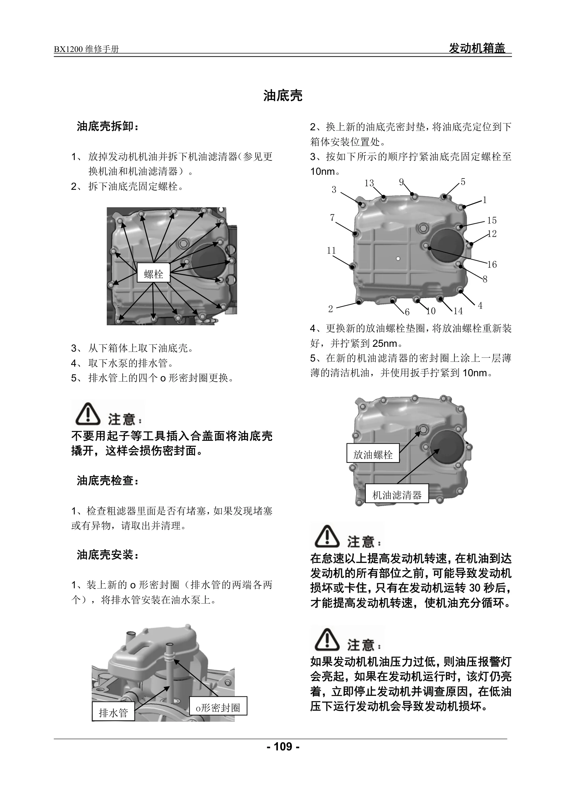

**----- Start of picture text -----** 
13 9 5 3 1 7 15 12 11 16 螺栓 8 4 2 6 10 14 **----- End of picture text -----** 

- 2 、拆下油底壳固定螺栓。 

   - 4 、更换新的放油螺栓垫圈，将放油螺栓重新装 

   - 好，并拧紧到 25nm 。 

- 3 、从下箱体上取下油底壳。 

   - 5 、在新的机油滤清器的密封圈上涂上一层薄薄的清洁机油，并使用扳手拧紧到 10nm 。 

- 4 、取下水泵的排水管。 

- 5 、排水管上的四个 o 形密封圈更换。 

**----- Start of picture text -----** 
放油螺栓 机油滤清器 **----- End of picture text -----** 

## 不要用起子等工具插入合盖面将油底壳撬开，这样会损伤密封面。 

## 油底壳检查： 

- 1 、检查粗滤器里面是否有堵塞，如果发现堵塞或有异物，请取出并清理。 

## 油底壳安装： 

在怠速以上提高发动机转速，在机油到达发动机的所有部位之前，可能导致发动机损坏或卡住，只有在发动机运转30 秒后，才能提高发动机转速，使机油充分循环。 

- 1 、装上新的 o 形密封圈（排水管的两端各两个），将排水管安装在油水泵上。 

**----- Start of picture text -----** 
o形密封圈 排水管 **----- End of picture text -----** 

如果发动机机油压力过低，则油压报警灯会亮起，如果在发动机运行时，该灯仍亮着，立即停止发动机并调查原因，在低油压下运行发动机会导致发动机损坏。 

发动机箱盖 

## 右前盖 

## 右前盖拆卸： 

- 1、松开导向板固定螺栓，从曲轴箱上拆下引出线导向板，放出磁电机线。 

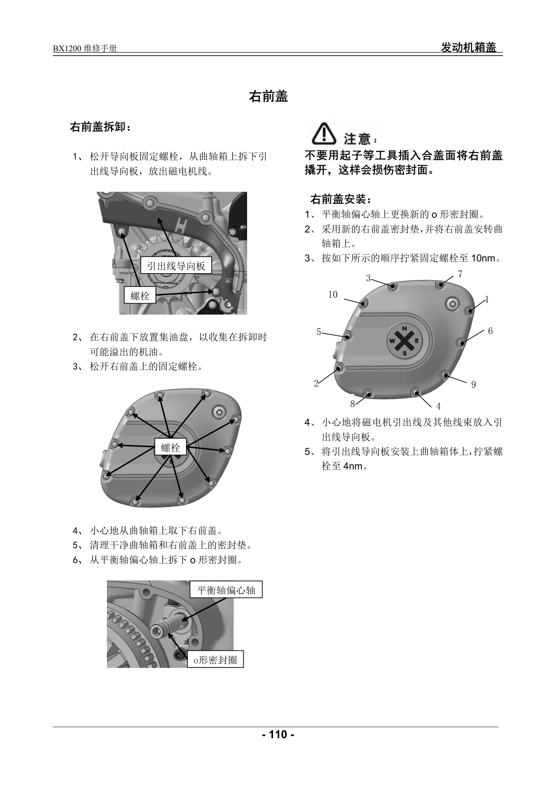

**----- Start of picture text -----** 
引出线导向板 螺栓 **----- End of picture text -----** 

- 2、在右前盖下放置集油盘，以收集在拆卸时可能溢出的机油。 

- 3、松开右前盖上的固定螺栓。 

**----- Start of picture text -----** 
螺栓 **----- End of picture text -----** 

## 不要用起子等工具插入合盖面将右前盖撬开，这样会损伤密封面。 

## 右前盖安装： 

- 1 、平衡轴偏心轴上更换新的 o 形密封圈。 

- 2 、采用新的右前盖密封垫，并将右前盖安转曲轴箱上。 

- 3 、按如下所示的顺序拧紧固定螺栓至 10nm 。 

**----- Start of picture text -----** 
7 3 10 1 5 6 2 9 8 4 **----- End of picture text -----** 

   - 4 、小心地将磁电机引出线及其他线束放入引出线导向板。 

   - 5 、将引出线导向板安装上曲轴箱体上，拧紧螺栓至 4nm 。 

- 4、小心地从曲轴箱上取下右前盖。 

- 5、清理干净曲轴箱和右前盖上的密封垫。 

- 6、从平衡轴偏心轴上拆下 o 形密封圈。 

**----- Start of picture text -----** 
平衡轴偏心轴 o形密封圈 **----- End of picture text -----** 

发动机箱盖 

## 左曲轴箱盖 

## 左曲轴箱盖拆卸： 

## 左曲轴箱盖安装： 

- 1 、在箱盖下放置集油盘，以收集在拆卸时可能溢出的机油。 

- 2 、松开左曲轴箱盖上的固定螺栓。 

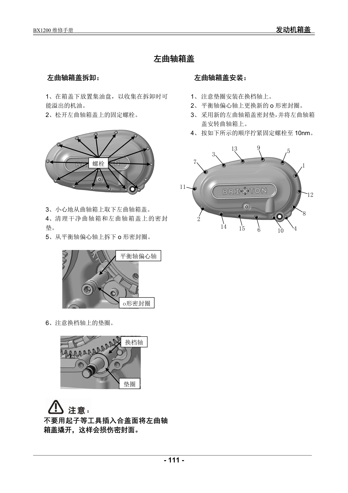

**----- Start of picture text -----** 
螺栓 **----- End of picture text -----** 

- 3 、小心地从曲轴箱上取下左曲轴箱盖。 

- 4 、清理干净曲轴箱和左曲轴箱盖上的密封垫。 

- 5 、从平衡轴偏心轴上拆下 o 形密封圈。 

- 1 、注意垫圈安装在换档轴上。 

- 2 、平衡轴偏心轴上更换新的 o 形密封圈。 

- 3 、采用新的左曲轴箱盖密封垫，并将左曲轴箱盖安转曲轴箱上。 

- 4 、按如下所示的顺序拧紧固定螺栓至 10nm 。 

**----- Start of picture text -----** 
13 9 5 3 7 1 11 12 8 2 14 15 6 10 4 **----- End of picture text -----** 

**----- Start of picture text -----** 
平衡轴偏心轴 o形密封圈 **----- End of picture text -----** 

- 6 、注意换档轴上的垫圈。 

**----- Start of picture text -----** 
换档轴 垫圈 **----- End of picture text -----** 

不要用起子等工具插入合盖面将左曲轴箱盖撬开，这样会损伤密封面。 

发动机箱盖 

## 气缸头盖 

## 气缸头盖拆卸： 

- 1 、松开头盖螺栓。 

- 2 、小心地从气缸头上取下头盖。 

- 3 、拆下组合垫圈和头盖密封垫组合。 

- 4 、清理气缸头盖上的残油。 

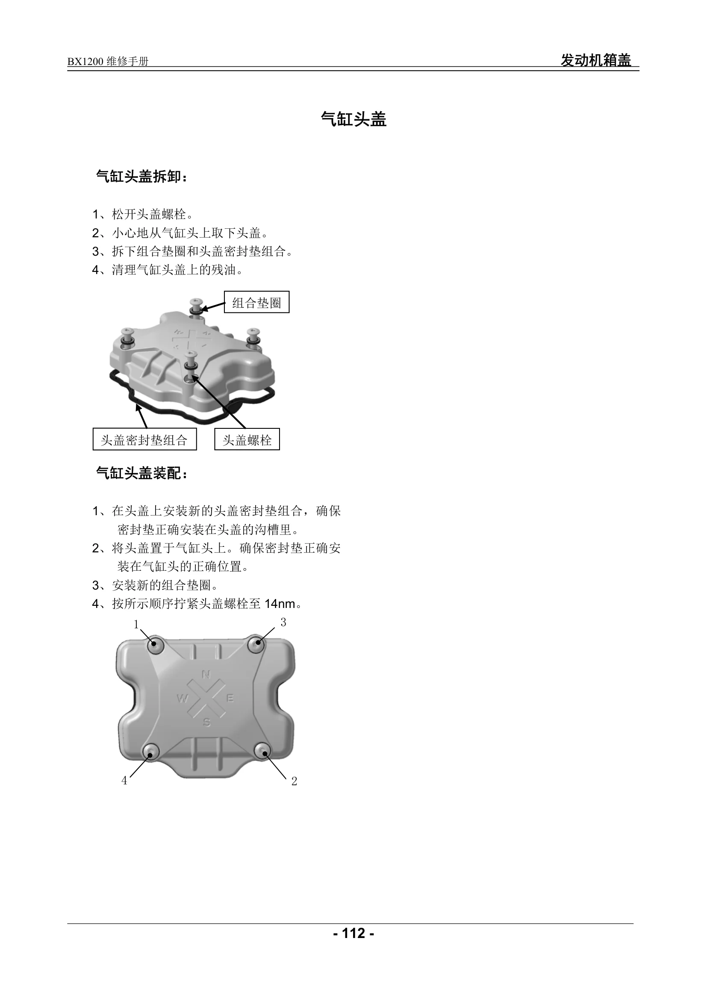

**----- Start of picture text -----** 
组合垫圈 头盖密封垫组合头盖螺栓 **----- End of picture text -----** 

## 气缸头盖装配： 

- 1 、在头盖上安装新的头盖密封垫组合，确保密封垫正确安装在头盖的沟槽里。 

- 2 、将头盖置于气缸头上。确保密封垫正确安装在气缸头的正确位置。 

- 3 、安装新的组合垫圈。 

- 4 、按所示顺序拧紧头盖螺栓至 14nm 。 

**----- Start of picture text -----** 
1 3 4 2 **----- End of picture text -----** 

平衡轴系统 

## 平衡轴系统 

维修须知前平衡轴装配后平衡轴拆卸后平衡轴装配前平衡轴拆卸平衡轴运动调整平衡轴检查 

## 维修须知 

进行本部分的维护检修时，为修理曲轴、平衡轴或变速传动系统，必须将上、下曲轴箱体分开，俗称剖箱。在剖箱之前，应拆去发动机的下列零部件： 

- 1 、左曲轴箱盖、离合器、换档机构； 

- 2 、右前盖； 

- 3 、油底壳、油水泵组合、粗滤组合； 

- 可不用拆气缸头、气缸体、活塞等零件，将发动机翻转过来，下曲轴箱体朝上进行剖箱。 

- 在装配之前，应用清洗剂清洁所有零部件，并用压缩空气吹干。 

平衡轴系统 

## 平衡轴系统 

## 后平衡轴拆卸： 

- 1 、松开但不完全拆卸锁紧平衡偏心轴的紧固螺栓。 

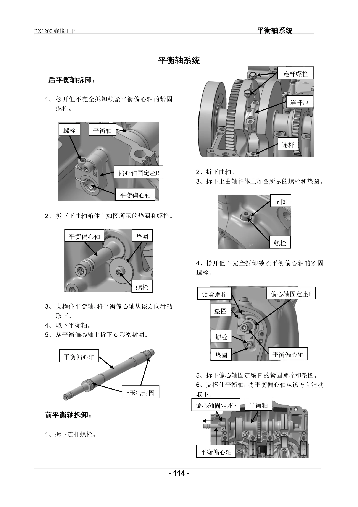

**----- Start of picture text -----** 
螺栓平衡轴 偏心轴固定座R 平衡偏心轴 **----- End of picture text -----** 

- 2 、拆下下曲轴箱体上如图所示的垫圈和螺栓。 

**----- Start of picture text -----** 
平衡偏心轴垫圈 螺栓 **----- End of picture text -----** 

- 3 、支撑住平衡轴，将平衡偏心轴从该方向滑动取下。 

- 4 、取下平衡轴。 

- 5 、从平衡偏心轴上拆下 o 形密封圈。 

**----- Start of picture text -----** 
平衡偏心轴 o形密封圈 **----- End of picture text -----** 

## 前平衡轴拆卸： 

- 1 、拆下连杆螺栓。 

**----- Start of picture text -----** 
连杆螺栓 连杆座 连杆 **----- End of picture text -----** 

- 2 、拆下曲轴。 

- 3 、拆下上曲轴箱体上如图所示的螺栓和垫圈。 

**----- Start of picture text -----** 
垫圈 螺栓 **----- End of picture text -----** 

- 4 、松开但不完全拆卸锁紧平衡偏心轴的紧固螺栓。 

**----- Start of picture text -----** 
锁紧螺栓偏心轴固定座F 垫圈 螺栓 垫圈平衡偏心轴 **----- End of picture text -----** 

- 5 、拆下偏心轴固定座 F 的紧固螺栓和垫圈。 

- 6 、支撑住平衡轴，将平衡偏心轴从该方向滑动取下。 

**----- Start of picture text -----** 
偏心轴固定座F 平衡轴 平衡偏心轴 **----- End of picture text -----** 

平衡轴系统 

- 7 、取下平衡轴。 

- 8 、从平衡偏心轴上拆下 o 形密封圈。 

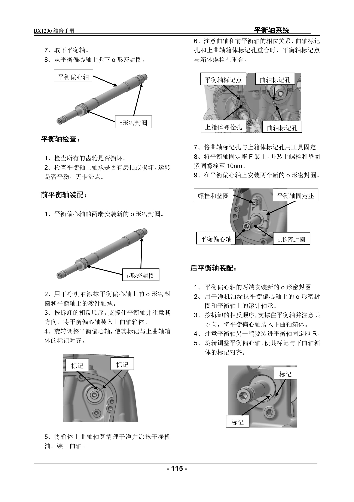

**----- Start of picture text -----** 
平衡偏心轴 o形密封圈 **----- End of picture text -----** 

- 6 、注意曲轴和前平衡轴的相位关系，曲轴标记孔和上曲轴箱体标记孔重合时，平衡轴标记点与箱体螺栓孔重合。 

**----- Start of picture text -----** 
平衡轴标记点曲轴标记孔 上箱体螺栓孔曲轴标记孔 **----- End of picture text -----** 

## 平衡轴检查： 

- 1 、检查所有的齿轮是否损坏。 

- 2 、检查平衡轴上轴承是否有磨损或损坏，运转是否平稳，无卡滞点。 

## 前平衡轴装配： 

- 1 、平衡偏心轴的两端安装新的 o 形密封圈。 

**----- Start of picture text -----** 
o形密封圈 **----- End of picture text -----** 

- 7 、将曲轴标记孔与上箱体标记孔用工具固定。 8 、将平衡轴固定座 F 装上，并装上螺栓和垫圈紧固螺栓至 10nm 。 

- 9 、在平衡偏心轴上安装两个新的 o 形密封圈。 

**----- Start of picture text -----** 
螺栓和垫圈平衡轴固定座 平衡偏心轴 o形密封圈 **----- End of picture text -----** 

## 后平衡轴装配： 

   - 1 、平衡偏心轴的两端安装新的 o 形密封圈。 

- 2 、用干净机油涂抹平衡偏心轴上的 o 形密封圈和平衡轴上的滚针轴承。 

- 3 、按拆卸的相反顺序，支撑住平衡轴并注意其方向，将平衡偏心轴装入上曲轴箱体。 

- 4 、旋转调整平衡偏心轴，使其标记与上曲轴箱体的标记对齐。 

**----- Start of picture text -----** 
标记标记 **----- End of picture text -----** 

- 2 、用干净机油涂抹平衡偏心轴上的 o 形密封圈和平衡轴上的滚针轴承。 

- 3 、按拆卸的相反顺序，支撑住平衡轴并注意其方向，将平衡偏心轴装入下曲轴箱体。 

- 4 、注意平衡轴另一端要装进平衡轴固定座 R 。 

- 5 、旋转调整平衡偏心轴，使其标记与下曲轴箱体的标记对齐。 

**----- Start of picture text -----** 
标记 标记 **----- End of picture text -----** 

- 5 、将箱体上曲轴轴瓦清理干净并涂抹干净机油，装上曲轴。 

## 平衡轴系统 

- 6 、装上垫圈和螺栓，紧固螺栓至 10nm 。 

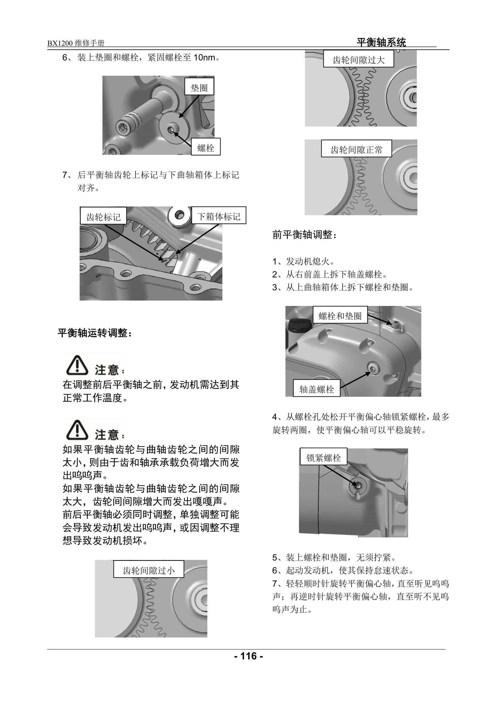

**----- Start of picture text -----** 
垫圈 螺栓 **----- End of picture text -----** 

- 7 、后平衡轴齿轮上标记与下曲轴箱体上标记对齐。 

**----- Start of picture text -----** 
齿轮标记下箱体标记 **----- End of picture text -----** 

## 平衡轴运转调整： 

在调整前后平衡轴之前，发动机需达到其正常工作温度。 

如果平衡轴齿轮与曲轴齿轮之间的间隙太小，则由于齿和轴承承载负荷增大而发出呜呜声。 

如果平衡轴齿轮与曲轴齿轮之间的间隙太大，齿轮间间隙增大而发出嘎嘎声。前后平衡轴必须同时调整，单独调整可能会导致发动机发出呜呜声，或因调整不理想导致发动机损坏。 

**----- Start of picture text -----** 
齿轮间隙过小 **----- End of picture text -----** 

**----- Start of picture text -----** 
齿轮间隙过大 齿轮间隙正常 **----- End of picture text -----** 

## 前平衡轴调整： 

- 1 、发动机熄火。 

- 2 、从右前盖上拆下轴盖螺栓。 

- 3 、从上曲轴箱体上拆下螺栓和垫圈。 

**----- Start of picture text -----** 
螺栓和垫圈 轴盖螺栓 **----- End of picture text -----** 

- 4 、从螺栓孔处松开平衡偏心轴锁紧螺栓，最多旋转两圈，使平衡偏心轴可以平稳旋转。 

**----- Start of picture text -----** 
锁紧螺栓 **----- End of picture text -----** 

- 5 、装上螺栓和垫圈，无须拧紧。 

- 6 、起动发动机，使其保持怠速状态。 

- 7 、轻轻顺时针旋转平衡偏心轴，直至听见呜呜声；再逆时针旋转平衡偏心轴，直至听不见呜呜声为止。 

平衡轴系统 

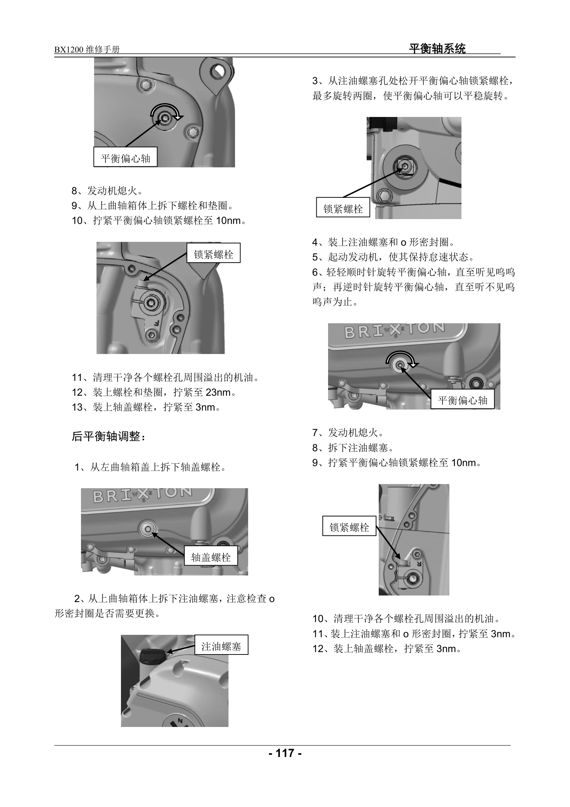

**----- Start of picture text -----** 
平衡偏心轴 **----- End of picture text -----** 

- 8 、发动机熄火。 

- 9 、从上曲轴箱体上拆下螺栓和垫圈。 

- 10 、拧紧平衡偏心轴锁紧螺栓至 10nm 。 

**----- Start of picture text -----** 
锁紧螺栓 **----- End of picture text -----** 

- 11 、清理干净各个螺栓孔周围溢出的机油。 

- 12 、装上螺栓和垫圈，拧紧至 23nm 。 

- 13 、装上轴盖螺栓，拧紧至 3nm 。 

## 后平衡轴调整： 

- 3 、从注油螺塞孔处松开平衡偏心轴锁紧螺栓，最多旋转两圈，使平衡偏心轴可以平稳旋转。 

**----- Start of picture text -----** 
锁紧螺栓 **----- End of picture text -----** 

- 4 、装上注油螺塞和 o 形密封圈。 

- 5 、起动发动机，使其保持怠速状态。 

- 6 、轻轻顺时针旋转平衡偏心轴，直至听见呜呜声；再逆时针旋转平衡偏心轴，直至听不见呜呜声为止。 

**----- Start of picture text -----** 
平衡偏心轴 **----- End of picture text -----** 

   - 7 、发动机熄火。 

   - 8 、拆下注油螺塞。 

- 1 、从左曲轴箱盖上拆下轴盖螺栓。 

**----- Start of picture text -----** 
轴盖螺栓 **----- End of picture text -----** 

- 2 、从上曲轴箱体上拆下注油螺塞，注意检查 o 

- 形密封圈是否需要更换。 

**----- Start of picture text -----** 
注油螺塞 **----- End of picture text -----** 

- 9 、拧紧平衡偏心轴锁紧螺栓至 10nm 。 

**----- Start of picture text -----** 
锁紧螺栓 **----- End of picture text -----** 

- 10 、清理干净各个螺栓孔周围溢出的机油。 

- 11 、装上注油螺塞和 o 形密封圈，拧紧至 3nm 。 

- 12 、装上轴盖螺栓，拧紧至 3nm 。 

车架、排气系统 

## 车架、排气系统 

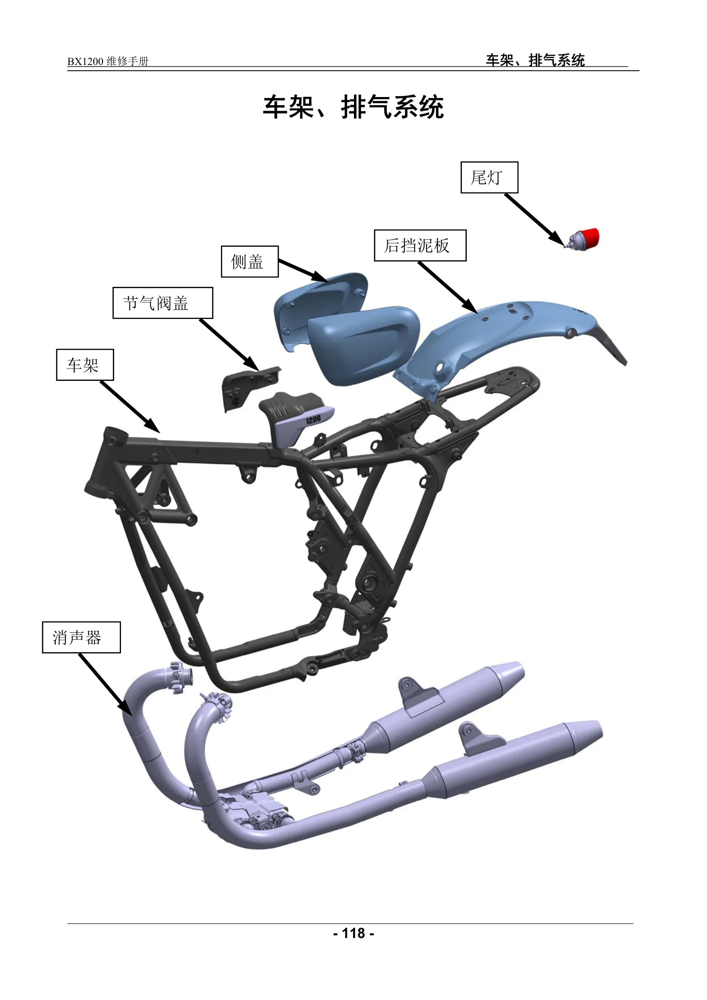

**----- Start of picture text -----** 
尾灯 后挡泥板 侧盖 节气阀盖 车架 消声器 **----- End of picture text -----** 

车架、排气系统 

## **11** 车架、排气系统 

维修须知后挡泥板的拆卸 / 安装故障排除排气消音器的拆卸 / 安装覆盖件、前大灯及仪表后位灯组合 

## 维修须知 

进行本部分的维护时，特别注意覆盖件、仪表、灯具不要划花、破损。在排气系统冷却前，拆卸或维修零部件可能导致严重灼伤。本部分主要包括覆盖件、后挡泥板、排气消声器、散热器及灯的拆卸、安装。 

重要扭矩值 

扶手紧固螺钉 **18** ～ **25N.m** 

## 故障排除 

- 排放噪声过大 

   - 1 、排放系统破坏； 

   - 2 、排气泄漏； 

- 工作异常 

   - 1 、排气系统变形； 

   - 2 、排气泄漏； 

   - 3 、消声器堵塞。 

车架、排气系统 

## 覆盖件、前大灯及仪表 

## 覆盖件、前大灯及仪表的拆卸步骤： 

- 1 、将摩托车以侧支架支撑在平地上，打开坐垫锁，取下坐垫。取下坐垫 

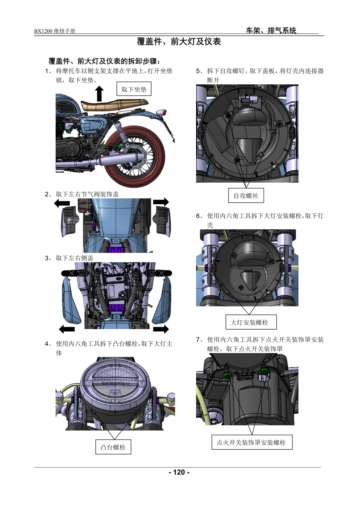

- 2 、取下左右节气阀装饰盖 

**----- Start of picture text -----** 
3 、取下左右侧盖 **----- End of picture text -----** 

- 4 、使用内六角工具拆下凸台螺栓，取下大灯主体 

**----- Start of picture text -----** 
凸台螺栓 **----- End of picture text -----** 

- 5 、拆下自攻螺钉，取下盖板，将灯壳内连接器断开 

**----- Start of picture text -----** 
自攻螺丝 **----- End of picture text -----** 

- 6 、使用内六角工具拆下大灯安装螺栓，取下灯壳 

**----- Start of picture text -----** 
大灯安装螺栓 **----- End of picture text -----** 

- 7 、使用内六角工具拆下点火开关装饰罩安装螺栓，取下点火开关装饰罩 

**----- Start of picture text -----** 
点火开关装饰罩安装螺栓 **----- End of picture text -----** 

车架、排气系统 

- 8 、使用工具拆下仪表下盖安装螺钉，取下仪表下盖 

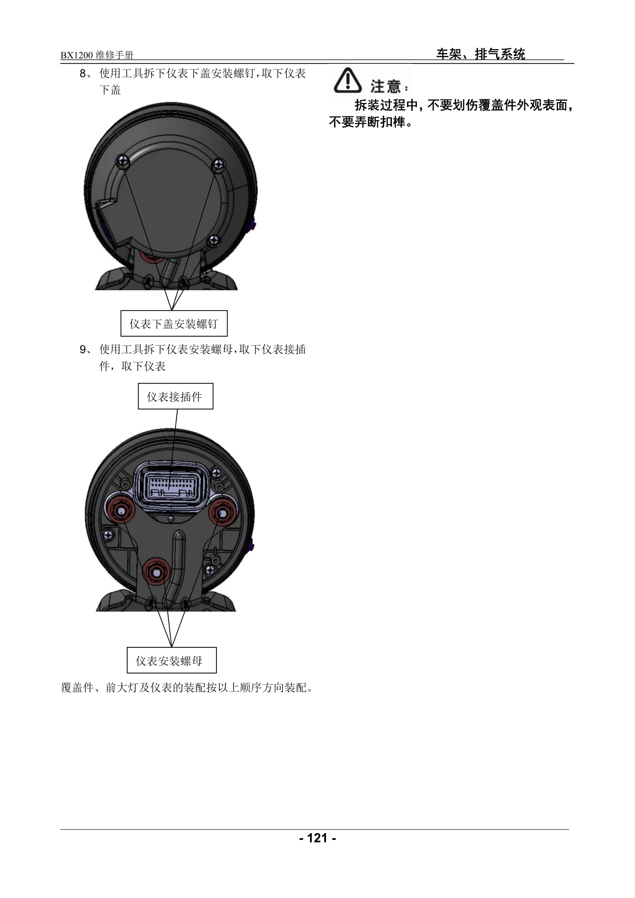

拆装过程中，不要划伤覆盖件外观表面，不要弄断扣榫。 

**----- Start of picture text -----** 
仪表下盖安装螺钉 **----- End of picture text -----** 

- 9 、使用工具拆下仪表安装螺母，取下仪表接插 

   - 件，取下仪表 

**----- Start of picture text -----** 
仪表接插件 仪表安装螺母 **----- End of picture text -----** 

覆盖件、前大灯及仪表的装配按以上顺序方向装配。 

车架、排气系统 

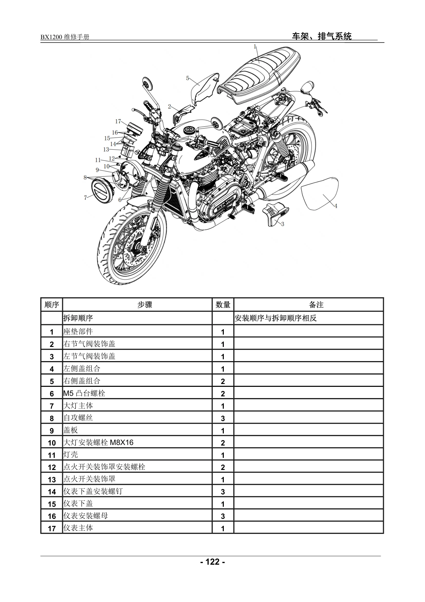

|顺序|步骤|数量|备注|
|---|---|---|---|
||拆卸顺序||安装顺序与拆卸顺序相反|
|**1**|座垫部件|**1**||
|**2**|右节气阀装饰盖|**1**||
|**3**|左节气阀装饰盖|**1**||
|**4**|左侧盖组合|**1**||
|**5**|右侧盖组合|**2**||
|**6**|M5凸台螺栓|**2**||
|**7**|大灯主体|**1**||
|**8**|自攻螺丝|**3**||
|**9**|盖板|**1**||
|**10**|大灯安装螺栓M8X16|**2**||
|**11**|灯壳|**1**||
|**12**|点火开关装饰罩安装螺栓|**2**||
|**13**|点火开关装饰罩|**1**||
|**14**|仪表下盖安装螺钉|**3**||
|**15**|仪表下盖|**1**||
|**16**|仪表安装螺母|**3**||
|**17**|仪表主体|**1**||

车架、排气系统 

## 后挡泥板、尾灯组合 

## 后挡泥板、尾灯的拆卸步骤： 

- 1、将摩托车以侧支架支撑在平地上，打开坐垫锁，取下座垫。取下座垫 

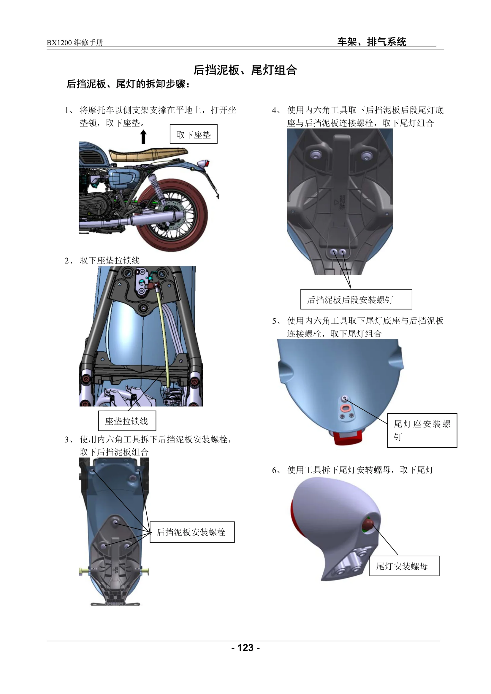

- 2、取下座垫拉锁线 

**----- Start of picture text -----** 
座垫拉锁线 **----- End of picture text -----** 

- 3、使用内六角工具拆下后挡泥板安装螺栓，取下后挡泥板组合 

**----- Start of picture text -----** 
后挡泥板安装螺栓 **----- End of picture text -----** 

- 4、使用内六角工具取下后挡泥板后段尾灯底座与后挡泥板连接螺栓，取下尾灯组合 

**----- Start of picture text -----** 
后挡泥板后段安装螺钉 **----- End of picture text -----** 

- 5、使用内六角工具取下尾灯底座与后挡泥板连接螺栓，取下尾灯组合 

**----- Start of picture text -----** 
尾灯座安装螺 钉 **----- End of picture text -----** 

- 6、使用工具拆下尾灯安转螺母，取下尾灯 

**----- Start of picture text -----** 
尾灯安装螺母 **----- End of picture text -----** 

车架、排气系统 

## 后挡泥板、尾灯的拆卸/安装 

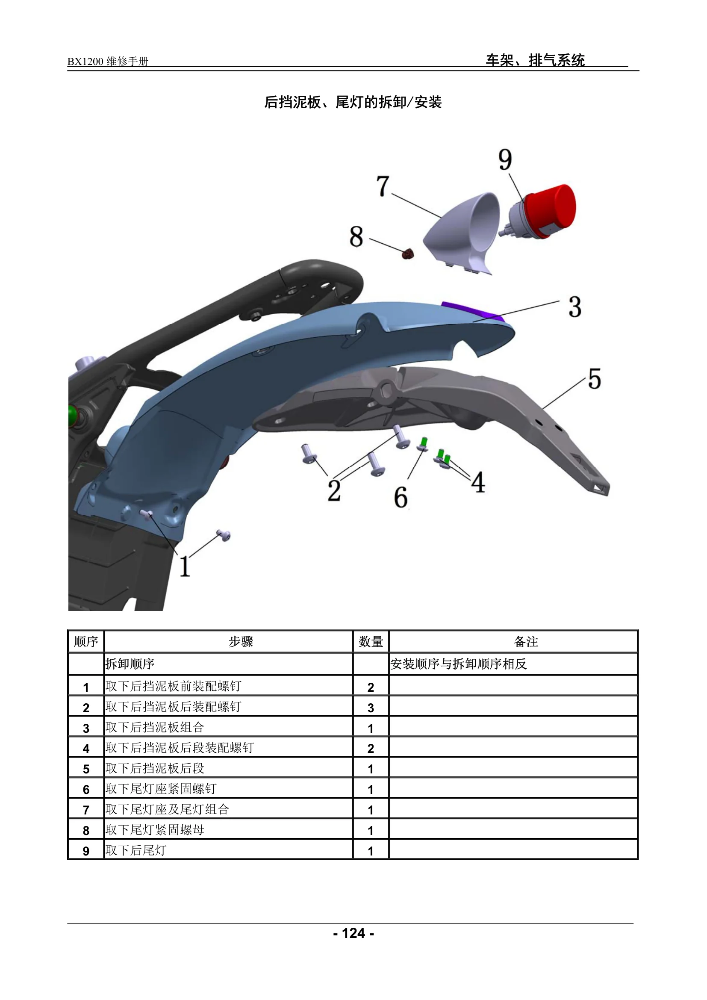

|顺序|步骤|数量|备注|
|---|---|---|---|
||拆卸顺序||安装顺序与拆卸顺序相反|
|**1**|取下后挡泥板前装配螺钉|**2**||
|**2**|取下后挡泥板后装配螺钉|**3**||
|**3**|取下后挡泥板组合|**1**||
|**4**|取下后挡泥板后段装配螺钉|**2**||
|**5**|取下后挡泥板后段|**1**||
|**6**|取下尾灯座紧固螺钉|**1**||
|**7**|取下尾灯座及尾灯组合|**1**||
|**8**|取下尾灯紧固螺母|**1**||
|**9**|取下后尾灯|**1**||

车架、排气系统 

## 排气消音器的拆卸/安装 

## 排气消声器的拆卸步骤： 

- 1、将摩托车以主支架支撑在平地上，收起副脚蹬，拆下消声器紧固螺母和拧松消声器抱箍，拆卸下消声器（左、右消声器相同），小心与车架后叉产生碰伤。 

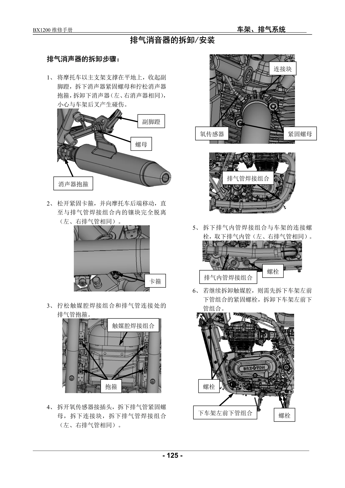

**----- Start of picture text -----** 
副脚蹬 螺母 消声器抱箍 **----- End of picture text -----** 

- 2、松开紧固卡箍，并向摩托车后端移动，直至与排气管焊接组合内的镶块完全脱离 

**----- Start of picture text -----** 
连接块 氧传感器紧固螺母 **----- End of picture text -----** 

**----- Start of picture text -----** 
排气管焊接组合 **----- End of picture text -----** 

- （左、右排气管相同）。 

**----- Start of picture text -----** 
卡箍 **----- End of picture text -----** 

- 3、拧松触媒腔焊接组合和排气管连接处的排气管抱箍。 

**----- Start of picture text -----** 
触媒腔焊接组合 抱箍 **----- End of picture text -----** 

- 4、拆开氧传感器接插头，拆下排气管紧固螺母，拆下连接块，拆下排气管焊接组合（左、右排气管相同）。 

- 5、拆下排气内管焊接组合与车架的连接螺栓，取下排气内管（左、右排气管相同）。螺栓 

- 排气内管焊接组合 

- 6、若继续拆卸触媒腔，则需先拆下车架左前下管组合的紧固螺栓，拆卸下车架左前下管组合。 

**----- Start of picture text -----** 
螺栓 下车架左前下管组合 螺栓 **----- End of picture text -----** 

车架、排气系统 

- 7、拆下触媒腔安装螺栓，触媒腔焊接组合左 

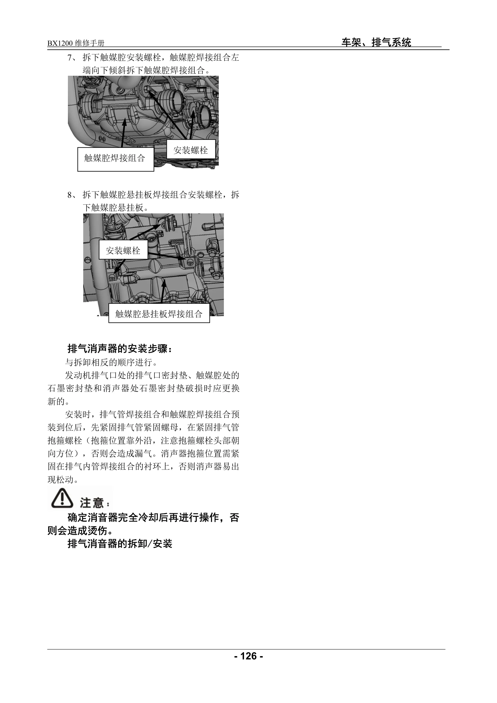

**----- Start of picture text -----** 
端向下倾斜拆下触媒腔焊接组合。 安装螺栓 触媒腔焊接组合 **----- End of picture text -----** 

- 8、拆下触媒腔悬挂板焊接组合安装螺栓，拆 

   - 下触媒腔悬挂板。 

**----- Start of picture text -----** 
安装螺栓 触媒腔悬挂板焊接组合 **----- End of picture text -----** 

## 排气消声器的安装步骤： 

## 与拆卸相反的顺序进行。 

发动机排气口处的排气口密封垫、触媒腔处的石墨密封垫和消声器处石墨密封垫破损时应更换新的。 

安装时，排气管焊接组合和触媒腔焊接组合预装到位后，先紧固排气管紧固螺母，在紧固排气管抱箍螺栓（抱箍位置靠外沿，注意抱箍螺栓头部朝向方位），否则会造成漏气。消声器抱箍位置需紧固在排气内管焊接组合的衬环上，否则消声器易出现松动。 

确定消音器完全冷却后再进行操作，否则会造成烫伤。 

排气消音器的拆卸/安装 

车架、排气系统 

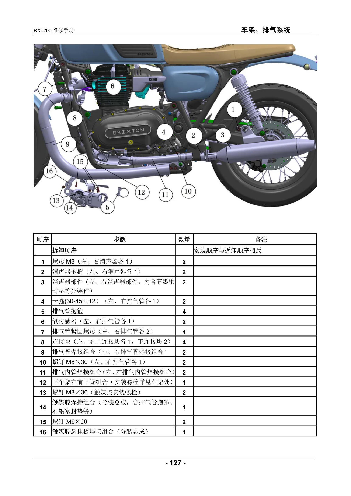

|顺序|步骤|数量|备注|
|---|---|---|---|
||拆卸顺序||安装顺序与拆卸顺序相反|
|**1**|螺母M8（左、右消声器各1）|**2**||
|**2**|消声器抱箍（左、右消声器各1）|**2**||
|**3**|消声器部件（左、右消声器部件，内含石墨密 封垫等分装件）|**2**||
|**4**|卡箍(30-45×12）（左、右排气管各1）|**2**||
|**5**|排气管抱箍|**4**||
|**6**|氧传感器（左、右排气管各1）|**2**||
|**7**|排气管紧固螺母（左、右排气管各2）|**4**||
|**8**|连接块（左、右上连接块各1，下连接块2）|**4**||
|**9**|排气管焊接组合（左、右排气管焊接组合）|**2**||
|**10**|螺钉M8×30（左、右排气管各1）|**2**||
|**11**|排气内管焊接组合（左、右排气内管焊接组合）|**2**||
|**12**|下车架左前下管组合（安装螺栓详见车架处）|**1**||
|**13**|螺钉M8×30（触媒腔安装螺栓）|**2**||
|**14**|触媒腔焊接组合（分装总成，含排气管抱箍、 石墨密封垫等）|**1**||
|**15**|螺钉M8×20|**2**||
|**16**|触媒腔悬挂板焊接组合（分装总成）|**1**||

前轮、前制动器、前悬挂装置、方向柱 

## 前轮、前悬挂装置、方向柱、前制动器 

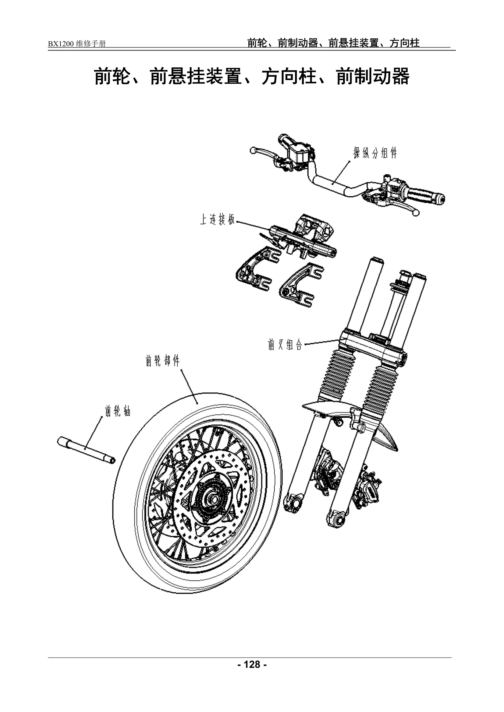

前轮、前制动器、前悬挂装置、方向柱 

## **12** 

## 前轮、前悬挂装置、方向柱、前制动器 

|维修须知|前轮|
|---|---|
|重要扭矩值|前悬挂装置|
|故障检修|方向柱|
|操纵分组件|前制动器|

## 维修须知 

- 在维修前轮时，应在发动机下面用千斤顶或其他支架将摩托车可靠地支撑起来，使前轮离开地面。 

- 只能采用标有“ TUBELESS ”（无内胎）标记的轮胎。 

- 吸入摩擦片粉尘会引起呼吸系统不适，切勿用风管或干刷清扫制动器组件，请到专业的维修网点进行维修和保养。 

## 重要扭矩值 

前轮轴 80 ～ 90 N.m 前制动主泵及离合卡子 8 ～ 12 N.m 手把管固定螺栓 21 ～ 25 N.m 前叉立管螺母 80 ～ 90 N.m 上下连接板固定螺栓 21 ～ 25 N.m 制动盘紧固螺钉 28 ～ 32 N.m 

## 故障检修 

方向不稳 

- 1 、立管轴承有损坏； 

2 、轮胎压力不够； 

- 3 、轮胎损坏； 

- 4 、车轮轴承损坏。 

## 轮子转动困难 

   - 1 、车轮轴承、轴套损坏 

   - 2 、轮胎气压不够。 

   - 3 、制动器摩擦片不复位。 

- 5 、立管调节螺母太紧。 

## 悬挂装置过软 

## 驾驶方向偏向一边或不走直线 

- 1 、左右减震器调节不均匀； 

   - 1 、前叉弹簧的弹力不够； 

   - 2 、液压油面过低或液体型号有误。 

- 2 、前叉弯曲； 

- 3 、前轮轴弯曲，车轮安装不正确； 

- 4 、车轮轴承损坏； 

## 悬挂装置过硬 

- 1 、液压油面过高或液体型号有误。 

- 2 、前减震叉管弯曲 

## 前轮跳动 

   - 3 、前减震阻力器堵塞。 

- 1 、轮圈弯曲变形 

- 2 、车轮轴承磨损 

- 3 、车轮辐条变形或松动 

- 4 、前轮轴松动 

- 5 、轮胎损坏 

## 制动器性能不良 

- 1 、制动器管内有空气； 

- 2 、制动蹄片磨损； 

- 3 、制动蹄片有水或油污。 

前轮、前制动器、前悬挂装置、方向柱 

## 操纵分组件拆卸/装配 

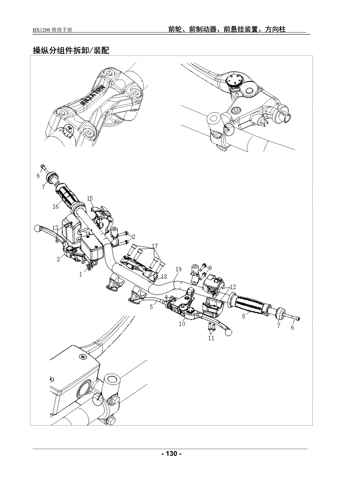

前轮、前制动器、前悬挂装置、方向柱 

注意用钢丝绳将前制动主油缸吊起来，其高度至少要与原来安装位置的高度相同，以免空气侵入主油缸，影响制动性能，禁止扭曲制动软管。装配离合器把手、前制动缸体时开口应与手把管的打刻点对齐。卡子后端的开口与手把管的打刻点对齐，先紧固卡子前面颗螺栓，再紧固后面颗螺栓。安装完毕，应调整离合操纵线。线缆和配线与布线图一致。 

## 维修要求 

|顺序|顺序|步骤|数量|备注|
|---|---|---|---|---|
|拆卸顺序|||安装顺序与拆卸顺序相反||
|1|制动开关插头||2||
|2|前制动主油缸卡子螺栓||2|注意：1、先拧紧前面的一颗螺栓，再紧固后面是 一颗螺栓；2、卡子上有两个凸起的三角形标记朝 后|
|3|前制动缸体部件||1||
|4|离合器开关插头||2||
|5|离合器线||1||
|6|平衡锤螺栓||2||
|7|平衡锤||2||
|8|左手把||1|把手标识对齐手把管打刻标识点|
|9|离合器把手螺栓||1|把手开口对齐手把管打刻标识点|
|10|离合器把手||1||
|11|左组合开关螺钉||2|注意：先拧紧上面颗螺栓，再紧固下面颗螺栓|
|12|左组合开关||1||
|13|右组合开关螺钉||2|注意：先拧紧上面颗螺栓，再紧固下面颗螺栓|
|14|电子加油器螺钉||1||
|15|右组合开关||1||
|16|右手把组合||1||
|17|卡子螺栓||4|注意：先拧紧前面颗螺栓，再紧固后面颗螺栓|
|18|卡子||1||
|19|手把管||1||

前轮、前制动器、前悬挂装置、方向柱 

## 前轮拆卸/装配 

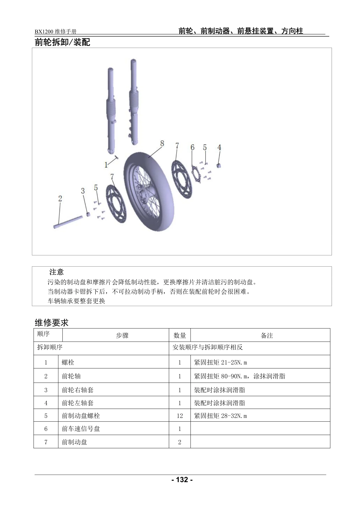

## 注意 

污染的制动盘和摩擦片会降低制动性能，更换摩擦片并清洁脏污的制动盘。当制动器卡钳拆下后，不可拉动制动手柄，否则在装配前轮时会很困难。车辆轴承要整套更换 

## 维修要求 

|顺序|顺序|步骤|数量|备注|
|---|---|---|---|---|
|拆卸顺序|||安装顺序与拆卸顺序相反||
|1|螺栓||1|紧固扭矩21-25N.m|
|2|前轮轴||1|紧固扭矩80-90N.m，涂抹润滑脂|
|3|前轮右轴套||1|装配时涂抹润滑脂|
|4|前轮左轴套||1|装配时涂抹润滑脂|
|5|前制动盘螺栓||12|紧固扭矩28-32N.m|
|6|前车速信号盘||1||
|7|前制动盘||2||

前轮、前制动器、前悬挂装置、方向柱 

## 前悬挂装置拆卸/装配 

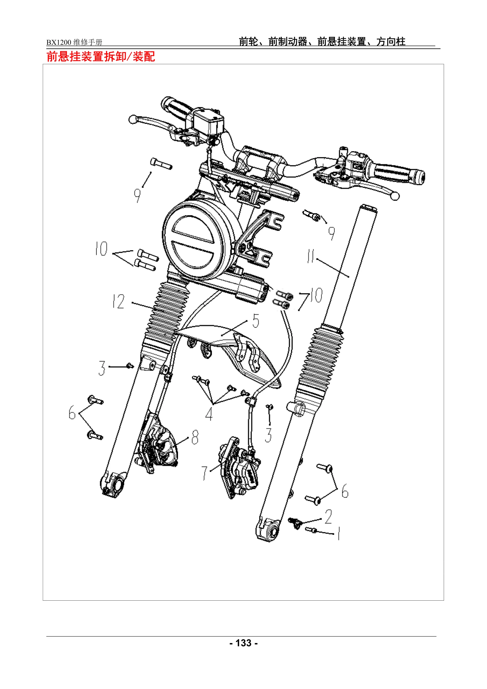

前轮、前制动器、前悬挂装置、方向柱 

## 注意 

用钢丝绳将前制动主油缸吊起来，其高度至少要与原来安装位置的高度相同，禁止扭曲制动软管。当制动器卡钳拆下后，不可拉动制动杆，否则在装配前轮时会很困难。拆卸减震前，拧松方向柱锁紧螺母，但不要拆掉。 

## 维修要求 

|顺序|顺序|步骤|数量|备注|
|---|---|---|---|---|
|拆卸顺序|||安装顺序与拆卸顺序相反||
|1|内六角带盘螺钉M6×20||1||
|2|前轮车速传感器||1||
|3|制动油管固定螺钉M5×12||2||
|4|前挡泥板装配螺钉M6×16||4||
|5|前挡泥板||1||
|6|前制动器装配螺栓螺钉M8×32||4|制动扭矩28~32N.m|
|7|前制动卡钳组合（L）||1|注意：用钢丝绳将前制动主油缸吊起来，禁止扭曲制 动软管|
|8|前制动卡钳组合（R）||1|注意：用钢丝绳将前制动主油缸吊起来，禁止扭曲制 动软管|
|9|上连接板安装螺钉M8×30||2|仅仅拧松，小心减震落下|
|10|下连接板安装螺钉M8×35||4|仅仅拧松，小心减震落下|
|11|前减震（L）||1||
|12|前减震（R）||1||

前轮、前制动器、前悬挂装置、方向柱 

## 方向柱拆卸/装配 

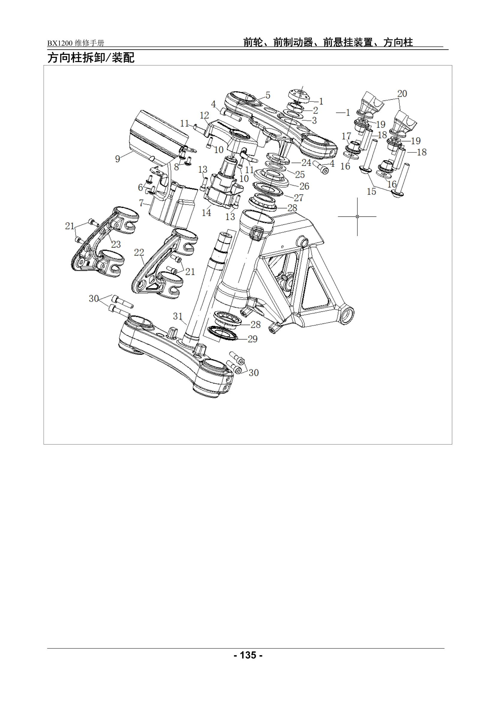

前轮、前制动器、前悬挂装置、方向柱 

## 维修要求 

|顺序|顺序|步骤|数量|备注|
|---|---|---|---|---|
|拆卸顺序|||安装顺序与拆卸顺序相反||
|1|装饰盖||1||
|2|方向柱螺母||1|装配扭矩80-90N.m|
|3|方向柱垫片||1||
|4|上连接板安装螺钉||2||
|5|上连接板||1||
|6|点火开关装饰罩安装螺钉||2|内六角螺钉M5X12|
|7|点火开关装饰罩||1||
|8|仪表安装螺钉||2|内六角螺钉M6X12|
|9|仪表||1||
|10|防盗锁止部件安装螺栓||2|内六角螺钉M5X16|
|11|线钩||2||
|12|防盗锁止部件||1||
|13|点火开关安装螺钉||2|螺钉M6×20|
|14|点火开关||1||
|15|卡座安装螺栓螺栓M10X1.25X60||2|螺栓M10X1.25X60，注意：装配时涂抹螺纹胶|
|16|大垫圈10||2||
|17|卡座缓冲胶垫||4|注意：如果有老化或龟裂应更换|
|18|卡座衬管||2||
|19|平垫圈10||2||
|20|卡座||2|注意：装配时涂抹螺纹胶|
|21|头灯支架安装螺钉||4|螺钉M6×16|
|22|左头灯支架||1||
|23|右头灯支架||1||
|24|调节螺母B||1|装配扭矩21-25N.m|
|25|调节螺母垫片||1||

前轮、前制动器、前悬挂装置、方向柱 

|26|调整螺母A|1|装配扭矩5-8N.m，装配时反复方向柱|
|---|---|---|---|
|27|方向柱防尘圈A|1|装配时涂抹足量润滑脂|
|28|推力轴承|2|装配时涂抹足量润滑脂|
|29|方向柱防尘圈B|1|装配时涂抹足量润滑脂|
|30|内六角螺钉M8X35|4|装配时反复多次紧固|
|31|方向柱|1||

## 方向柱装配 

轴承滚柱表面涂抹足量的锂基润滑脂。把方向柱置入车架立管中。 

依次放入轴承和调节螺母 A ，暂时拧紧调节螺母 A 至扭矩为 25N.m 。 

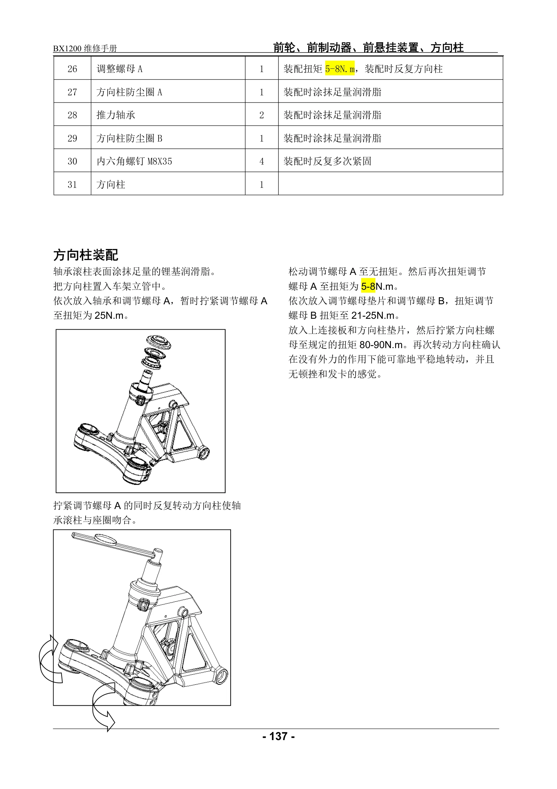

松动调节螺母 A 至无扭矩。然后再次扭矩调节螺母 A 至扭矩为 5-8N.m 。 

依次放入调节螺母垫片和调节螺母 B ，扭矩调节螺母 B 扭矩至 21-25N.m 。 

放入上连接板和方向柱垫片，然后拧紧方向柱螺母至规定的扭矩 80-90N.m 。再次转动方向柱确认在没有外力的作用下能可靠地平稳地转动，并且无顿挫和发卡的感觉。 

拧紧调节螺母 A 的同时反复转动方向柱使轴承滚柱与座圈吻合。 

前轮、前制动器、前悬挂装置、方向柱 

GK500 维修手册 

## 前制动器 

## 维修须知 

- 脏污的制动盘和摩擦片会使降低制动性能，更换摩擦片并清洁脏污的制动盘。 

- 吸入摩擦片粉尘会引起呼吸系统不适，切勿用风管或干刷清扫制动器组件。请到专业的维修网点进行维修和保养。 

- 抛洒的制动液会严重损伤仪表玻璃和油气部件表面，对一些橡胶也有害。在拆卸主油缸时要非常留意，首先确认主油缸是水平的。 

- 切勿让污染物（尘垢，水等）进入主油缸。 

- 液压系统一旦开启，或者制动感觉松软时，必须将制动系统的空气排净。 

- 当系统检修时，必须使用 DOT4 制动液，切勿与不同型号的制动液混用。 

- 驾驶摩托车之前必须检查制动运行状态。 

## 故障检修 

制动松软 

- 1 、管路中有空气； 

- 2 、管路泄露； 

- 3 、制动液面低。 

- 4 、制动摩擦片脏污； 

- 5 、制动副油缸活塞密封磨损，老化。 

- 6 、制动主油缸活塞密封磨损，老化。 

- 7 、制动副油缸活塞粘滞、磨损。 

- 8 、制动主油缸活塞粘滞、磨损。 

- 9 、制动蹄片磨损。 

- 10 、制动蹄片滑动不良。 

- 11 、管路堵塞。 

制动手柄不灵活 

   - 1 、制动系统阻塞、阻滞 

   - 2 、制动钳活塞粘滞、磨损。 

   - 3 、制动蹄片滑动不良。 

   - 4 、管路堵塞、阻滞。 

   - 5 、制动主泵活塞粘滞、磨损。 

   - 6 、制动手柄弯曲。制动向一侧跑偏 

   - 1 、制动盘 / 摩擦片脏污。 

   - 2 、车轮未校正。 

   - 3 、制动盘翘曲，变形。 

   - 4 、制动蹄片滑动不良。 

- 12 、制动盘翘曲，变形。 

- 13 、管路污染。 

## 前制动卡钳部件拆卸/装配 

前轮、前制动器、前悬挂装置、方向柱 

GK500 维修手册 

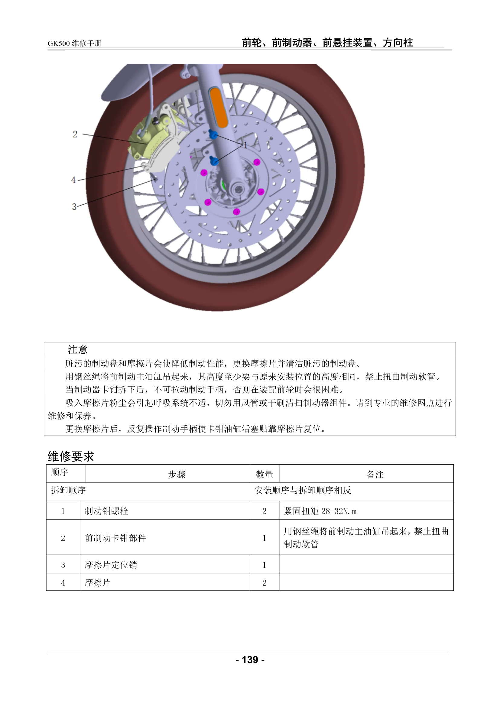

## 注意 

脏污的制动盘和摩擦片会使降低制动性能，更换摩擦片并清洁脏污的制动盘。用钢丝绳将前制动主油缸吊起来，其高度至少要与原来安装位置的高度相同，禁止扭曲制动软管。当制动器卡钳拆下后，不可拉动制动手柄，否则在装配前轮时会很困难。 

吸入摩擦片粉尘会引起呼吸系统不适，切勿用风管或干刷清扫制动器组件。请到专业的维修网点进行维修和保养。 

更换摩擦片后，反复操作制动手柄使卡钳油缸活塞贴靠摩擦片复位。 

## 维修要求 

|顺序|顺序|步骤|数量|备注|
|---|---|---|---|---|
|拆卸顺序|||安装顺序与拆卸顺序相反||
|1|制动钳螺栓||2|紧固扭矩28-32N.m|
|2|前制动卡钳部件||1|用钢丝绳将前制动主油缸吊起来，禁止扭曲 制动软管|
|3|摩擦片定位销||1||
|4|摩擦片||2||

**后轮、后制动器、后悬挂装置** 

BX-1200 维修手册 

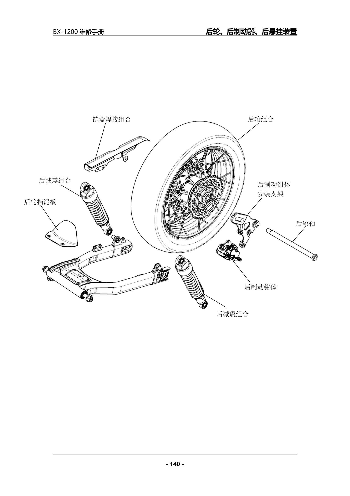

**----- Start of picture text -----** 
链盒焊接组合后轮组合 后减震组合 后制动钳体 安装支架 后轮挡泥板 后轮轴 后制动钳体 后减震组合 **----- End of picture text -----** 

**后轮、后制动器、后悬挂装置** 

BX-1200 维修手册 

## **13** 

## 后轮、后制动器、后悬挂装置 

维修须知后叉组合故障排除后减震器后轮后叉摇臂组合后制动器 

## **维修须知** 

本部分介绍后轮、后制动器、后叉、后减震器及摇臂连杆的拆卸、安装和保养。在维修后轮、后减震、摇臂连杆时，应在发动机下面用千斤顶或其他支架将摩托车可靠地支撑起来。 

**重要扭矩值后轮轴螺母 80～100 N.m 后叉轴螺母 60～70N.m 减震摇臂螺栓、螺母 34～44 N.m 制动盘紧固螺钉 20～30 N.m** 

## **故障排除** 

**后轮、后制动器、后悬挂装置** 

BX-1200 维修手册 

##  **后轮摆动** 

- 1、轮圈弯曲； 

- 2、后轮轴承磨损； 

- 3、轮胎气压低； 

- 4、调节器左右不一致； 

##  **轮子转动困难** 

- 1、车轮轴承、轴套损坏； 

- 2、车轮安装不正确； 

- 3、后轮轴弯曲。 

##  **悬挂不正常** 

- 1、减震弹簧过硬或过软； 

- 2、后叉轴承损坏； 

- 3、减震器有弯曲。 

##  **有杂音** 

紧固件松动。 

**后轮、后制动器、后悬挂装置** 

BX-1200 维修手册 

## **后叉** 

## **后叉的拆卸步骤：** 

## 5.拆下线卡 

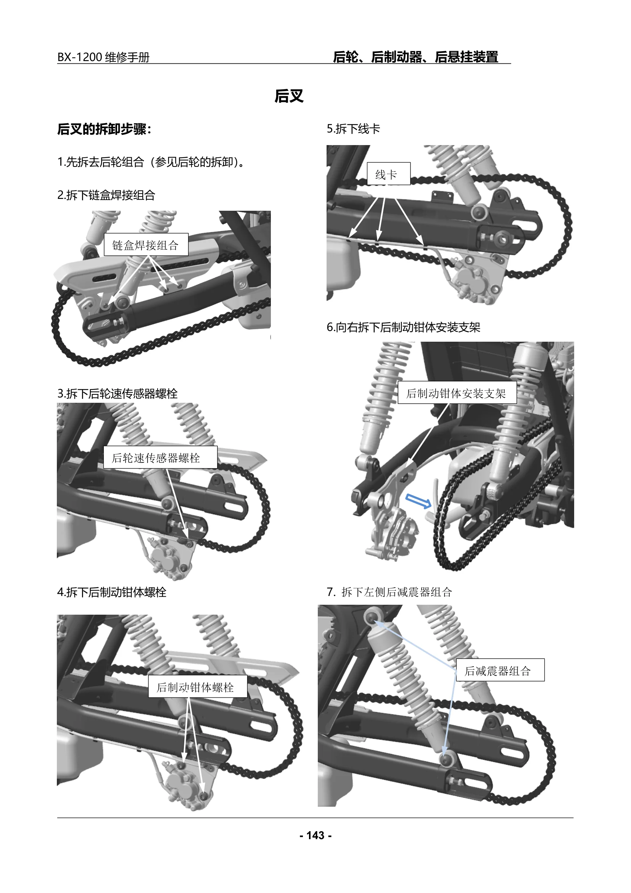

**----- Start of picture text -----** 
线卡 **----- End of picture text -----** 

## 1.先拆去后轮组合（参见后轮的拆卸）。 

## 2.拆下链盒焊接组合 

**----- Start of picture text -----** 
链盒焊接组合 3.拆下后轮速传感器螺栓 后轮速传感器螺栓 **----- End of picture text -----** 

## 6.向右拆下后制动钳体安装支架 

**----- Start of picture text -----** 
3.拆下后轮速传感器螺栓后制动钳体安装支架 后轮速传感器螺栓 4.拆下后制动钳体螺栓 7. 拆下左侧后减震器组合 后减震器组合 后制动钳体螺栓 **----- End of picture text -----** 

**后轮、后制动器、后悬挂装置** 

BX-1200 维修手册 

## 8. 拆下右侧后减震器组合 

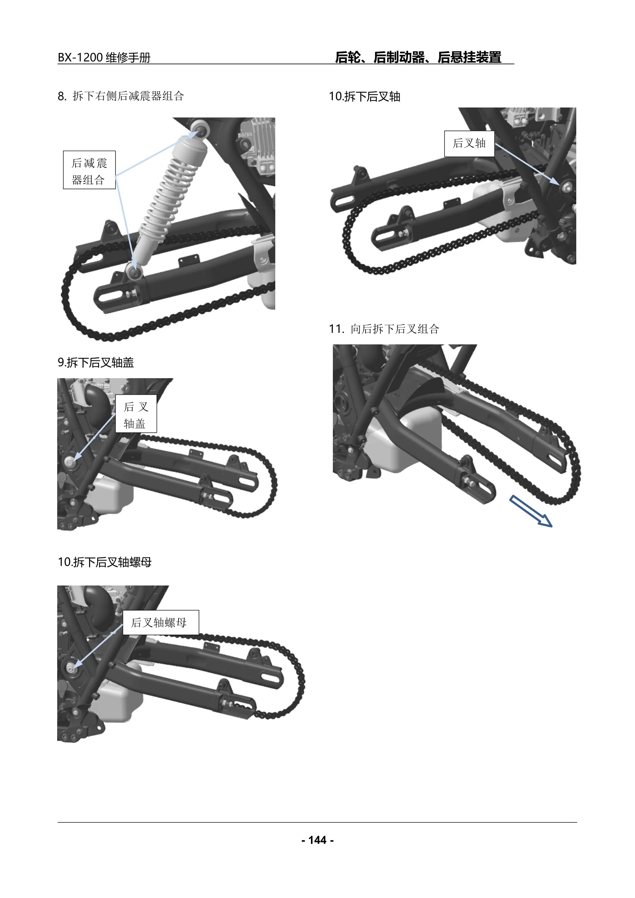

**----- Start of picture text -----** 
后减震 器组合 **----- End of picture text -----** 

## 9.拆下后叉轴盖 

**----- Start of picture text -----** 
后叉 轴盖 **----- End of picture text -----** 

## 10.拆下后叉轴 

**----- Start of picture text -----** 
后叉轴 **----- End of picture text -----** 

## 11. 向后拆下后叉组合 

## 10.拆下后叉轴螺母 

**----- Start of picture text -----** 
后叉轴螺母 **----- End of picture text -----** 

**后轮、后制动器、后悬挂装置** 

BX-1200 维修手册 

## **后叉的安装步骤：** 

与拆卸相反的顺序进行。 

后叉轴螺母紧固扭矩60～70N.m。 

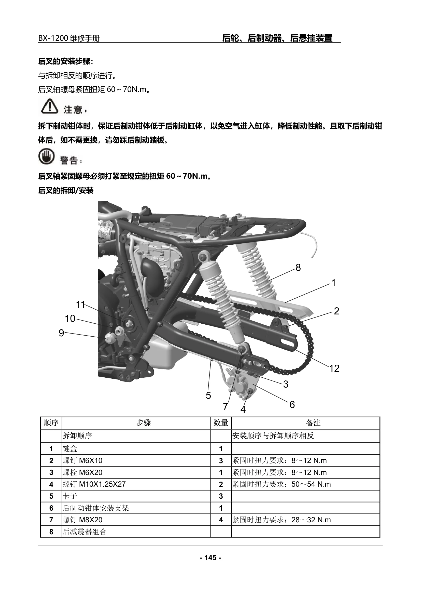

## **拆下制动钳体时，保证后制动钳体低于后制动缸体，以免空气进入缸体，降低制动性能。且取下后制动钳体后，如不需更换，请勿踩后制动踏板。** 

## **后叉轴紧固螺母必须打紧至规定的扭矩60～70N.m。** 

## **后叉的拆卸/安装** 

|**后叉轴紧固螺母必须打紧至规定的扭矩60～70N.m。** **后叉的拆卸/安装**|**后叉轴紧固螺母必须打紧至规定的扭矩60～70N.m。** **后叉的拆卸/安装**|**后叉轴紧固螺母必须打紧至规定的扭矩60～70N.m。** **后叉的拆卸/安装**|**后叉轴紧固螺母必须打紧至规定的扭矩60～70N.m。** **后叉的拆卸/安装**|
|---|---|---|---|
|1 2 3 4 5 6 7 8 9 10 11 12||||
|顺序|步骤|数量|备注|
||拆卸顺序||安装顺序与拆卸顺序相反|
|**1**|链盒|**1**||
|**2**|螺钉M6X10|**3**|紧固时扭力要求：8～12 N.m|
|**3**|螺栓M6X20|**1**|紧固时扭力要求：8～12 N.m|
|**4**|螺钉M10X1.25X27|**2**|紧固时扭力要求：50～54 N.m|
|**5**|卡子|**3**||
|**6**|后制动钳体安装支架|**1**||
|**7**|螺钉M8X20|**4**|紧固时扭力要求：28～32 N.m|
|**8**|后减震器组合|||

**后轮、后制动器、后悬挂装置** 

BX-1200 维修手册 

|**9**|后叉轴盖|**1**||
|---|---|---|---|
|**10**|后叉轴螺母M16X1.5|**1**|紧固时扭力要求：96～100 N.m|
|**11**|后叉轴|**1**|紧固时扭力要求：96～100 N.m|
|**12**|后叉组合|**1**||

## **后叉轴的检查** 

将后叉轴放在V 型座上，用百分表测试后叉 

轴的偏摆，如果读数≥0.2mm ,更换新的后叉轴。 

## **后叉的分解/组装** 

后叉的分解/组装，参照下图进行。 

密封圈、滚针轴承取下后应更换新的。滚针轴承安装后保证距端面3mm，且应在滚针上涂抹锂基润滑脂。装好后，检查滚针轴承转动是否灵活。 

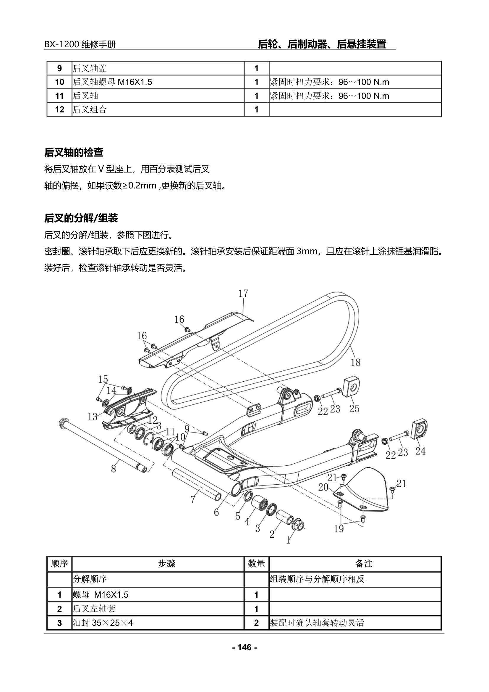

|顺序|步骤|数量|备注|
|---|---|---|---|
||分解顺序||组装顺序与分解顺序相反|
|**1**|螺母M16X1.5|**1**||
|**2**|后叉左轴套|**1**||
|**3**|油封35×25×4|**2**|装配时确认轴套转动灵活|

**后轮、后制动器、后悬挂装置** 

BX-1200 维修手册 

|**4**|冲压外圈滚针轴承HK253330|**1**|安装时滚针上涂锂基润滑脂|
|---|---|---|---|
|**5**|轴承衬管支撑圈|**1**||
|**6**|后叉焊接组合|**1**||
|**7**|后叉轴承衬管|**1**||
|**8**|后叉轴|**1**||
|**9**|铆螺母M5×12|**2**||
|**10**|深沟球轴承6003-2RS|**2**|安装时滚针上涂锂基润滑脂|
|**11**|孔用弹性挡圈A型35|**1**||
|**12**|后叉右轴套|**1**|装配时确认轴套转动灵活|
|**13**|链条护卡|**1**||
|**14**|翻边垫圈|**2**||
|**15**|螺钉M5×10|**2**||
|**16**|螺钉M6×12|**3**||
|**17**|链盒焊接组合|**1**||
|**18**|滚子链525-102|**1**||
|**19**|铆螺母M6×12|**1**||
|**20**|小挡泥板|**1**||
|**21**|螺钉M6X12|**2**||
|**22**|螺母M8|**2**||
|**23**|螺栓M8X60|**2**||
|**24**|链条调节右定位板|**1**||
|**25**|链条调节左定位板|**1**||

蓄电池与供电系统 

## **15** 蓄电池与供电系统 

概述主要零部件介绍电路原理图主要故障诊断零件布置图 

## 概述 

供电系统是整车电气系统工作的前提，能为其它电气分系统提供充足的电能。包含的内容有：充电、存电和放电。 GK1200 供电系统的特点是供电能力大，可达 560W 。它由以下零部件组成： 

- 磁电机 

- 调压整流器 

- 蓄电池 

- 点火开关 

- 各路保险 

## 电路原理图 

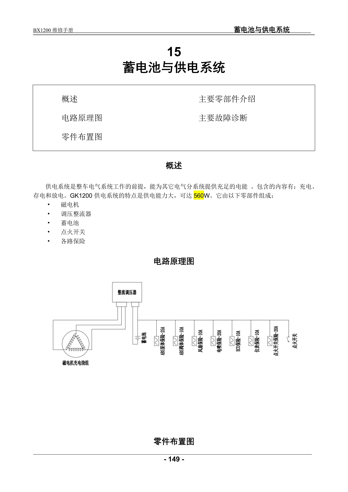

## 零件布置图 

蓄电池与供电系统 

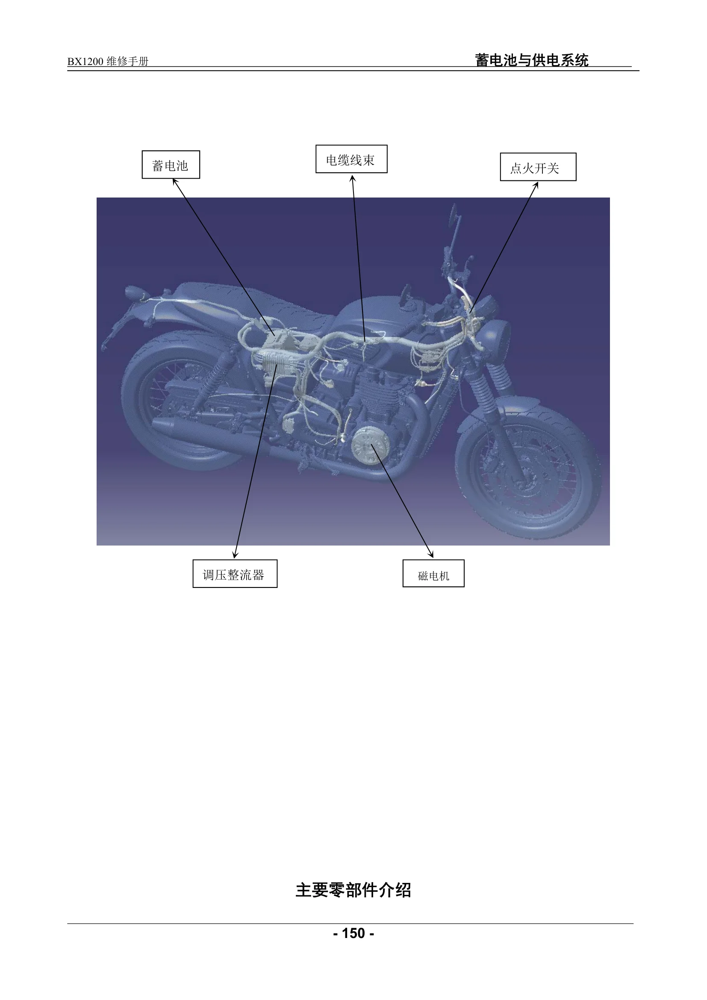

**----- Start of picture text -----** 
电缆线束 蓄电池点火开关 调压整流器磁电机 **----- End of picture text -----** 

## 主要零部件介绍 

蓄电池与供电系统 

## ○磁电机 

- **1** 、外形图 

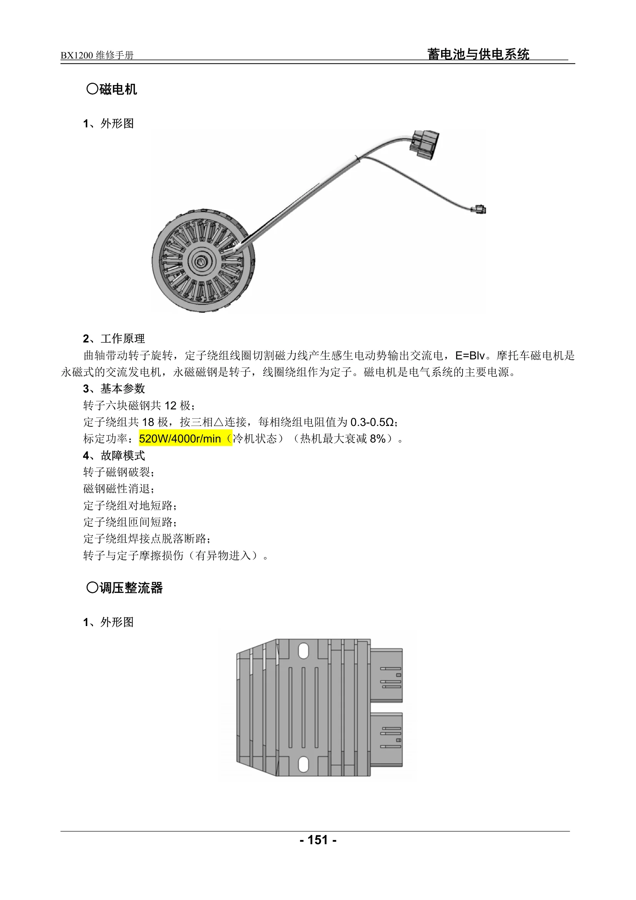

## **2** 、工作原理 

曲轴带动转子旋转，定子绕组线圈切割磁力线产生感生电动势输出交流电， E=Blv 。摩托车磁电机是永磁式的交流发电机，永磁磁钢是转子，线圈绕组作为定子。磁电机是电气系统的主要电源。 **3** 、基本参数 

转子六块磁钢共 12 极；定子绕组共 18 极，按三相△连接，每相绕组电阻值为 0.3-0.5Ω ；标定功率： 520W/4000r/min （冷机状态）（热机最大衰减 8% ）。 **4** 、故障模式转子磁钢破裂；磁钢磁性消退；定子绕组对地短路；定子绕组匝间短路；定子绕组焊接点脱落断路；转子与定子摩擦损伤（有异物进入）。 

## ○调压整流器 

## **1** 、外形图 

蓄电池与供电系统 

## **2** 、工作原理 

通过全波整流、可控稳压充电电路将磁电机输出的随转速波动的三相正弦交流电转换成稳定的直流电。向负载提供电能，并对蓄电池充电。 

**3** 、基本参数 

结构型式：三相全波整流，短路方式（ MOS 管）；调整电压： 14.5V±0.3V ；最大工作电流： 50A 。 **4** 、故障模式稳压电路失控，对蓄电池过充电；整流电路断路或短路，对蓄电池不能充电或充电不足；引出线短路或断路。 

## ○蓄电池 

**1** 、外形图 

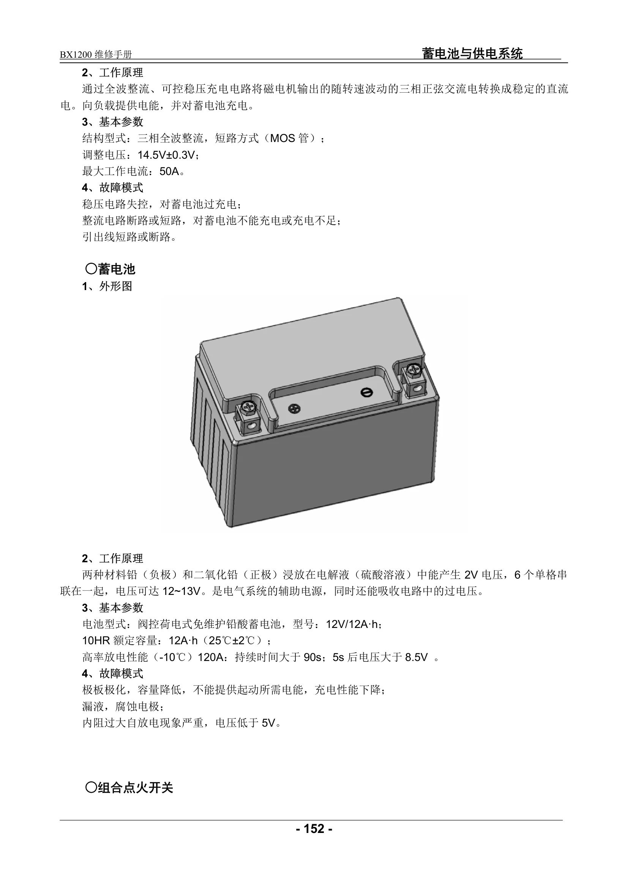

## **2** 、工作原理 

两种材料铅（负极）和二氧化铅（正极）浸放在电解液（硫酸溶液）中能产生 2V 电压， 6 个单格串联在一起，电压可达 12~13V 。是电气系统的辅助电源，同时还能吸收电路中的过电压。 

**3** 、基本参数 

电池型式：阀控荷电式免维护铅酸蓄电池，型号： 12V/12Aꞏh ； 10HR 额定容量： 12Aꞏh （ 25 ℃ ±2 ℃）； 

高率放电性能（ -10 ℃） 120A ：持续时间大于 90s ； 5s 后电压大于 8.5V 。 **4** 、故障模式极板极化，容量降低，不能提供起动所需电能，充电性能下降；漏液，腐蚀电极；内阻过大自放电现象严重，电压低于 5V 。 

## ○组合点火开关 

蓄电池与供电系统 

## **1** 、外形图 

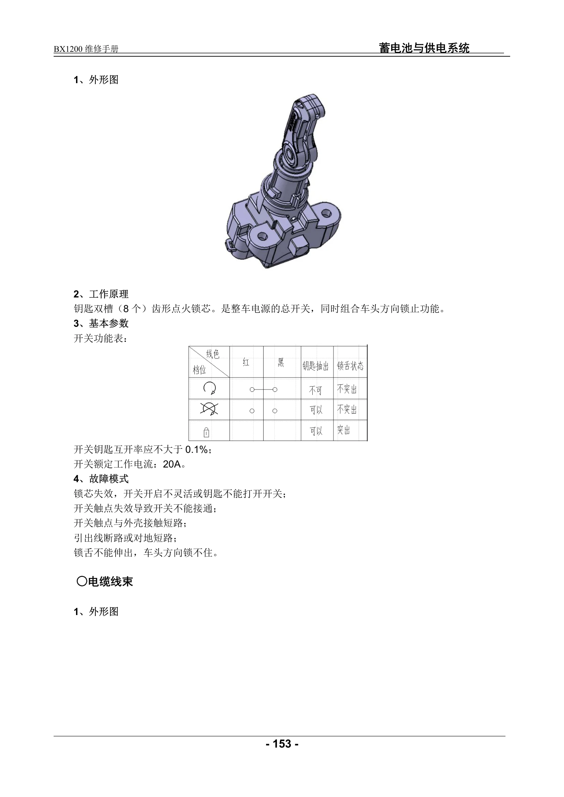

- **2** 、工作原理 

钥匙双槽（ 8 个）齿形点火锁芯。是整车电源的总开关，同时组合车头方向锁止功能。 **3** 、基本参数 

开关功能表： 

开关钥匙互开率应不大于 0.1% ； 

开关额定工作电流： 20A 。 

**4** 、故障模式 

锁芯失效，开关开启不灵活或钥匙不能打开开关；开关触点失效导致开关不能接通；开关触点与外壳接触短路；引出线断路或对地短路；锁舌不能伸出，车头方向锁不住。 

## ○电缆线束 

- **1** 、外形图 

蓄电池与供电系统 

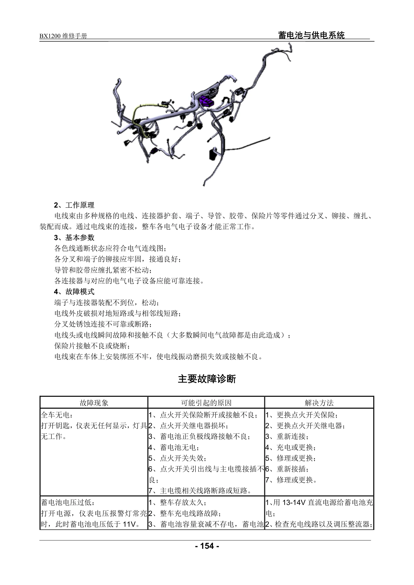

## **2** 、工作原理 

电线束由多种规格的电线、连接器护套、端子、导管、胶带、保险片等零件通过分叉、铆接、缠扎、装配而成。通过电线束的连接，整车各电气电子设备才能正常工作。 

**3** 、基本参数 

各色线通断状态应符合电气连线图； 

各分叉和端子的铆接应牢固，接通良好； 

导管和胶带应缠扎紧密不松动； 

各连接器与对应的电气电子设备应能可靠连接。 

**4** 、故障模式 

端子与连接器装配不到位，松动；电线外皮破损对地短路或与相邻线短路；分叉处锈蚀连接不可靠或断路； 

电线头或电线瞬间故障和接触不良（大多数瞬间电气故障都是由此造成）；保险片接触不良或烧断； 

电线束在车体上安装绑匝不牢，使电线振动磨损失效或接触不良。 

## 主要故障诊断 

|故障现象|可能引起的原因|解决方法||
|---|---|---|---|
|全车无电： 打开钥匙，仪表无任何显示，灯具 无工作。|1、点火开关保险断开或接触不良； 2、点火开关继电器损坏； 3、蓄电池正负极线路接触不良； 4、蓄电池无电； 5、点火开关失效； 6、点火开关引出线与主电缆接插不 良； 7、主电缆相关线路断路或短路。|1、更换点火开关保险； 2、更换点火开关继电器； 3、重新连接； 4、充电或更换； 5、修理或更换； 6、重新接插； 7、修理或更换。||
|蓄电池电压过低： 打开电源，仪表电压报警灯常亮 时，此时蓄电池电压低于11V。|1、整车存放太久； 2、整车充电线路故障； 3、蓄电池容量衰减不存电，蓄电池|1、用13-14V直流电源给蓄电池充 电； 2、检查充电线路以及调压整流器；||

|BX1200维修手册 蓄电池与供电系统|BX1200维修手册 蓄电池与供电系统|BX1200维修手册 蓄电池与供电系统|
|---|---|---|
||自放电。|3、更换蓄电池。|
|蓄电池充电不足： 发动机起动以后，蓄电池端电压低 于14V。|1、调压整流器引出线与主电缆或磁 电机接插不良； 2、主电缆相关线路断路或短路； 3、磁电机失效； 4、调压整流器失效；|1、重新接插； 2、修理或更换； 3、更换磁电机； 4、更换调压整流器；|
|蓄电池过充电： 蓄电池有较大的析气或者蓄电池 变形现象。|1、调压整流器失效。|1、更换调压整流器以及蓄电池。|

起动系统 

## **16** 起动系统 

概述主要零部件介绍电路原理图主要故障诊断零件布置图 

## 概述 

发动机初始工作时，需要借助外力作用，先让它转动起来，才能进入点火供油程序，内燃机才能循环燃烧，稳定工作。 BX1200 摩托车只设置了电控起动。满足启动条件（空挡或者收起侧支架接通离合器开关），然后按下起动按钮，接通起动继电器，起动电机转动，带动中间齿轮、单向器，使发动机进入工作循环，正常点火喷油燃烧。系统由以下零部件组成： 

- 起动电机； 

- 起动继电器； 

- 蓄电池； 

- - 

- 起动开关和运行熄火开关； 

- ECU 部件 

- 电子档位开关、侧支架开关和离合器开关。 

## 电路原理图 

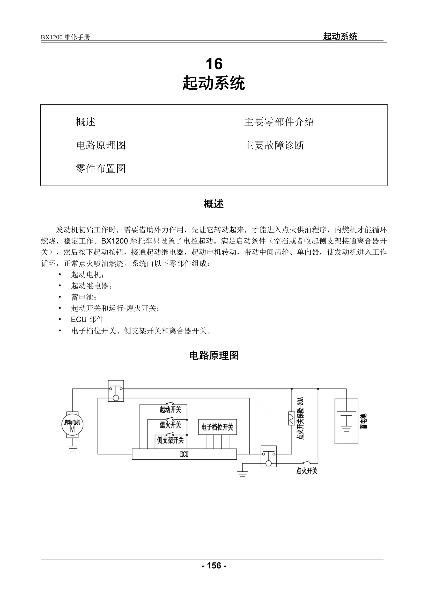

起动系统 

## 零件布置图 

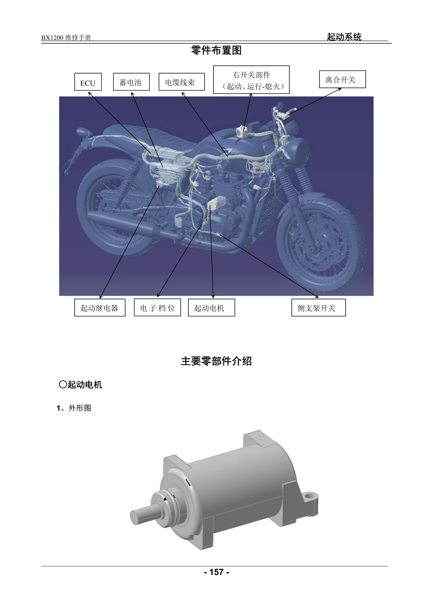

**----- Start of picture text -----** 
右开关部件 离合开关 ECU 蓄电池电缆线束（起动、运行-熄火） 起动继电器电子档位起动电机侧支架开关 **----- End of picture text -----** 

## 主要零部件介绍 

## ○起动电机 

- **1** 、外形图 

起动系统 

## **2** 、工作原理 

载流导体在磁场中要受到电磁力作用， F=Bli 。给起动电机正负极通电（负极搭铁），电机轴旋转，通过减速齿轮、单向器、曲柄，带动发动机初始运转。 

**3** 、基本参数 

定子四块磁钢共 4 极，四个炭刷； 

输出轴旋转方向：齿端看入顺时针； 

输出特性： 

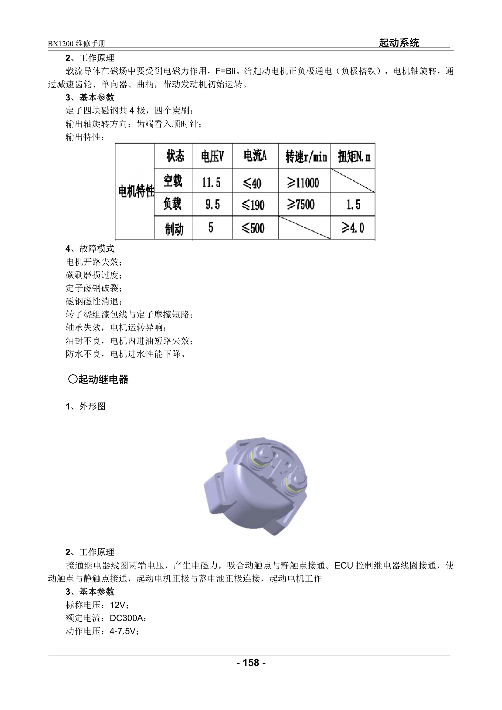

**4** 、故障模式电机开路失效；碳刷磨损过度；定子磁钢破裂；磁钢磁性消退；转子绕组漆包线与定子摩擦短路；轴承失效，电机运转异响；油封不良，电机内进油短路失效；防水不良，电机进水性能下降。 

## ○起动继电器 

## **1** 、外形图 

## **2** 、工作原理 

接通继电器线圈两端电压，产生电磁力，吸合动触点与静触点接通。 ECU 控制继电器线圈接通，使动触点与静触点接通，起动电机正极与蓄电池正极连接，起动电机工作 

**3** 、基本参数 

标称电压： 12V ；额定电流： DC300A ；动作电压： 4-7.5V ； 

起动系统 

释放电压： 0.5-3V ；触点压降： 0.2V 以下（ 300A 时）；线圈电流： 4.5A 以下（ 12V 时）。 

**4** 、故障模式 

线圈或接线片开路，触点不能吸合；线圈短路，触点不能吸合；触点锈蚀或烧蚀，即使吸合也不能接通；电流过大将触点粘在一起不能断开；电源电路断路使整车无法启动。 

## ○控制开关 

- **1** 、外形图 

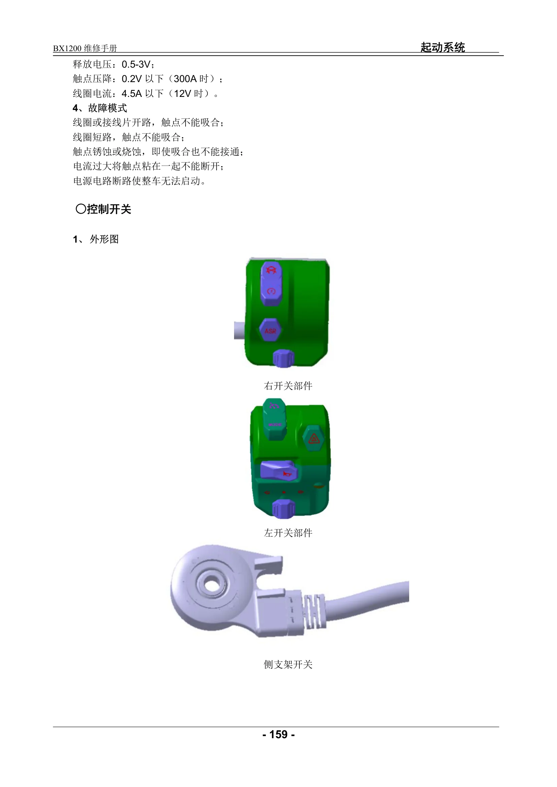

右开关部件 

左开关部件 

**----- Start of picture text -----** 
侧支架开关 **----- End of picture text -----** 

起动系统 

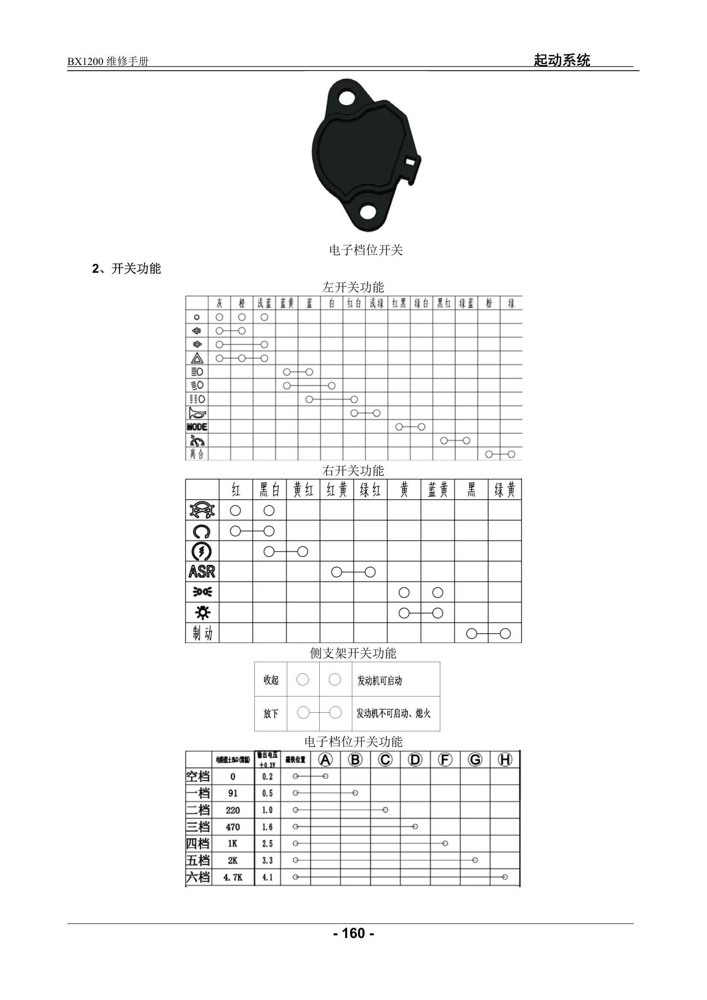

电子档位开关 

**2** 、开关功能 

**----- Start of picture text -----** 
左开关功能 右开关功能 侧支架开关功能 **----- End of picture text -----** 

**----- Start of picture text -----** 
电子档位开关功能 **----- End of picture text -----** 

起动系统 

## **3** 、故障模式 

开关定位销断裂，使用时在手把管上旋转；开关无到位感或到位感不强；按钮不能复位；开关失效、引出线断路，使开关不能接通；引出线短路，开关功能紊乱；侧支架开关松动，触点接触不良；侧支架开关引出线磨破，断路或断路；开关磨损、振动、进水锈蚀失效。 

## 主要故障诊断 

|故障现象|可能引起的原因|诊断方法|解决方法||
|---|---|---|---|---|
|起动继电器不吸合： 按下起动按钮未听 到继电器吸合的声 音，起动电机不转。|1、主电缆相关线路断路； 2、防盗匹配未成功； 3、侧翻传感器作用或者故 障； 4、处于非空挡时，侧支架 开关未收起或者侧支架开 关收起后未接通离合开 关； 5、ECU故障|1、检查起动继电器线圈两端电压 在起动时是否有变化； 2、仪表上防盗指示灯快闪； 3、取下侧翻传感器后可以起动 时，为侧翻传感器作用或者故障； 4、收起侧支架，接通离合开关判 断是否能起动； 5、使用诊断仪读取是否存在故障|1、更换相关线路； 2、重新进行防盗匹配； 3、更换侧翻传感器； 4、/ 5、清除ECU 故障||
|起动电机不转：有继 电器吸合的声音，但 电机不转。|1、蓄电池电压过低； 2、粗线接线头松动； 3、电机开路失效； 4、起动继电器极柱触点 间断路； 5、电机短路失效； 6、发动机卡死电机堵转。|检查蓄电池电压下降情况，不下 降，先检查各接头是否松动，再 检查继电器或电机开路，如下降 过大（低于5V），则为电机短路 或电机堵转。|1、给蓄电池充电； 2、紧固接线头； 3、更换电机； 4、更换起动继电器； 5、更换电机； 6、检查发动机。||
|起动电机一直工作|起动继电器损坏|/|更换起动继电器||
|电机转速过低|1、蓄电池电压或容量过 低； 2、接线头接触不良； 3、起动电机输出扭矩不 够； 4、发动机阻力过大。|/|1、给蓄电池充电或更换； 2、紧固接线头； 3、更换电机； 4、检查发动机。||

照明信号示系统 

+ 

## **17** 照明信号系统 

概述主要零部件介绍电路原理图主要故障诊断零件布置图 

## 概述 

照明信号系统是车辆安全行驶的重要保证，它包括前照灯照明系统、信号灯控制系统和喇叭系统。前照灯照明系统： 

车辆夜间行驶时需要前照灯来照亮路面，并向周围的车辆和人提示本车的存在，中高速行驶时使用远光灯，会车时使用近光灯，近光灯要求防眩。另外对于双灯照明系统还要求，当一只远光灯失效时，另一只远光灯不允许点亮，这需要通过大灯控制器来控制。 

信号灯控制系统： 

车辆转向行驶时，需要通过转向灯的闪烁来提示周围的车辆及人群进行合理避让；夜间行驶时，需要尾灯来提示本车的存在，并照明牌照号码；制动时需要点亮制动灯来提示后面车辆该车正在制动减速。转向灯的闪烁由开关和闪光器控制，其它灯点亮只由开关控制。 

喇叭系统： 

如果周围有其它车辆或行人正在阻碍或可能阻碍本车行驶时，可用喇叭提示，以保证行车安全。喇叭的工作由喇叭按钮控制。 

组成零部件： 

- 前照灯（含日行灯） 

- 尾灯 

- 转向灯 

- 喇叭 

- 大灯继电器 

- 闪光器 

- 前制动灯开关 

- 后制动灯开关 

- 左右组合开关 

- ECU 

照明信号示系统 

## 电路原理图 

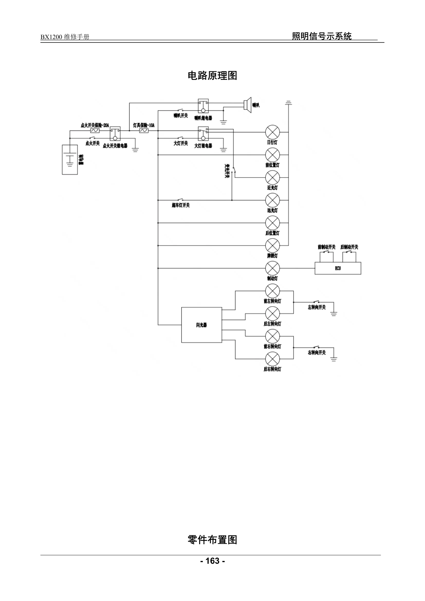

零件布置图 

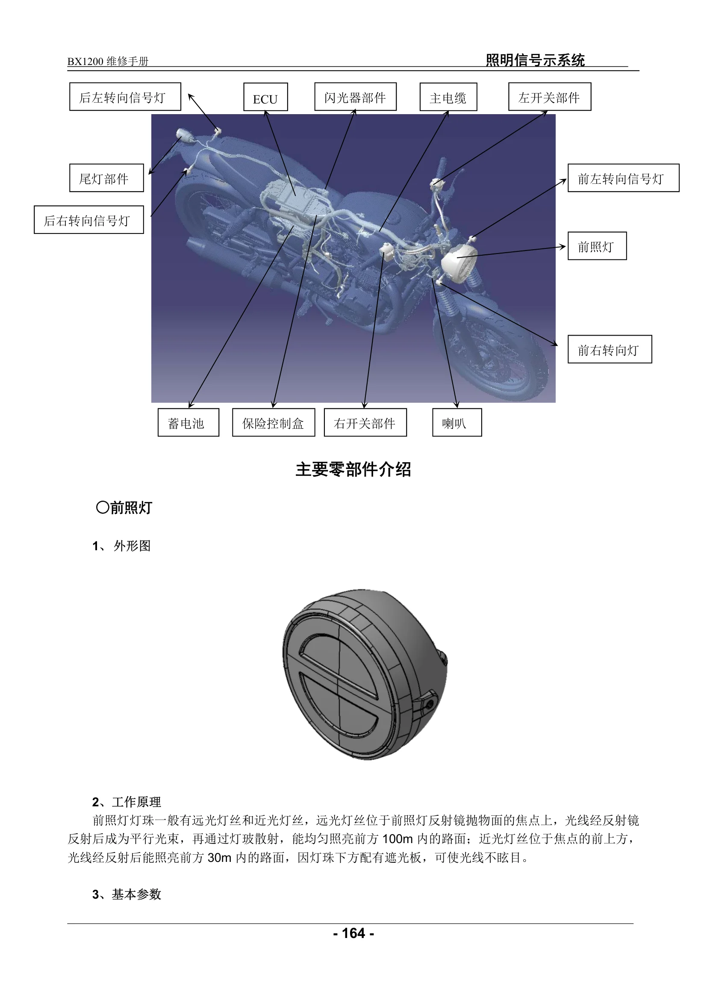

**----- Start of picture text -----** 
照明信号示系统 **----- End of picture text -----** 

**----- Start of picture text -----** 
后左转向信号灯 ECU 闪光器部件主电缆左开关部件 尾灯部件前左转向信号灯 后右转向信号灯 前照灯 前右转向灯 蓄电池保险控制盒右开关部件喇叭 **----- End of picture text -----** 

## 主要零部件介绍 

## ○前照灯 

## **1** 、外形图 

## **2** 、工作原理 

前照灯灯珠一般有远光灯丝和近光灯丝，远光灯丝位于前照灯反射镜抛物面的焦点上，光线经反射镜反射后成为平行光束，再通过灯玻散射，能均匀照亮前方 100m 内的路面；近光灯丝位于焦点的前上方，光线经反射后能照亮前方 30m 内的路面，因灯珠下方配有遮光板，可使光线不眩目。 

- **3** 、基本参数 

照明信号示系统 

大灯珠规格： LED 20W ；日行灯规格： LED 5W ；位置灯规格： LED 1W 。 **4** 、故障模式灯珠失效；灯具内进水或进灰尘；线路板焊接松动；灯壳玻片擦花；灯具线断路或短路；反射镜高温变形；遮光罩断裂或松动；灯光偏斜。 5、灯光调整 

上下调整：调节前大灯左右两边的调节螺钉，调节螺钉顺时针转动，调整光线下移，反之上移。左右调整：该车左右无法调整。 

## ○大灯继电器 

1、外形图 

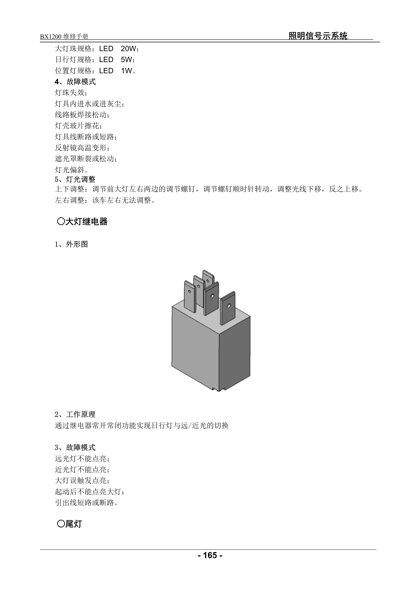

2、工作原理 

通过继电器常开常闭功能实现日行灯与远/近光的切换 

3、故障模式 

远光灯不能点亮；近光灯不能点亮；大灯误触发点亮；起动后不能点亮大灯；引出线短路或断路。 

## ○尾灯 

照明信号示系统 

## **1** 、外形图 

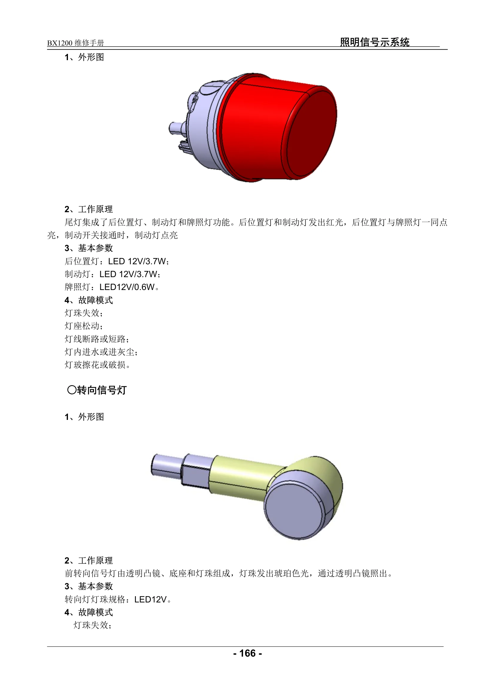

## **2** 、工作原理 

尾灯集成了后位置灯、制动灯和牌照灯功能。后位置灯和制动灯发出红光，后位置灯与牌照灯一同点亮，制动开关接通时，制动灯点亮 

- **3** 、基本参数 

后位置灯： LED 12V/3.7W ； 

制动灯： LED 12V/3.7W ； 

牌照灯： LED12V/0.6W 。 

- **4** 、故障模式 

灯珠失效；灯座松动；灯线断路或短路；灯内进水或进灰尘；灯玻擦花或破损。 

## ○转向信号灯 

- **1** 、外形图 

## **2** 、工作原理 

- 前转向信号灯由透明凸镜、底座和灯珠组成，灯珠发出琥珀色光，通过透明凸镜照出。 **3** 、基本参数 

转向灯灯珠规格： LED12V 。 

- **4** 、故障模式 

   - 灯珠失效； 

照明信号示系统 

灯座松动；灯线断路或短路；灯内进水或进灰尘；灯玻擦花或破损；手柄松动或断裂。 

## ○闪光器 

- **1** 、外形图 

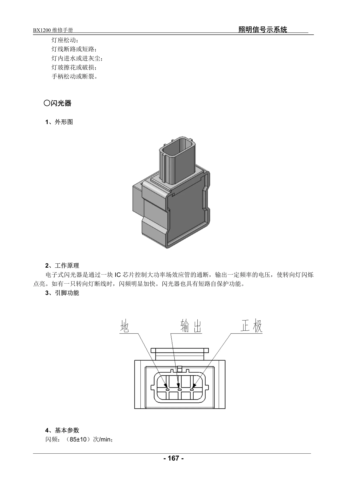

## **2** 、工作原理 

电子式闪光器是通过一块 IC 芯片控制大功率场效应管的通断，输出一定频率的电压，使转向灯闪烁点亮。如有一只转向灯断线时，闪频明显加快。闪光器也具有短路自保护功能。 **3** 、引脚功能 

**4** 、基本参数 

闪频：（ 85±10 ）次 /min ； 

照明信号示系统 

快闪：（ 160±10 ）次 /min ； 

**5** 、故障模式转向灯不能点亮；转向灯不能闪烁；干扰误触发短路保护；继电器失效；一只转向灯断线时，无快闪；引脚锈蚀不能接通。 

## ○前制动灯开关 

**1** 、外形图 

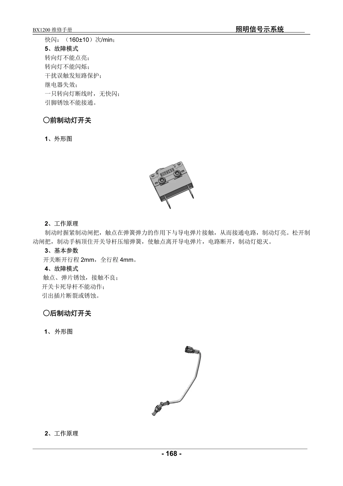

**2** 、工作原理 

制动时握紧制动闸把，触点在弹簧弹力的作用下与导电弹片接触，从而接通电路，制动灯亮。松开制动闸把，制动手柄顶住开关导杆压缩弹簧，使触点离开导电弹片，电路断开，制动灯熄灭。 

**3** 、基本参数 

开关断开行程 2mm ，全行程 4mm 。 

**4** 、故障模式 

触点、弹片锈蚀，接触不良；开关卡死导杆不能动作；引出插片断裂或锈蚀。 

## ○后制动灯开关 

**1** 、外形图 

- **2** 、工作原理 

照明信号示系统 

后制动灯开关为液压式制动开关，当踩下制动踏板时，制动开关内压力达到一定值后，开关两触点弹片同时接触，接通电路，制动灯点亮。 

**3** 、基本参数 

开关在 0.1-0.5MPa 时接通。 

**4** 、故障模式 

压力泄露；引出线断路或短路。 

## ○喇叭 

## **1** 、外形图 

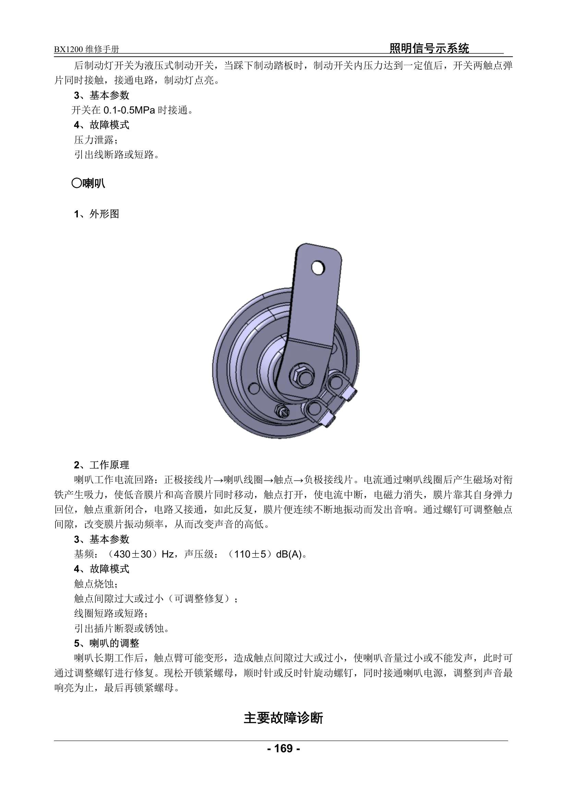

## **2** 、工作原理 

喇叭工作电流回路：正极接线片 → 喇叭线圈 → 触点 → 负极接线片。电流通过喇叭线圈后产生磁场对衔铁产生吸力，使低音膜片和高音膜片同时移动，触点打开，使电流中断，电磁力消失，膜片靠其自身弹力回位，触点重新闭合，电路又接通，如此反复，膜片便连续不断地振动而发出音响。通过螺钉可调整触点间隙，改变膜片振动频率，从而改变声音的高低。 

**3** 、基本参数 

基频：（ 430 ± 30 ） Hz ，声压级：（ 110 ± 5 ） dB(A) 。 

**4** 、故障模式触点烧蚀；触点间隙过大或过小（可调整修复）；线圈短路或短路；引出插片断裂或锈蚀。 **5** 、喇叭的调整 

喇叭长期工作后，触点臂可能变形，造成触点间隙过大或过小，使喇叭音量过小或不能发声，此时可通过调整螺钉进行修复。现松开锁紧螺母，顺时针或反时针旋动螺钉，同时接通喇叭电源，调整到声音最响亮为止，最后再锁紧螺母。 

## 主要故障诊断 

照明信号示系统 

|故障现象|可能引起的原因|解决方法|
|---|---|---|
|全车所有灯具不点亮，喇叭开关按 下后喇叭不响|1、灯具保险损坏； 2、电缆上灯具相关部分短路。|1、更换灯具保险； 2、检查灯具相关部分电路，排除 短路部分，对电缆进行调整或 更换|
|只有远近光不能点亮|1、大灯接插件远近光针脚松动或损 坏； 2、变光开关损坏； 3、大灯继电器损坏； 4、远近光灯珠损坏。|1、取下大灯接插件检查大灯接插 件，进行修复或更换； 2、更换左开关部件； 3、更换大灯继电器； 4、更换前照灯|
|只有日行灯不能点亮|1、大灯接插件日行灯针脚松动或损 坏； 2、大灯继电器损坏； 3、日行灯灯珠损坏。|1、取下大灯接插件检查大灯接插 件，进行修复或更换； 2、更换大灯继电器； 3、更换前照灯|
|只有前位置灯不能点亮|1、大灯接插件前位置灯针脚松动或 损坏； 2、前位置灯灯珠损坏。|1、取下大灯接插件检查大灯接插 件，进行修复或更换； 2、更换前照灯|
|后位置灯、牌照灯不能点亮|1、尾灯接插件后位置灯与牌照灯针 脚松动； 2、后位置灯与牌照灯损坏|1、取下尾灯接插件检查尾灯接插 件，进行修复或更换； 2、更换尾灯|
|只有制动灯不能点亮|1、尾灯上制动灯线路断开； 2、前后制动开关损坏； 3、ECU 未正常发出点亮指令。|1、检查制动灯线路，进行修复或 更换； 2、检查前后制动开关是否正常工 作，如损坏则进行更换； 3、更换ECU|
|转向灯不能点亮|1、闪光器损坏； 2、转向开关损坏； 3、转向灯损坏。|1、更换闪光器； 2、更换左开关部件； 3、更换转向灯。|
|喇叭不工作|1、喇叭损坏； 2、喇叭继电器损坏； 3、喇叭开关损坏。|1、更换喇叭； 2、更换喇叭继电器； 3、更换左开关部件。|

信息显示系统 

## **18** 信息显示系统 

概述主要零部件介绍电路原理图主要故障诊断零件布置图 

## 概述 

信息显示系统将整车静态和动态的信息通过仪表盘显示出来，提供给驾驶人员，指导驾驶人员进行安全操作。 

BX1200 显示的整车信息包括以下内容：车速、发动机转速、油位、档位、电压报警、水温显示以及水温报警、转向指示、远光指示、累计 / 小计行驶里程、时间、油位显示以及油位报警、机油压力报警、电喷故障指示、 ABS 报警指示、模式显示、巡航系统显示、牵引力控制系统显示、防盗指示灯。 BX1200 显示系统信号的传递全为电子信号，为 TFT 液晶仪表。组成系统的零部件有： 

- 仪表部件 

- 车速传感器 

- 油位传感器 

- 电子档位开关 

- 左右开关部件 

- 水温传感器 

- ABS 

- ECU 

信息显示系统 

## 电路原理图 

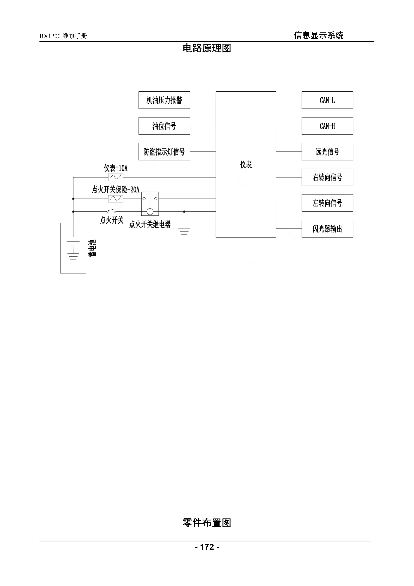

## 零件布置图 

信息显示系统 

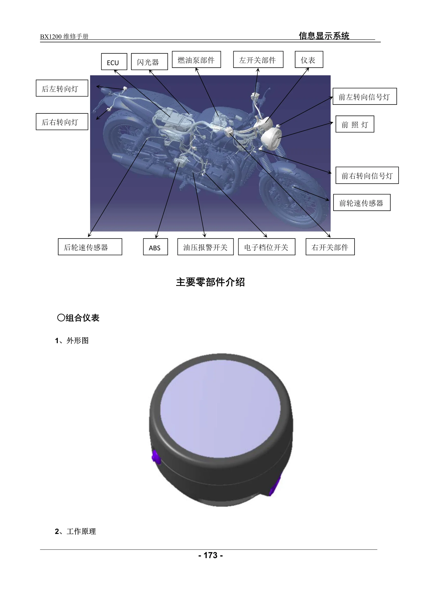

**----- Start of picture text -----** 
ECU 闪光器燃油泵部件左开关部件仪表 后左转向灯 前左转向信号灯 后右转向灯 前照灯 前右转向信号灯 前轮速传感器 后轮速传感器 ABS 油压报警开关电子档位开关右开关部件 **----- End of picture text -----** 

## 主要零部件介绍 

## ○组合仪表 

- **1** 、外形图 

- **2** 、工作原理 

信息显示系统 

全电子式仪表（也称数字仪表），首先输入的全是电子信号（包括数字信号和模拟信号），通过电路处理，全部转换为数字信号，经 CPU 控制输出，驱动液晶显示屏，显示各项信息。 **3** 、引脚功能表 

|**3**、引脚功能|表|||
|---|---|---|---|
|引脚编号|功能|引脚编号|功能|
|1||13||
|2||14||
|3||15|防盗指示灯|
|4||16|燃油油位|
|5||17|闪光器输入|
|6||18|左转向信号|
|7||19|右转向信号|
|8||20|远光指示灯|
|9||21|机油压力报警指示|
|10|地|22||
|11|常电|23|CAN-H|
|12|点火开关电|24|CAN-L|

**4** 、基本功能 

仪表显示内容有：车速、发动机转速、档位、电压报警、水温显示以及水温报警、转向指示、远光指示、累计 / 小计行驶里程、时间、油位显示以及油位报警、机油压力报警、电喷故障指示、 ABS 报警指示、模式显示、巡航系统显示、牵引力控制系统显示、防盗指示灯。 

**5** 、故障模式部分功能不能正确显示；操作按钮不能进行时钟调节；仪表进水；外壳机械振动破裂；表面变色或擦花。 

## ○电子档位开关 

**1** 、外形图 

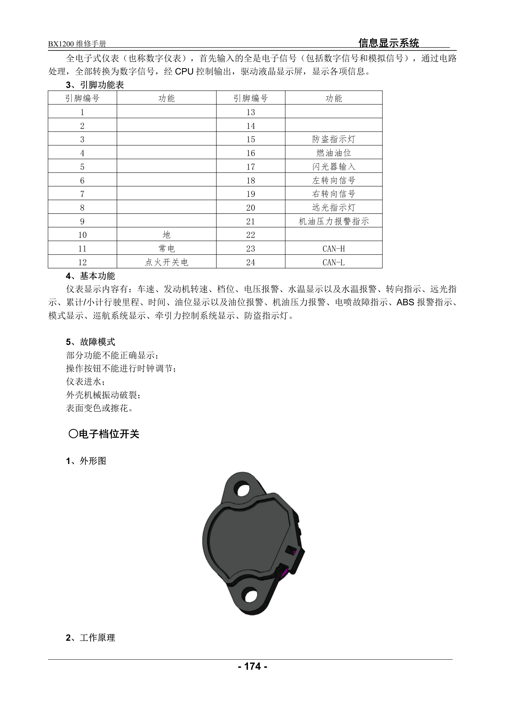

- **2** 、工作原理 

信息显示系统 

## 变速鼓旋转带动动触头旋转，利用霍尔原理输出不同电压值，代表不同档位。 

## **3** 、档位功能 

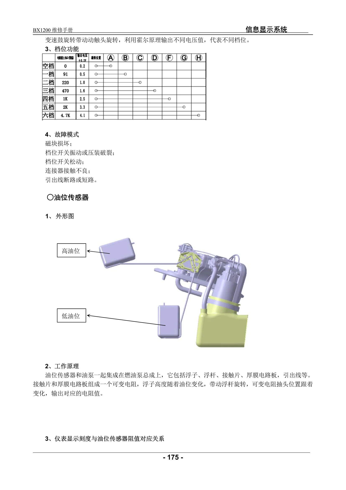

**4** 、故障模式 

磁块损坏； 

档位开关振动或压装破裂；档位开关松动；连接器接触不良；引出线断路或短路。 

## ○油位传感器 

- **1** 、外形图 

**----- Start of picture text -----** 
高油位 低油位 **----- End of picture text -----** 

**2** 、工作原理 

油位传感器和油泵一起集成在燃油泵总成上，它包括浮子、浮杆、接触片、厚膜电路板，引出线等。接触片和厚膜电路板组成一个可变电阻，浮子高度随着油位变化，带动浮杆旋转，可变电阻抽头位置跟着变化，输出对应的电阻值。 

- **3** 、仪表显示刻度与油位传感器阻值对应关系 

信息显示系统 

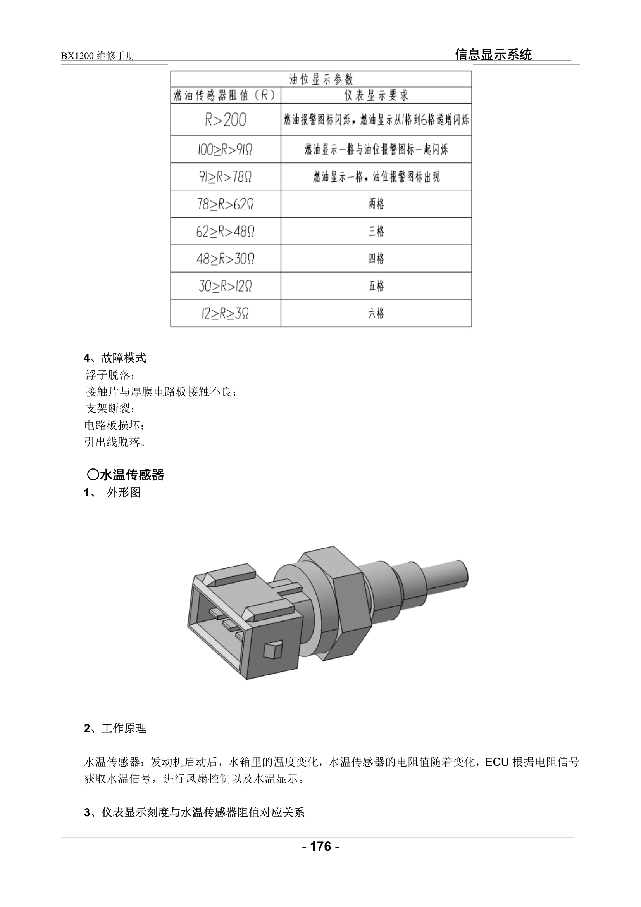

**4** 、故障模式 

浮子脱落；接触片与厚膜电路板接触不良；支架断裂； 

电路板损坏；引出线脱落。 

## ○水温传感器 

**1** 、外形图 

## **2** 、工作原理 

水温传感器：发动机启动后，水箱里的温度变化，水温传感器的电阻值随着变化， ECU 根据电阻信号获取水温信号，进行风扇控制以及水温显示。 

- **3** 、仪表显示刻度与水温传感器阻值对应关系 

信息显示系统 

|温度℃|标准电阻（Ω）|
|---|---|
|45|265.0~323.0|
|50|216.0~264.0|
|54|185.0~229.0|
|60|148.5~180.5|
|80*|74.6~90.6|
|90|53.5~66.5|
|100|40.6~48.6|
|108|34.0~38.0|
|110|32.0~36.0|
|113|30.0~34.0|
|115*|25.7~31.7|
|120|23.0~27.0|
|125|2.05~24.5|

## 主要故障诊断 

模式显示、巡航系统显示、牵引力控制系统显示 

|故障现象|可能引起的原因|解决方法|
|---|---|---|
|车速指示故障： 车速数字不显示； 车速偏差大。|1、车速传感器与信号盘间距过大； 2、车速传感器失效； 3、信号盘失效； 4、仪表失效； 5、线路接插不良、断路或短路； 6、CAN 通讯错误； 7、ABS故障。|1、减小间距至1-1.5mm； 2、更换车速传感器； 3、更换信号盘； 4、更换仪表； 5、重新接插或修复； 6、使用诊断工具进行排查故障； 7、排查ABS故障。|
|有车速无里程增加指示|1、仪表失效。|1、更换仪表。|
|发动机转速指示故障|1、线路接插不良或断路； 2、仪表失效； 3、ECU 失效； 4、转速传感器失效。|1、重新接插或修复； 2、更换仪表； 3、更换ECU； 4、更换转速传感器。|
|车速大于5km/h 后，ABS 故障灯常 亮；|1、ABS 发生故障； 2、CAN 通讯故障； 3、仪表失效。|1、排查ABS 故障； 2、使用诊断工具进行排查故障； 3、更换仪表。|
|油位报警指示灯闪烁，同时油位显 示从一格到六格递增闪烁|1、燃油传感器失效； 2、仪表失效|1、更换燃油传感器； 2、更换仪表；|
|无档位指示； 档位指示错误。|1、档位开关失效； 2、仪表失效； 3、CAN 通讯故障。|1、更换档位开关； 2、更换仪表； 3、使用诊断工具进行排查故障。|

|BX1200维修手册 信息显示系统|BX1200维修手册 信息显示系统|BX1200维修手册 信息显示系统|
|---|---|---|
|水温报警指示灯闪烁，同时水温显 示从一格到六格递增闪烁|1、水温传感器失效； 2、仪表失效； 3、CAN 通讯故障|1、更换水温传感器； 2、更换仪表； 3、使用诊断工具进行排查故障。|
|电压报警灯误触发常亮|1、仪表失效。|1、更换仪表。|
|转向指示灯不能点亮 远光指示灯不能点亮|1、线路接插不良或断路； 2、仪表失效。|1、重新接插或修复； 2、更换仪表。|
|时钟显示故障： 无显示、不能调节或误差大。|1、仪表失效。|1、更换仪表。|
|机油压力报警指示灯常亮|1、机油压力报警开关失效； 2、仪表失效。|1、更换机油压力报警开关； 2、更换仪表。|
|仪表不能功能调节|1、仪表失效。|1、更换仪表。|
|防盗指示灯异常点亮|1、防盗控制器失效； 2、仪表失效。|1、更换防盗控制器； 2、更换仪表|
|电喷故障灯、模式显示、巡航指示 灯、牵引力控制系统异常显示|1、电喷系统存在故障； 2、仪表异常； 3、CAN 通讯异常。|1、使用诊断工具进行排查故障； 2、更换仪表； 3、使用诊断工具进行排查故障。|

发动机管理系统 

## 发动机管理系统 

## 概述 

BX1200 发动机管理系统采用闭环式电喷系统，通过控制喷油量，能有效地控制混合气空燃比，使发动机在各种工况下空燃比达到最佳值，从而实现提高功率、降低油耗、减小排气污染、提高驾驶性能、低温起动性能和怠速性能。 

闭环式电喷系统的控制包括：燃油定量控制、点火正时控制、点火闭合角控制等。燃油定量控制是系统最重要的功能，它包括λ闭环控制、起动控制、起动后控制、暖机控制、怠速控制、部分负荷控制、全负荷控制、加减速控制、超速断油控制和减速断油控制。系统的基本组成： 

## 1 、传感器： 

- 进气温度压力传感器、节气门位置传感器、电子加油器部件（空气密度信息、负荷 

- 信息、负荷范围信息、加速减速信息） 

      - 发动机水温传感器（发动机温度信息） 

      - 消声器氧传感器（过量空气系数大于 1 或者小于 1 的信息） 

      - 发动机转速传感器（转速信息、曲轴位置） 

   - 2 、执行器： 

      - 燃油泵 

      - 喷油器（供油） 

      - 点火线圈 

      - 火花塞（点火） 

      - 电子节气门（进气） 

   - 3 、电子控制单元： 

      - ECU 

发动机管理系统 

## 维修注意事项 

- 1 、可以通过整车仪表上的故障指示灯来进行电喷系统故障诊断，也可以使用专用诊断仪与整车 ECU 进行通讯来进行电喷系统故障诊断及读取故障码。 

- 2 、故障诊断时，打开钥匙开关即可进行。 

- 3 、如果是传感器等出现故障时， ECU 采用默认值等方式跛行继续行驶，请用户及时驾驶车辆到特约维修店进行检修；如果是执行器等出现故障时， ECU 将不能正常控制车辆运行，请用户立即联系特约维修店进行检修。 

发动机管理系统 

## 系统原理图 

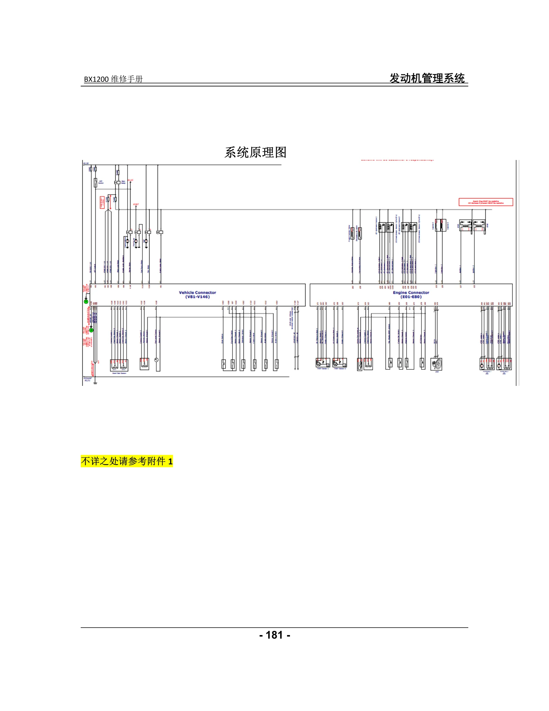

## 不详之处请参考附件 **1** 

发动机管理系统 

## 零件布置图 

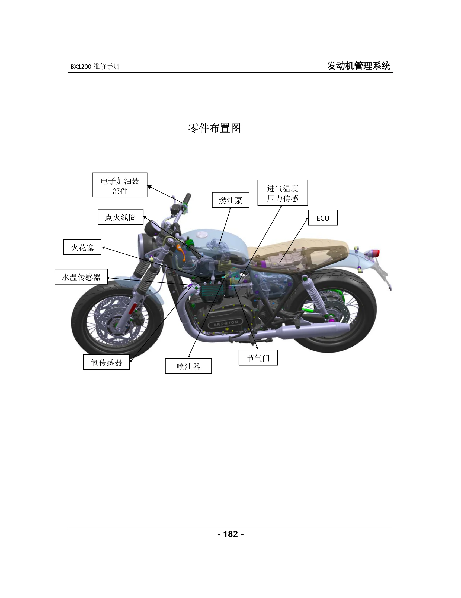

**----- Start of picture text -----** 
电子加油器 进气温度 部件 燃油泵压力传感 点火线圈 ECU 火花塞 水温传感器 节气门 氧传感器 喷油器 **----- End of picture text -----** 

发动机管理系统 

## **M31** 、 **M31C** 售后维修及检测规范 

一、整车检查 

依次检查并确认整车电路、气路、油路各部分零部件装配无误。油箱内加入 3 到 5L 燃油，接上蓄电池电源正负极。 

二、防盗匹配 

1、整车出厂时已经完成了防盗匹配，已经对车辆的车架号、钥匙、防盗器、ECU 进行了绑定。换任何一个零部件都需要重新进行防盗匹配，否则车辆无法启动。 2、防盗匹配流程具体见防盗钥匙匹配操作说明。 

三、ECU 自学习 

- 1、M31 欧五整车出厂时已经完成了ECU 自学习，如更换发动机或ECU，都需要 

- 重新进行ECU 自学习 

2、更换新的ECU 后，打开钥匙开关上电，仪表上电喷故障灯闪烁，启动车辆，仪表上电喷故障灯仍然闪烁，空档运行并热机，在此过程中，可以正常加减油。此时发动机限速7000RPM。 

3、空档状态下，待水温达到80℃以上，拉油门至发动机转速达到6500RPM 松开，等转速回落到怠速时再拉油门至发动机转速达到6500RPM 再松开。这样重复操作4 次，目的是让ECU 进行飞轮自学习。学习完毕后仪表电喷故障灯熄灭，这样ECU 就处于正常状态了。 

备注：只有M31 欧五整车需要ECU 自学习，M31C 国四整车不需要。四、电喷功能检查 

- 1、空档限速 

ECU 学习完毕后，空档状态下，水温80℃以下发动机限速3000RPM，水温80℃ 以上发动机限速7000RPM。 

- 2、驾驶模式 

有两种驾驶模式，即标准模式和动力模式。按左手把开关的模式按钮，可以进行模式切换。 

   - 3、定速巡航 

- 1）、激活：打开钥匙开关，按巡航按钮3s 以上进行激活，仪表巡航指示灯亮 

- 橙色，这时巡航功能激活。 

2）、巡航： 

- Ⅰ、整车在骑行中，档位在1-6 档，车速在30-160km/h，按巡航按钮短按1s 

左右，之后松油门，车辆按当前车速进行巡航，仪表巡航指示灯亮绿色。 

- Ⅱ、车辆在当前车速巡航中，加油超速比当前巡航车速差值小于30km/h，回油 

- 门后仍按加油前巡航车速巡航。 

   - 3）巡航解除： 

Ⅰ、巡航中，车辆在当前车速巡航中，加油超速比当前巡航车速差值超过 30km/h，巡航解除。 

发动机管理系统 

Ⅱ、ECU 收到刹车、离合、巡航按钮信号，发动机转速接近最高转速、ASR 介入、换档信号、油门和巡航按钮故障信号、节气门故障信号、倾倒信号、熄火开关信号，巡航解除。 

- 4、ASR 牵引力控制 

- 1）、默认状态下，车辆ASR 常开，仪表无显示ASR 指示灯。手动按ASR 按钮 

3s 以上关闭，此时仪表显示为黄色ASR 指示灯闪烁。 

2）、当ECU 监控到前后轮速有差异时ASR 起作用，此时仪表显示为黄色ASR 指示灯常亮，车辆表现为加油发动机拉不起高速。主支架支撑后轮处于悬空状态即可确认。 

- 5、风扇控制 

当水温传感器采集的水温≥93℃时风扇开启，水温≤88℃时风扇关闭。 

五、电喷故障检查 

打开钥匙开关，连接诊断仪，读取诊断仪里故障码，确认有无故障。检查无电喷故障后，启动发动机，检查并确认以下项次： 

- 1 、让整车怠速运行，发动机怠速运行稳定，无熄火现象。转动电子油门，发 

- 动机转速上升自然，松开油门，发动机转速回落自然，不熄火。 

   - 2 、发动机运行至水温 80 ℃以上时，发动机怠速转速 1000 ± 100rpm 。 

- 3 、检查电瓶电压 14.5 ± 0.5V （发动机处于运行状态，可以判定磁电机充电是否 

- 正常）。 

4 、各档位骑行整车无加速无力、熄火、放炮、发喘等异常现象，档位切换无不适现象，依次加档，全开油门，至整车设计最高车速，松开油门，发动机转速回落自然，无熄火现象。 

- 5 、以上测试过程中，如车辆出现异常，需进行返修处理。 

备注： 1 、凡是拔取 **ECU** 接插件或断开电池正 **/** 负极的操作前，都必须先钥匙开关保持关闭状态 **30** 秒以上。 

- **2** 、凡是电喷系统报故障，首先进行上下电或用诊断仪清除故障，如仍报故障，再进行排查相关零部件。 

## 诊断仪读取故障码及描述： 

|故障代码|故障代码描述|解决措施（供参考）|
|---|---|---|
|P0105|一缸进气压力传感器电气故障|1、检查节气门阀体和整车线缆是否接触不良 2、更换节气门阀体总成|
|P0120|一路节气门位置传感器1||
|P0220|一路节气门位置传感器2||
|P2135|一路节气门位置传感器一致性故障||
|P0225|踏板位置传感器1|1、检查电子油门和整车线缆是否接触不良 2、更换电子油门|
|P2130|踏板位置传感器2||

||BX1200维修手册 发动机管理系统|BX1200维修手册 发动机管理系统|BX1200维修手册 发动机管理系统|
|---|---|---|---|
||P2140|踏板位置传感器一致性故障||
||P1402|一路节气门自学习机械下止点故障|1、检查节气门阀体和整车线缆是否接触不良 2、更换节气门阀体总成|
||P1403|一路节气门自学习条件故障||
||P1404|一路节气门自学习电压故障||
||P0638|一路节气门位置错误||
||P1600|一缸进气小泄露故障|检查进气系统是否漏气|
||P0115|冷却液温度传感器|1、检查水温传感器是否接触不良 2、更换水温传感器|
||P0110|空气温度传感器|1、检查节气门阀体和整车线缆是否接触不良 2、更换节气门阀体总成|
||P0560|电池电压|1、检查电瓶电压是否正常 2、更换电瓶|
||P0130|1缸前氧传感器电气故障|1、检查对应缸氧传感器和整车线缆是否接触 不良 2、更换对应缸氧传感器|
||P0150|2缸前氧传感器电气故障||
||P0336|发动机转速传感器|1、检查磁电机触发器和整车线缆是否接触不 良 2、更换发动机定子组合|
||P0201|喷油器1|1、检查对应缸喷油器和线束是否接触不良 2、更换对应缸喷油器|
||P0202|喷油器2||
||P0351|点火线圈1|1、检查对应缸点火线圈和线束是否接触不良 2、更换对应缸点火线圈|
||P0352|点火线圈2||
||P0230|燃油泵继电器|1、检查整车线缆保险盒油泵继电器线路 2、检查整车线缆保险盒保险片 3、更换油泵继电器|
||P2100|一路节气门体电机|1、检查节气门阀体和整车线缆是否接触不良 2、更换节气门阀体总成|
||P0030|氧传感器加热器1|1、检查对应缸氧传感器和整车线缆是否接触 不良 2、更换对应缸氧传感器|
||P0050|氧传感器加热器2||
||P0914|档位传感器|1、检查档位传感器是否接触不良 2、更换档位传感器|
||P0480|风扇|1、检查风扇、风扇继电器与整车线缆是否接 触不良 2、检查整车线缆保险盒保险片 3、更换风扇继电器|

||BX1200维修手册 发动机管理系统|BX1200维修手册 发动机管理系统|BX1200维修手册 发动机管理系统|
|---|---|---|---|
||P0106|一缸进气压力合理性故障|1、检查节气门阀体和整车线缆是否接触不良 2、更换节气门阀体总成 3、检查进气系统是否漏气|
||P2175|一缸进气歧管信号过低||
||P1105|二缸进气压力传感器电气故障|1、检查节气门阀体和整车线缆是否接触不良 2、更换节气门阀体总成|
||P2120|二路节气门位置传感器1||
||P2125|二路节气门位置传感器2||
||P2138|二路节气门位置传感器一致性故障||
||P0639|二路节气门位置错误||
||P210A|二路节气门体电机||
||P0615|起动继电器|1、检查整车线缆与继电器是否接触不良 2、检查起动继电器保险片 3、更换起动继电器|
||P1408|二路节气门自学习机械下止点故障|1、检查节气门阀体和整车线缆是否接触不良 2、更换节气门阀体总成 3、检查进气系统是否漏气|
||P1409|二路节气门自学习条件故障||
||P1410|二路节气门自学习电压故障||
||P1601|二缸进气歧管故障||
||P0106|二缸进气压力合理性故障||
||P2173|二缸进气歧管信号过低||
||PC426|防盗|1、检查整车线缆与防盗器是否接触不良 2、检查防盗系统是否没匹配 3、更换防盗器|
||P0604|RAM故障|1、检查整车线缆与ECU是否接触不良 2、更换ECU|
||P0601|EEPROM故障|1、检查整车线缆与ECU是否接触不良 2、更换ECU|
||PC001|CAN Bus off|1、检查整车线缆与ECU是否接触不良 2、更换ECU 3、更换CAN通讯故障相关零部件|
||PC140|仪表|1、检查整车线缆与仪表是否接触不良 2、更换仪表|
||P160C|Safety重置|1、检查整车线缆与ECU是否接触不良 2、更换ECU|
||P0121|一路节气门电位计1 合理性|1、检查节气门阀体和整车线缆是否接触不良 2、更换节气门阀体总成|
||P0221|一路节气门电位计2 合理性||
||P2121|二路节气门电位计1 合理性||
||P2126|二路节气门电位计2 合理性||
||P060C|Safety 停机|1、检查整车线缆与ECU 是否接触不良|

||BX1200维修手册 发动机管理系统|BX1200维修手册 发动机管理系统|BX1200维修手册 发动机管理系统|
|---|---|---|---|
||||2、更换ECU|
||P1400|一路节气门自学习跛行位置故障|1、检查节气门阀体和整车线缆是否接触不良 2、更换节气门阀体总成|
||P1401|一路节气门自学习范围故障||
||P1305|刹车灯继电器故障|1、检查整车线缆与刹车灯继电器是否接触不 良 2、更换刹车灯继电器或刹车灯|
||P1406|二路节气门自学习跛行位置故障|1、检查节气门阀体和整车线缆是否接触不良 2、更换节气门阀体总成|
||P1407|二路节气门自学习范围故障||
||P0512|启动按钮|1、检查右手把开关和整车线缆是否接触不良 2、更换右手把开关|
||P1405|一路节气门自学习TRC 故障|1、检查节气门阀体和整车线缆是否接触不良 2、更换节气门阀体总成|
||P1411|二路节气门自学习TRC 故障||
||PC121|ABS节点不存在|1、检查ABS控制器和整车线缆是否接触不良 2、更换ABS 控制器|
||P0500|前轮速度传感器|1、检查对应轮速传感器和整车线缆是否接触 不良 2、更换对应轮速传感器|
||P2158|后轮速度传感器||
||P0564|巡航按键故障|1、检查左手把开关和整车线缆是否接触不良 2、更换左手把开关|
||P0443|碳罐电磁阀电气故障|1、检查碳罐电磁阀和整车线缆是否接触不良 2、更换碳罐电磁阀|
||P0111|进气温度传感器合理性故障|1、检查1缸节气门阀体和整车线缆是否接触 不良 2、更换1缸节气门阀体总成|
||P0685|冷却液温度传感器合理性故障|1、检查水温传感器和整车线缆是否接触不良 2、更换水温传感器|
||P1762|倾倒传感器电气故障|1、检查倾倒传感器和整车线缆是否接触不良 2、更换倾倒传感器|
||P2227|大气压力传感器信号不合理|1、检查整车线缆与ECU是否接触不良 2、更换ECU|
||P0505|怠速转速控制系统故障|1、检查节气门阀体和整车线缆是否接触不良 2、更换节气门阀体总成 3、检查发动机和进气系统漏气|
||P1615|ROM校验测试失败|1、检查整车线缆与ECU是否接触不良 2、更换ECU|
||P1309|飞轮自学习|检查是否进行了ECU 自学习操作|
||P2500|双模式开关卡滞|1、检查左手把开关和整车线缆是否接触不良|

||BX1200维修手册 发动机管理系统|BX1200维修手册 发动机管理系统|BX1200维修手册 发动机管理系统|
|---|---|---|---|
||||2、更换左手把开关|
||P0133|前氧传感器1 慢反应|1、检查对应缸氧传感器和整车线缆是否接触 不良 2、更换对应缸氧传感器|
||P0153|前氧传感器2慢反应||
||P0300|检测到随机/多缸失火|1、检查对应缸点火线圈和整车线缆是否接触 不良 2、检查对应缸点火线圈和火花塞是否接触不 良 3、更换对应缸点火线圈或火花塞|
||P0301|1缸失火200||
||P0302|2缸失火200||
|||||

电气系统图 

GK1200 维修手册 

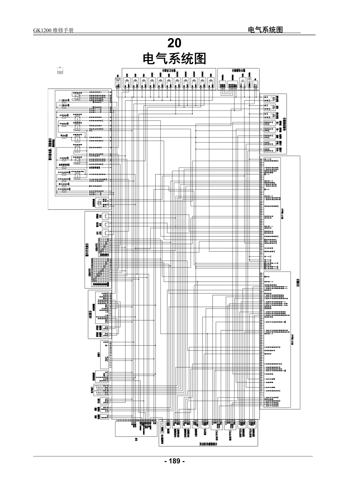

**----- Start of picture text -----** 
20 电气系统图 **----- End of picture text -----** 

